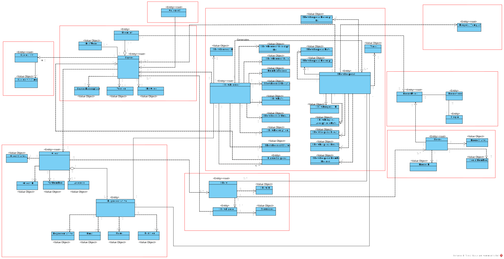

# Domain-Driven Design (DDD) in the Shodrone Project

## Introduction to Domain-Driven Design

Domain-Driven Design (DDD) is a software development approach introduced by Eric Evans in his 2003 book, *Domain-Driven Design: Tackling Complexity in the Heart of Software*. DDD focuses on creating software that reflects a deep understanding of the business domain it serves. It emphasizes collaboration between technical experts (developers, architects) and domain experts (business stakeholders) to build a shared understanding of the domain, which is then translated into a model that drives the software design and implementation.

In the context of the Shodrone project—a system to support back-office operations for a company providing customized drone multimedia shows—DDD is crucial for managing the complexity of the domain, which includes concepts like clients, show requests, figures, shows, and drone simulations. The class diagram provided (entities like `ShowRequest`, `Figure`, `Customer`, `Drone`) reflects a DDD-inspired design, capturing the domain’s core concepts and their relationships.

## Importance of DDD

DDD offers several benefits, particularly for complex systems like Shodrone:

1. **Alignment with Business Needs**:
    - DDD ensures the software mirrors the real-world business domain, making it more relevant and valuable to stakeholders. For Shodrone, this means the system accurately represents concepts like `ShowRequest` (with attributes like `ShowDate` and `NumberOfDrones`) and `Figure` (with `DSLCode` and `Exclusivity`), directly addressing the company’s operational needs.

2. **Improved Communication**:
    - DDD introduces a *Ubiquitous Language*—a shared vocabulary used by both developers and domain experts. In Shodrone, terms like “Figure,” “Show,” “Exclusivity,” and “Drone” are consistently used in code, documentation, and discussions, reducing misunderstandings.

3. **Handling Complexity**:
    - By focusing on the core domain and modeling it explicitly, DDD helps manage complexity. Shodrone’s domain involves intricate relationships (a `Show` composed of multiple `Figures`, each with `Drones` and `DSLCode`). DDD’s modeling techniques (entities, value objects, aggregates) help structure this complexity into manageable components.

4. **Maintainability and Scalability**:
    - A well-modeled domain makes the system easier to maintain and extend. For example, Shodrone’s requirement to support future DSL versions (3.1.3) is facilitated by a modular design where `Figure` and `Version` are distinct entities, allowing for future migrations.

5. **Focus on Core Business Logic**:
    - DDD prioritizes the core domain over technical concerns. In Shodrone, the core domain is the management and simulation of drone shows, not the underlying database or ui framework. DDD ensures that business logic (collision detection in simulations) is central to the design.

## Key Concepts of DDD

DDD introduces several concepts that are reflected in the Shodrone class diagram:

- **Entities**: Objects with a distinct identity that persists over time. In Shodrone, `Customer`, `ShowRequest`, `Figure`, and `Drone` are entities, each with a unique identifier.
- **Value Objects**: Objects without identity, used to describe attributes. For example, `Address` and `Email` in the `Customer` and `Representative` entities are value objects, immutable and defined by their attributes.
- **Aggregates**: A cluster of related objects treated as a single unit for data consistency. In the diagram, `ShowRequest` is an aggregate root, encapsulating `ShowProposal` and `ShowDescription`, ensuring consistency in show request operations.
- **Aggregate Roots**: The entry point to an aggregate, ensuring controlled access. `ShowRequest`, `Customer`, and `Figure` are aggregate roots in Shodrone, managing their respective sub-entities (`Representative` under `Customer`).
- **Ubiquitous Language**: A shared language derived from the domain. Shodrone’s glossary (mentioned below) defines terms like “Exclusivity,” “DSLCode,” and “ShowDate,” ensuring consistency across the team.

## Steps to Apply DDD in the Shodrone Project

Applying DDD to the Shodrone project involves several steps, which align with the project’s development process (sprints, Scrum methodology):

### 1. Domain Discovery and Collaboration
- **Objective**: Understand the domain through collaboration with stakeholders.
- **Process**: Engage with Shodrone’s domain experts (CRM Managers, Show Designers, Drone Techs) to identify key concepts, processes, and rules. For example, discussions would reveal that a `ShowRequest` includes a `ShowDescription` and may involve new `Figures` with `Exclusivity`.
- **Shodrone Application**: This step was likely performed during the initial requirements gathering, leading to the identification of entities like `Customer`, `ShowRequest`, and `Figure`, as well as use cases (3.1.4 Show Request).

### 2. Build a Ubiquitous Language
- **Objective**: Create a shared vocabulary to ensure consistency.
- **Process**: Document domain terms and their meanings in a glossary, using them consistently in conversations, code, and documentation. For Shodrone, terms like “Figure,” “DSLCode,” “Exclusivity,” and “ShowProposal” are part of this language.
- **Shodrone Application**: A glossary of Shodrone’s domain concepts is available in the project documentation (`docs/glossary.md`), defining all terms used in the class diagram and code. This ensures that when a developer sees `ShowRequest.ShowDate`, it matches the business’s understanding of a show’s scheduled date.

### 3. Model the Domain
- **Objective**: Translate the domain understanding into a model.
- **Process**: Use DDD building blocks (entities, value objects, aggregates) to create a domain model. The Shodrone class diagram is a result of this step, showing:
    - Entities like `Customer` with attributes (`ClientID`, `VatNumber`, `Address`) and relationships (1-to-many with `Representative`).
    - Aggregates like `ShowRequest`, which encapsulates `ShowProposal` and `ShowDescription`.
    - Value objects like `Exclusivity` and `Version`, which describe attributes without identity.
- **Shodrone Application**: The diagram reflects a well-structured model, with clear boundaries (`Show` as an aggregate root managing `Drones` and `Figures`).

### 4. Define Bounded Contexts
- **Objective**: Divide the domain into manageable parts.
- **Process**: Identify areas of the domain that can be modeled independently. For Shodrone, potential bounded contexts include:
    - **Client Management**: Handling `Customer` and `Representative`.
    - **Show Management**: Handling `ShowRequest`, `ShowProposal`, and `Show`.
    - **Simulation**: Handling `Figure`, `Drone`, and simulation logic.
- **Shodrone Application**: The current diagram appears to cover a single bounded context (Show Management and Simulation), but as the system scales (supporting large shows as per 3 System Specifications), separate contexts may be defined.

### 5. Implement the Domain Model
- **Objective**: Translate the model into code.
- **Process**: Write code that reflects the domain model, using the Ubiquitous Language in class names, methods, and variables. For Shodrone:
    - `ShowRequest` class with methods like `createProposal()` and `scheduleShow()`.
    - `Figure` class with attributes like `DSLCode` and `Exclusivity`.
    - Use Java (NFR09) to implement the model, ensuring alignment with the class diagram.
- **Shodrone Application**: The implementation is split across modules (`shodrone-app1` for client/show management, `shodrone-app2` for simulation, `shodrone-util` for shared logic like DSL validation).

### 6. Iterate and Refine
- **Objective**: Continuously improve the model based on feedback.
- **Process**: Use Scrum sprints (NFR01) to iteratively refine the model. For example, Sprint 1 focuses on DSL parsing (LPROG), Sprint 2 on client management (EAPLI), and Sprint 3 on simulation (SCOMP). Feedback from stakeholders (e.g., Shodrone’s CRM team) during sprint reviews helps refine the model.
- **Shodrone Application**: The project’s three sprints (2 Rules) allow for iterative development, with each sprint adding new functionality (e.g., simulation in Sprint 3) and refining existing models based on testing and stakeholder input.

### 7. Ensure Technical Alignment
- **Objective**: Balance domain focus with technical requirements.
- **Process**: Address non-functional requirements (NFRs) while keeping the domain model intact. For Shodrone:
    - Scalability (NFR12): The simulation system uses multithreading and shared memory to handle large shows.
    - Persistence (NFR07): Supports both in-memory and RDBMS, mapping entities like `Customer` and `ShowRequest` to the database.
    - Authentication (NFR08): Ensures secure access to domain operations.
- **Shodrone Application**: The class diagram is implemented in a way that supports these NFRs, with entities designed for persistence (`ClientID` as a primary key) and simulation (e.g., `Drone` with `DroneID`).

## Benefits for the Shodrone Project

Applying DDD to Shodrone yields specific benefits:

- **Clear Domain Representation**: The class diagram accurately captures Shodrone’s domain, with entities like `ShowRequest` and `Figure` directly reflecting business concepts.
- **Scalability for Future Features**: The model supports future requirements, such as DSL version migration (3.1.3) and large-scale simulations (3 System Specifications), by using modular aggregates.
- **Team Collaboration**: The Ubiquitous Language (backed by the glossary) ensures that developers, testers, and Shodrone stakeholders (e.g., CRM Managers) speak the same language, reducing miscommunication.
- **Maintainable Codebase**: The separation of concerns (e.g., `Customer` vs. `Show` aggregates) makes the system easier to maintain, especially as new features are added (e.g., new movement types in the DSL).

## [Glossary of Shodrone Domain Concepts](../../../global-artifacts/01.requirements-engineering/glossary.md)

To ensure a shared understanding of the domain, a comprehensive glossary of Shodrone’s concepts is available in the project documentation at `docs/glossary.md`. This glossary defines all terms used in the class diagram and code, including:

- **Customer**: An entity (corporate or public) with a unique `VatNumber`, managing a list of `Representatives`.
- **ShowRequest**: A client’s request for a drone show, including `ShowDate`, `NumberOfDrones`, and `ShowDescription`.
- **Figure**: A drone formation defined by `DSLCode`, with optional `Exclusivity` for specific clients.
- **Show**: A sequence of `Figures`, orchestrated with `Drones` and validated via simulation.
- **Exclusivity**: A value object defining whether a `Figure` is exclusive to a client and for how long.
- **DSLCode**: A high-level description of a `Figure` using a Domain-Specific Language, generated externally and imported into the system.

The glossary ensures that all team members, from developers to stakeholders, use these terms consistently, aligning with DDD’s Ubiquitous Language principle.

## Conclusion

Domain-Driven Design is a powerful approach for building complex systems like Shodrone, where the domain involves intricate concepts and relationships. By focusing on the core domain, creating a shared Ubiquitous Language, and modeling the domain with entities, value objects, and aggregates, DDD ensures that the software is both business-relevant and technically sound. The Shodrone project benefits from DDD through its clear domain model (as seen in the class diagram), improved collaboration, and scalability for future growth. The iterative nature of Scrum sprints allows the team to refine the model over time, while the glossary in `docs/glossary.md` ensures a consistent understanding of the domain across all stakeholders.

