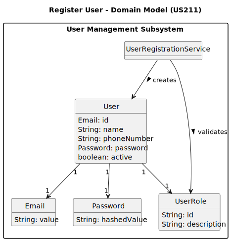

# US211 - Register users

## 2. Analysis

### 2.1. Relevant Domain Model Excerpt 

### 2.2. Other Remarks

* User Creation Responsibility: The registration of users must be restricted to the Administrator role through the application backoffice. A bootstrap mechanism must also be provided to initialize the system with a default set of users.
* Email Validation: The system must enforce that user emails belong to the @showdrone.com domain and follow a valid format. Duplicate emails must be rejected during registration.
* Role Assignment: Upon creation, a user must be assigned one role. Although the current version supports a single role per user, the system design should allow for a future upgrade to support multiple roles per user.
* Password Handling: Upon registration, users receive a temporary password (via secure channel – to be defined). Passwords must be hashed using a strong cryptographic algorithm (bcrypt). No password should ever be stored in plain text.
* Bootstrap Registration: The system must include support for batch registration via configuration files or initialization scripts, allowing initial users to be created without using the GUI.
* User Status: Users must be created with an "active" status by default. Status management (disabling/enabling users) is handled in US212.
* Error Handling: The registration process must return meaningful error messages, such as “Invalid email format”, “Email must be @showdrone.com”, or “Email already in use”.