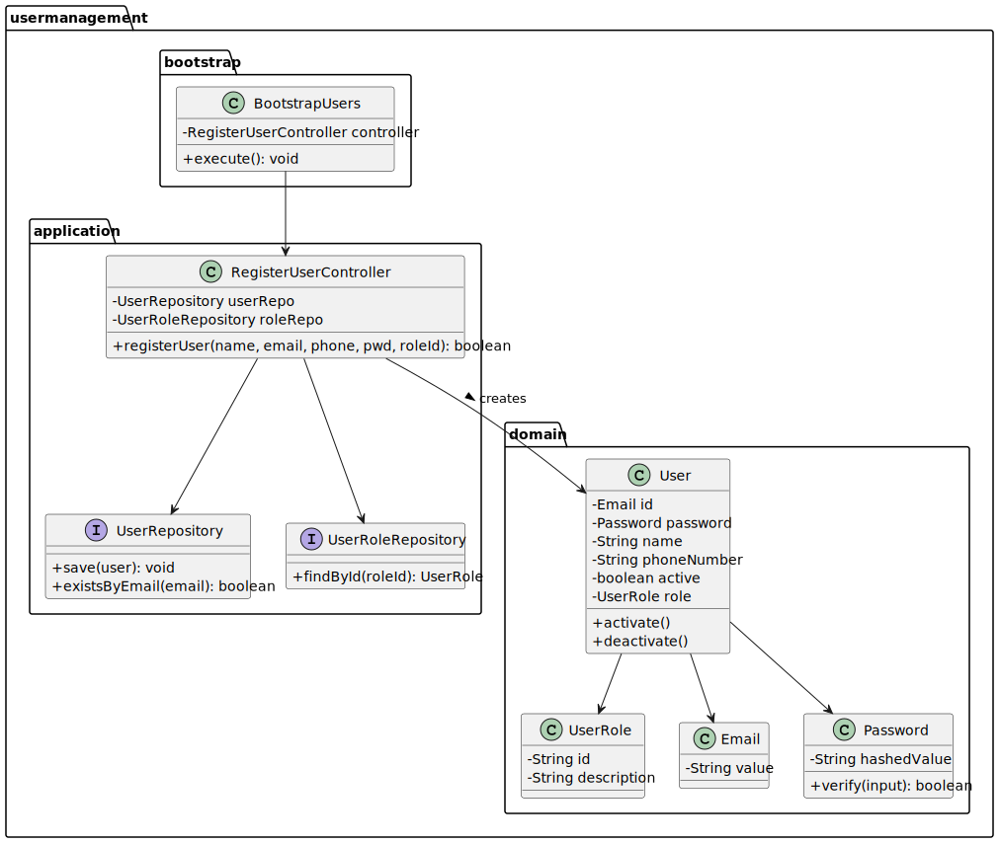

# US211 - Register users

## 3. Design

### 3.1. Design Overview

The design for US211 supports the registration of new users in the Shodrone back-office system by administrators. It also ensures bootstrap user initialization when the system is first launched. This functionality ensures that only valid users with proper roles are created and persisted securely in the system.
The user registration process follows these high-level steps:
1. **User Input**: The administrator provides the new user's data (name, email, phone, password, role) via a console-based UI or via the bootstrap process.
2. **Validation**:
- The system checks that the email has a valid format and belongs to the @showdrone.com domain.
- It ensures that the email is not already used.
- It validates that the role exists.

3. **User Creation**: The controller creates an instance of the User aggregate, including the construction of the Email, Password, and association to a valid UserRole.

4. **Persistence**: The newly created User is stored via the UserRepository

The design adheres to a layered architecture with strict separation of responsibilities:
- UI Layer: Handles administrator input and output using the EAPLI console framework or via script during bootstrap.
- Application Layer: RegisterUserController orchestrates the registration workflow, using the repositories and domain services.
- Domain Layer: Includes the User, Email, Password, and UserRole entities and value objects, encapsulating registration rules.
- Persistence Layer: Abstracted via the UserRepository and UserRoleRepository interfaces, with JPA and in-memory implementations.
- Infrastructure Layer: Provides bootstrap support and service instantiation.

### 3.2. Sequence Diagrams

3.2.1. Class Diagram
The following class diagram models the authentication domain and infrastructure. It includes the User, UserRole, AuthenticationRepository, AuthenticationController, and supporting classes such as AuthFacade and UserSession.

3.2.2. Sequence Diagram (SD)
The sequence diagram below illustrates the login process from user input to session creation and feedback:

### 3.3. Design Patterns (if any)

Domain-Driven Design (DDD) Patterns

- Application Service
RegisterUserController acts as an application service that coordinates the registration logic, delegating domain concerns to entities and value objects.

- Repository
UserRepository and UserRoleRepository abstract persistence, supporting both in-memory and JPA-based implementations.

- Value Object
Email and Password are modeled as value objects, encapsulating validation and formatting logic.

- Aggregate Root
User is the aggregate root, encapsulating user data and ensuring the consistency of registration rules.

- Factory Method
The creation of value objects (Password) ensures proper hashing and validation upon instantiation.
