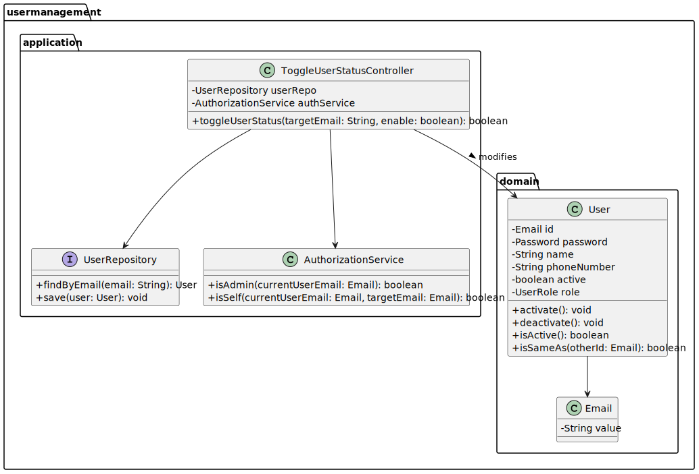
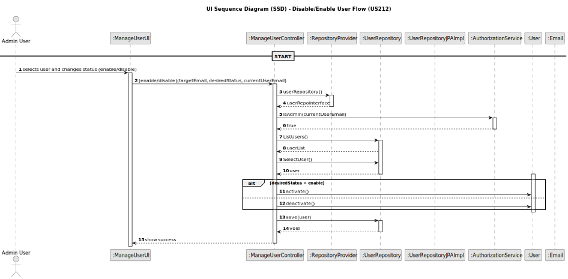

# US212 - Disable/enable users

## 3. Design

### 3.1. Design Overview

The design for US212 enables system administrators to disable or enable users via the Shodrone back-office. This function is critical for controlling system access and enforcing security policies. Only administrators may perform this action, and the system must prevent an Admin from disabling their own account.
The process follows these high-level steps:
1. **Admin Input**: The administrator selects a target user and chooses to either disable or enable them via the UI.
2. **Authorization Check**: The system verifies that the requestor has Admin privileges and is not trying to disable themselves.
3. **Fetch and Modify User**: The target user is retrieved from the repository, and their active status is toggled accordingly.
4. **Persistence**: The updated User object is persisted using the UserRepository.

The implementation follows a layered architecture, consistent with DDD principles:
- UI Layer: Presents the list of users with actions to enable/disable, using the EAPLI console framework or backoffice UI.
- Application Layer: The UserStatusController orchestrates the operation, interacting with the domain model and checking access permissions.
- Domain Layer: Includes business rules for access control (Admin-only), self-deactivation protection, and status toggling.
- Persistence Layer: Provides access to user data through the UserRepository.
- Infrastructure Layer: Handles repository implementation and integration with authentication/authorization mechanisms.

### 3.2. Sequence Diagrams

3.2.1. Class Diagram
The following class diagram models the authentication domain and infrastructure. It includes the User, UserRole, AuthenticationRepository, AuthenticationController, and supporting classes such as AuthFacade and UserSession.

3.2.2. Sequence Diagram (SD)
The sequence diagram below illustrates the login process from user input to session creation and feedback:

### 3.3. Design Patterns (if any)

This use case applies the following Domain-Driven Design (DDD) and architectural patterns:

- Application Service
The ToggleUserStatusController coordinates the use case, invoking domain logic and enforcing access rules.

- Repository
UserRepository abstracts data access, allowing decoupling from the persistence mechanism (JPA or in-memory).

- Aggregate Root
The User aggregate encapsulates user data and manages its own status, exposing intent-revealing methods like disable() and enable().

- Domain Service
A stateless service responsible for enforcing access control logic such as Admin role validation and self-disable prevention.

- Value Object
The Email remains a value object used to uniquely identify a user.
