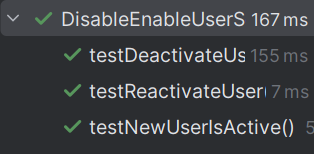

# US212 - Disable/enable users

## 4. Tests

This section documents the unit tests and validation strategies used to verify the correctness of the user status management functionality, ensuring that only valid operations (admin-initiated) are permitted and persisted correctly.
You should include:

### **Test Cases**

1. **Unit Test: New User Is Active by Default**
    * **Description**: Verifies that a user is active when initially created.
    * **Expected Outcome**: isUserActive(...) returns true.
    * **Test**:
   ```java
    @Test
    void testNewUserIsActive() {
        UserDTO dto = new UserDTO(email.toString(), "User", new ArrayList<>());

        assertTrue(controller.isUserActive(dto), "New User is active");
    }
    ```

2. **Unit Test: Deactivate User**
    * **Description**: Confirms that a user can be disabled and cannot access the system afterward.
    * **Expected Outcome**: The active flag is set to false.
    * **Test**:
   ```java
    @Test
    void testDeactivateUser() {
        UserDTO dto = new UserDTO(email.toString(), "User", new ArrayList<>());

        controller.deactivateUser(dto);

        assertFalse(controller.isUserActive(dto), "Inactive User");
    }
    ```

3. **Unit Test: Reactivate User**
    * **Description**: Ensures that a previously disabled user can be reactivated.
    * **Expected Outcome**: The active flag is set back to true.
    * **Test**:
   ```java
    @Test
    void testReactivateUser() {
        UserDTO dto = new UserDTO(email.toString(), "User", new ArrayList<>());

        controller.deactivateUser(dto);
        assertFalse(controller.isUserActive(dto), "Inactive User");

        controller.activateUser(dto);
        assertTrue(controller.isUserActive(dto), "User is active");
    }
    ```

### Screenshot


## 5. Construction (Implementation)

**Controller**: ManageUserController
The ManageUserController handles status toggling operations (enable/disable), interfacing between UI requests and domain rule enforcement.

**Responsibilities**
- Fetches user from list and changes the active flag.
- Delegates persistence to UserRepository.
- Provides helper methods to check user status (isUserActive).

**DDD Principles**
- Business rules such as "a user must be active to login" and "only Admins may disable users" are enforced at the application and domain levels.
- The User aggregate encapsulates activate() and deactivate() methods.
- The controller serves as an Application Service, coordinating the workflow without implementing business logic directly.

**Persistence Layer**
- UserRepository: Handles retrieval and storage of user aggregates with updated status.
- AuthenticationRepository: Used to verify or synchronize roles and login permissions.
