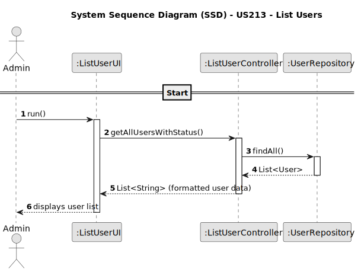

# US213 - List users

## 1. Requirements Engineering

### 1.1. User Story Description

As an Administrator, I want to be able to list the users of the backoffice, including their status, so that I can view all registered users and manage access.

### 1.2. Customer Specifications and Clarifications

- The list must include all users, regardless of whether they are active or inactive.
- The list must clearly indicate the status of each user ("Active" or "Inactive").
- Only Admins can access this feature.

**Clarifications**

Q: Are disabled users shown in the list?
A: Yes, and their status must be clearly visible.

Q: Can non-Admin users access the user list?
A: No, access is restricted to Admins only.

Q: Can this list be filtered or searched?
A: Filtering and search features are optional but encouraged for usability.

### 1.3. Acceptance Criteria

* AC1: Only Admin users can access the user listing.
* AC2: The system must display all users in the backoffice.
* AC3: Each user’s information must include name, email, role, and status (active/inactive).
* AC4: The user data must be retrieved from the database.
* AC5: The UI must provide clear visibility of each user's status.

### 1.4. Found out Dependencies

* Depends on US210 – Authentication and authorization (to restrict access to Admins).
* Depends on US212 – Enable/disable users (status info).
* Related to US211 – Register users (source of the users to be listed).
* NFR08 – Role-based access control must be enforced.

### 1.5 Input and Output Data

**Input Data:**

* Request to access user listing (triggered by Admin).

**Output Data:**

* Name
* Email
* Status

### 1.6. System Sequence Diagram (SSD)

### 1.7 Other Relevant Remarks

None
