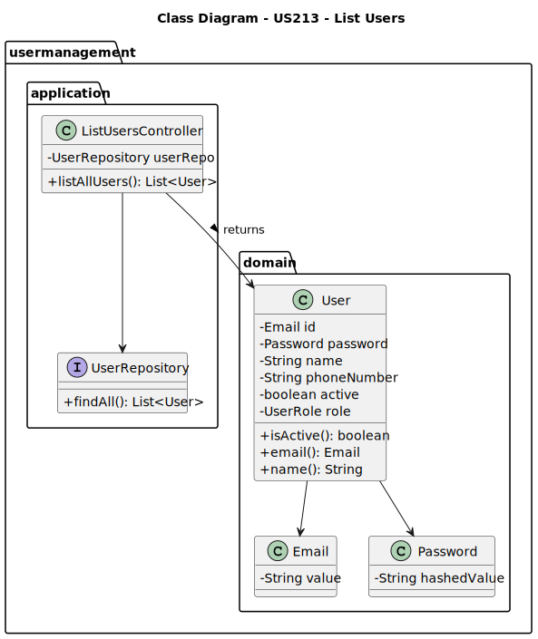
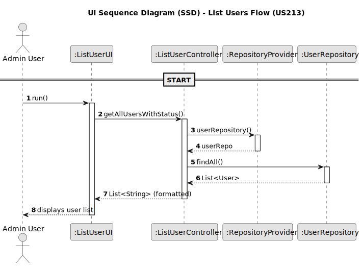

# US213 - List users

## 3. Design

### 3.1. Design Overview

The design for US213 allows system administrators to view a list of all users in the Shodrone back-office, including their name, email, and active status. This feature is essential for maintaining visibility and control over system access.
The process follows these high-level steps:
1. **Admin Request**: The administrator accesses the user listing interface from the UI.
2. **Authorization Check**: The system verifies that the requestor has Admin privileges.
3. **User Retrieval**: The application layer delegates to the service to fetch all users from the configured data source (either in-memory or database).
4. **Presentation**: The result is returned to the UI and displayed to the administrator.

The implementation follows a layered architecture aligned with Domain-Driven Design (DDD) principles:
- UI Layer: Displays the user list in tabular format using the EAPLI console or web backoffice interface.
- Application Layer: The ListUsersController orchestrates the listing operation and enforces access control.
- Domain Layer: Holds the User aggregate and relevant value objects (Email, Password). No domain logic is triggered for listing.
- Persistence Layer: Abstracted via UserRepository, which provides access to user data. It supports both in-memory and database persistence based on system configuration.
- Infrastructure Layer: Contains concrete implementations of the repository and any integration with the authentication/authorization infrastructure.

### 3.2. Sequence Diagrams
The following class diagram models the authentication domain and infrastructure. It includes the User, UserRole, AuthenticationRepository, AuthenticationController, and supporting classes such as AuthFacade and UserSession.

3.2.2. Sequence Diagram (SD)
The sequence diagram below illustrates the login process from user input to session creation and feedback:

### 3.3. Design Patterns (if any)

This use case applies the following Domain-Driven Design (DDD) and architectural patterns:

- Application Service
The ListUsersController coordinates the listing operation, ensuring access control and delegation to the appropriate service.

- Repository
The UserRepository abstracts the data retrieval logic, allowing the system to switch between in-memory and persistent storage transparently.

- Aggregate Root
The User aggregate represents the core user entity but is only read in this use case.

- Value Object
The Email is modeled as a value object to uniquely identify users.

- Role-Based Access Control (RBAC)
Admin-only access is enforced at the service/controller level.