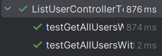

# US213 - List users

## 4. Tests

This section documents the unit tests and validation strategies used to verify the correctness of the user listing functionality, ensuring that user information is correctly retrieved, status is properly resolved, and edge cases (such as missing domain users) are handled gracefully.
You should include:

### **Test Cases**

1. **Unit Test: List Returns All Users with Correct Status**
    * **Description**: Verifies that a list of users is returned and each user is displayed with the correct active/inactive status.
    * **Expected Outcome**: Two entries are returned, one marked as ACTIVE, the other as INACTIVE.
    * **Test**:
   ```java
    @Test
    void testGetAllUsersWithStatusShowsCorrectFormat() {
        UserDTO user1 = new UserDTO("john@shodrone.app", "John", List.of(new UserRoleDTO("1", AuthenticationController.ROLE_ADMIN)));
        UserDTO user2 = new UserDTO("jane@shodrone.app", "Jane", List.of(new UserRoleDTO("2", AuthenticationController.ROLE_CRM_MANAGER)));

        User domainUser1 = mock(User.class);
        when(domainUser1.isActive()).thenReturn(true);

        User domainUser2 = mock(User.class);
        when(domainUser2.isActive()).thenReturn(false);

        when(mockAuthRepo.getAllUsers()).thenReturn(List.of(user1, user2));

        UserRepository mockUserRepo = (UserRepository) mockAuthRepo;
        when(mockUserRepo.ofIdentity(new Email("john@shodrone.app"))).thenReturn(Optional.of(domainUser1));
        when(mockUserRepo.ofIdentity(new Email("jane@shodrone.app"))).thenReturn(Optional.of(domainUser2));

        List<String> result = controller.getAllUsersWithStatus();

        assertEquals(2, result.size());
        assertTrue(result.get(0).contains("ACTIVE"));
        assertTrue(result.get(1).contains("INACTIVE"));
    }
    ```

2. **Unit Test: Domain User Not Found Falls Back to INACTIVE**
    * **Description**: Ensures that when a user is listed in the DTO list but does not exist in the domain repository, the system marks them as INACTIVE.
    * **Expected Outcome**: One entry returned, marked as INACTIVE.
    * **Test**:
   ```java
    @Test
    void testGetAllUsersWithStatusWhenUserNotFound() {
        UserDTO user = new UserDTO("ghost@shodrone.app", "Ghost", List.of(new UserRoleDTO("1", AuthenticationController.ROLE_ADMIN)));

        when(mockAuthRepo.getAllUsers()).thenReturn(List.of(user));

        UserRepository mockUserRepo = (UserRepository) mockAuthRepo;
        when(mockUserRepo.ofIdentity(new Email("ghost@shodrone.app"))).thenReturn(Optional.empty());

        List<String> result = controller.getAllUsersWithStatus();

        assertEquals(1, result.size());
        assertTrue(result.get(0).contains("INACTIVE"));
    }
    ```

3. **Unit Test: No Users Found**
    * **Description**: Confirms that the system handles an empty list of users without errors.
    * **Expected Outcome**: The result is an empty list.
    * **Test**:
   ```java
    @Test
    void testGetAllUsersWithStatusWhenNoUsersExist() {
        when(mockAuthRepo.getAllUsers()).thenReturn(List.of());

        List<String> result = controller.getAllUsersWithStatus();

        assertTrue(result.isEmpty());
    }
    ```

### Screenshot


## 5. Construction (Implementation)

**Controller**: ListUserController
The ListUserController handles the retrieval of all users registered in the system and formats them with their active/inactive status, interfacing between the UI and the authentication/domain layer.

**Responsibilities**
- Retrieves all users using the AuthenticationRepository.
- Resolves the status of each user by querying the corresponding User entity via UserRepository.
- Formats user data (name, email, status) into a readable format for the UI.
  
**DDD Principles**
- The User aggregate provides the method isActive() to expose its current status without leaking internal state.
- The controller acts as an Application Service, coordinating the use case flow without containing domain logic.
- Role-based access control is enforced in higher layers (UI/service), not directly in this controller.

**Persistence Layer**
- AuthenticationRepository: Provides access to the list of registered users as UserDTOs.
- UserRepository: Used to retrieve the domain User entity for each email and check its active status.
- Both repositories are resolved via RepositoryProvider, allowing seamless switching between in-memory and JPA implementations depending on the project configuration.