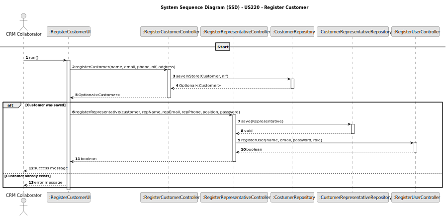

# US220 - Register customer

## 1. Requirements Engineering

### 1.1. User Story Description

As a CRM Collaborator, I want to register a customer and have the system automatically create a customer representative, so that the customer can submit show requests.

### 1.2. Customer Specifications and Clarifications

- The customer is an organization that includes information such as name, NIF (VAT number), address, email, and phone.
- Upon customer registration, a customer representative must also be created.
- The customer representative must be a valid system user with credentials to access the Customer App.
- The representative's name, email, phone, position, and password must be collected at the time of registration.
- CRM Collaborators are the only users allowed to register customers.
- The system must ensure the NIF is unique among all customers.
- The representative’s email must be unique in the system (as it is a user login).

**Clarifications**

Q: Can a customer have multiple representatives?
A: Yes, but this use case focuses only on the creation of the first representative at the time of customer registration.

Q: What if a customer already exists with the same NIF?
A: The registration must be blocked and an appropriate error message shown.

Q: Must the system send a welcome email or activation link?
A: Not required for this story, unless covered in the user management US.

### 1.3. Acceptance Criteria

* AC1: Only CRM Collaborators can access this functionality.
* AC2: The system must register a customer with all required fields (name, NIF, address, email, phone).
* AC3: The system must automatically register a customer representative.
* AC4: The representative must be created as a user in the system with a valid role and password.
* AC5: The system must ensure that NIF and email addresses are unique.
* AC6: Upon success, the system must display a confirmation message; upon failure, a descriptive error must be shown.

### 1.4. Found out Dependencies

* Depends on US210 – Authentication and authorization (for role checks).
* Depends on US211 – Register users (to reuse logic for creating representative as a user).
* Related to US221 – Add a customer representative (additional representatives).
* Related to US212 – Enable/disable users (manage representative status).
* NFR08 – Role-based access control must be enforced.

### 1.5 Input and Output Data

**Input Data:**

* Customer: Name, NIF, Email, Phone, Address
* Representative: Name, Email, Phone, Position, Password

**Output Data:**

* Confirmation of customer and representative creation.
* Failure messages for duplicates or validation errors.

### 1.6. System Sequence Diagram (SSD)

### 1.7 Other Relevant Remarks

None
