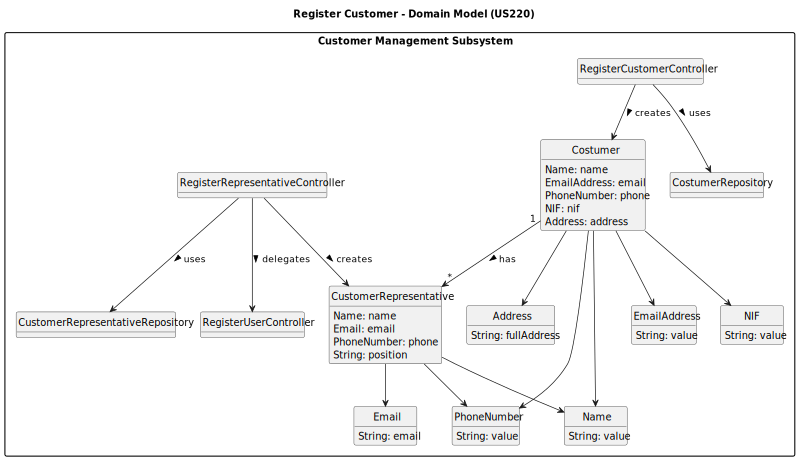

# US220 - Register customer

## 2. Analysis

### 2.1. Relevant Domain Model Excerpt 

### 2.2. Other Remarks

* Access Control: Only users with the CRM Collaborator role are authorized to register customers. This must be enforced at the UI and controller layers.
* Entity Relationship:
- A Costumer (customer) can have multiple CustomerRepresentatives.
- When a new customer is created, at least one representative must be created alongside.
- Each CustomerRepresentative is also a User in the system with the CUSTOMER_REPRESENTATIVE role.
* Validation Rules:
- The NIF of the customer must be unique.
- The email of the representative must be unique in the user repository.
- Strong validation of required fields (name, address, etc.) must occur before persistence.
* Persistence Behavior:
- The Costumer is stored via the CostumerRepository, using saveInStore(customer, nif).
- The CustomerRepresentative is stored via the CustomerRepresentativeRepository.
- The representative is also registered as a User via the RegisterUserController.
* Password Handling:
- The password for the representative is entered manually during registration and securely stored.
- Password rules must be enforced (minimum length, complexity).
* Error Handling:
- If the customer already exists (by NIF), the registration must be aborted with a clear error message.
- If the representative registration fails after the customer is created, the system should report partial success and potentially allow retry or rollback.
* Bootstrapping Support:
- The use case must also be achievable via a bootstrap process (as required in the spec).
