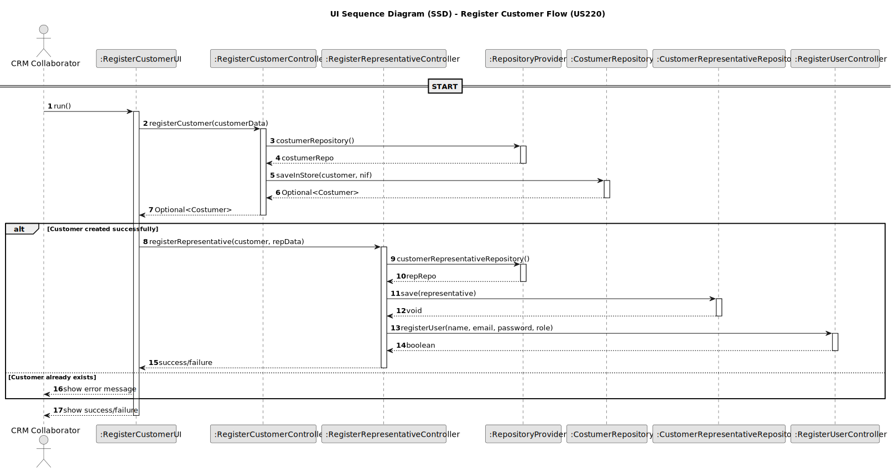

# US220 - Register Customer

## 3. Design

### 3.1. Design Overview

The design for US220 enables CRM Collaborators to register a new Customer and automatically associate a Customer Representative, who is also created as a system user with appropriate credentials and permissions.

This use case supports customer onboarding and represents a critical entry point for future interactions with the system, such as show requests and communication.

The process follows these high-level steps:
1. **Initiation**: The CRM Collaborator accesses the registration interface.
2. **Input**: The UI prompts for and validates customer and representative data.
3. **Customer Creation**: The application layer creates a new customer and stores it via the `CostumerRepository`.
4. **Representative Creation**: A `CustomerRepresentative` entity is created and stored.
5. **User Registration**: The representative is also registered as a system user with the role `Customer Representative`.
6. **Feedback**: The system confirms success or provides error messages in case of duplication or failure.

The implementation follows a layered architecture aligned with Domain-Driven Design (DDD) principles:
- **UI Layer**: `RegisterCustomerUI` handles the data collection and validation.
- **Application Layer**:
    - `RegisterCustomerController` registers the customer.
    - `RegisterRepresentativeController` registers the representative and invokes `RegisterUserController` to create the system user.
- **Domain Layer**: Contains the entities `Costumer`, `CustomerRepresentative`, and value objects like `Name`, `NIF`, `Address`, etc.
- **Persistence Layer**: Uses `CostumerRepository` and `CustomerRepresentativeRepository` to store data in memory or JPA.
- **Infrastructure Layer**: Provides the actual repository implementations and integration with the authentication system.

### 3.2. Sequence Diagram

The following sequence diagram illustrates the main interactions to register a customer and representative:

### 3.3. Design Patterns (if any)

This use case applies the following Domain-Driven Design (DDD) and architectural patterns:

- **Application Service**  
  `RegisterCustomerController` and `RegisterRepresentativeController` coordinate the registration workflow.

- **Repository**  
  `CostumerRepository` and `CustomerRepresentativeRepository` abstract data persistence.

- **Aggregate Root**  
  `Costumer` is the aggregate root in the customer domain.

- **Value Object**  
  Fields like `Name`, `EmailAddress`, `PhoneNumber`, `NIF`, and `Address` are implemented as value objects to enforce immutability and domain integrity.

- **Factory Pattern**  
  Controllers act as simple factories to instantiate domain entities from raw input.

- **RBAC (Role-Based Access Control)**  
  This operation is restricted to CRM Collaborators. Access must be checked at UI or controller level.

- **Optional (Fail-Safe)**  
  The return type of `registerCustomer` is an `Optional<Costumer>` to clearly signal success or failure.
