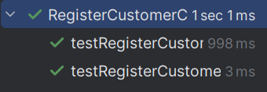

## 4. Tests

This section documents the unit tests and validation strategies used to verify the correctness of the customer registration functionality, ensuring that customer data is correctly saved, uniqueness is respected, and a representative is properly linked and registered as a system user.

### **Test Cases**

1. **Unit Test: Customer is Successfully Registered**
    * **Description**: Verifies that a valid customer is saved and returned properly.
    * **Expected Outcome**: A `Costumer` object is returned wrapped in an `Optional`.
    * **Test**:
   ```java
   @Test
   void testRegisterCustomerSuccessfully() {
       Name name = Name.valueOf("João","Pedro");
       EmailAddress email = EmailAddress.valueOf("joao.pedro@shodrone.app");
       PhoneNumber phone = new PhoneNumber("912345678");
       NIF nif = new NIF("123456789");
       Address address = new Address("Rua da Liberdade", "Lisboa", "3333-333", "Portugal");

       Costumer expected = new Costumer(name, email, phone, nif, address);

       when(mockRepository.saveInStore(any(Costumer.class), eq(nif)))
               .thenReturn(Optional.of(expected));

       domain.valueObjects.Name newName = Utils.convertName(name);
       Optional<Costumer> result = controller.registerCustomer(newName, email, phone, nif, address);

       assertTrue(result.isPresent());
       assertEquals(expected, result.get());
       verify(mockRepository).saveInStore(any(Costumer.class), eq(nif));
   }
   ```

2. **Unit Test: Customer Registration Fails Due to Duplicate NIF**
    * **Description**: Ensures the controller handles registration failure when the NIF already exists.
    * **Expected Outcome**: An empty `Optional` is returned and nothing is persisted.
    * **Test**:
   ```java
   @Test
   void testRegisterCustomerFailsReturnsEmpty() {
       Name name = Name.valueOf("Ana","Lima");
       EmailAddress email = EmailAddress.valueOf("ana.lima@shodrone.app");
       PhoneNumber phone = new PhoneNumber("912345679");
       NIF nif = new NIF("123456789");
       Address address = new Address("Av. Central", "Porto", "4444-444", "Portugal");

       when(mockRepository.saveInStore(any(Costumer.class), eq(nif)))
               .thenReturn(Optional.empty());

       domain.valueObjects.Name newName = Utils.convertName(name);
       Optional<Costumer> result = controller.registerCustomer(newName, email, phone, nif, address);

       assertTrue(result.isEmpty());
       verify(mockRepository).saveInStore(any(Costumer.class), eq(nif));
   }
   ```

3. **Unit Test: Representative is Registered and Saved with Success**
    * **Description**: Ensures that the representative is stored and registered as a system user with the correct role.
    * **Expected Outcome**: Returns true and all involved services are invoked.
    * **Test**:
   ```java
   @Test
   void testRegisterRepresentativeSuccess() {
       Name name = new Name("Ana Lima");
       Email email = new Email("ana.lima@shodrone.app");
       PhoneNumber phone = new PhoneNumber("912345679");
       String position = "Sales Lead";
       String password = "securePassword123";

       Costumer costumer = new Costumer(
               eapli.framework.infrastructure.authz.domain.model.Name.valueOf("Ana", "Lima"),
               EmailAddress.valueOf(email.getEmail()),
               phone,
               new NIF("123456789"),
               new Address("Rua X", "Porto", "4000-123", "Portugal")
       );

       when(mockUserController.registerUser(anyString(), anyString(), anyString(), anyString()))
               .thenReturn(true);

       boolean result = controller.registerRepresentative(costumer, name, email, phone, position, password);

       assertTrue(result);
       verify(mockRepository).save(any(CustomerRepresentative.class));
       verify(mockUserController).registerUser(
               eq(name.name()),
               eq(email.getEmail()),
               eq(password),
               eq(AuthenticationController.ROLE_CUSTOMER_REPRESENTATIVE)
       );
   }
   ```

### Screenshot




## 5. Construction (Implementation)

**Controllers**: `RegisterCustomerController`, `RegisterRepresentativeController`  
These controllers work together to register a new `Costumer` in the system and immediately create and associate a `CustomerRepresentative`, who is also registered as a `User` with the appropriate role.

**Responsibilities**

- `RegisterCustomerController`:
    - Creates a new `Costumer` using the provided value objects (`Name`, `EmailAddress`, `PhoneNumber`, `NIF`, `Address`).
    - Delegates persistence to the `CostumerRepository`.
    - Returns an `Optional<Costumer>` indicating success or failure (e.g., duplicate NIF).

- `RegisterRepresentativeController`:
    - Creates and stores a new `CustomerRepresentative` linked to the customer.
    - Registers the representative as a system user by invoking `RegisterUserController`.
    - Ensures the representative has the role `Customer Representative`.

**DDD Principles**

- `Costumer` is the aggregate root of the customer domain, encapsulating the customer's identity and attributes.
- `CustomerRepresentative` is an associated entity that represents users acting on behalf of the customer.
- Value objects such as `Name`, `EmailAddress`, `PhoneNumber`, `NIF`, and `Address` ensure immutability and domain correctness.
- The controllers act as **Application Services**, coordinating domain creation and delegating persistence.
- Domain logic is kept within the aggregates, while the controllers focus on orchestration.
- Separation of concerns is respected: no UI or persistence logic exists in the domain layer.

**Persistence Layer**

- `CostumerRepository`: Abstracts the storage of customer entities and provides a `saveInStore()` method that prevents duplicates via NIF.
- `CustomerRepresentativeRepository`: Handles persistence of customer representatives.
- `RepositoryProvider`: Provides access to the appropriate repository implementation (in-memory or JPA).
- `RegisterUserController`: Integrates with the authentication infrastructure to create system users with defined roles.
