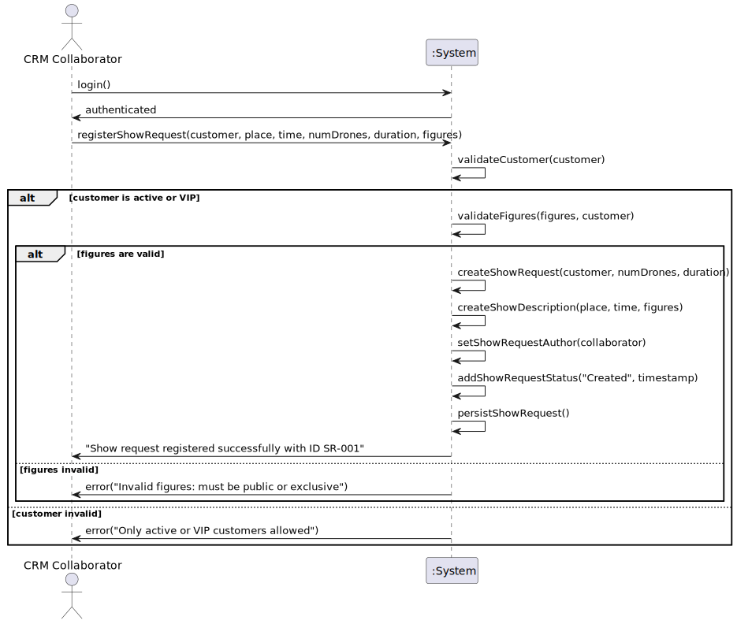

# US230 - Register Show Request

## 1. Requirements Engineering

### 1.1. User Story Description

As a CRM Collaborator, I want to register a show request so that I can initiate the process of scheduling a drone show for a customer. The show request must capture essential details as defined in the domain model, including the customer, place, time, number of drones, duration, a description of the show (sequence of figures and exclusivity requirements), and workflow information (author, creation timestamp, status history). This ensures the request can be processed, validated, and eventually simulated or executed.

### 1.2. Customer Specifications and Clarifications

The following specifications are derived from the requirements document (Section 3.1.4, Page 10) and the DDD model:

- A `ShowRequest` must include:
    - **Customer**: The customer requesting the show (must be active or VIP, per Section 3.1.2, Page 9).
    - **Place**: The location of the show (part of `ShowDescription`, e.g., "Lisbon Central Park").
    - **Time**: The scheduled date and time (part of `ShowDescription`, e.g., "2025-06-15 20:00").
    - **Number of Drones**: The number of drones required (e.g., 50).
    - **Duration**: The duration of the show in minutes (e.g., 30 minutes).
    - **Show Description**: A sequence of figures (`FigureExecution`) with exclusivity requirements (figures must be public or exclusive to the customer, per Section 3.1.3, Page 9).
    - **Workflow Information**:
        - Author (`ShowRequestAuthor`): The CRM Collaborator who registered the request.
        - Creation timestamp (`creationDate`).
        - Status history (`ShowRequestStatus`): Initialized as "Created" with a timestamp.

**Clarifications**:
- **Q: What happens if the customer is not active or VIP?**
    - A: The system rejects the request with an error: "Only active or VIP customers can register show requests."
- **Q: How should the place and time be specified?**
    - A: Place is a free-text field (non-empty), and time must be in "YYYY-MM-DD HH:MM" format.
- **Q: Can the same figure be used multiple times in the sequence?**
    - A: Yes, the sequence (`FigureExecution`) can include repeated figures (e.g., "Circle -> Spiral -> Circle").

### 1.3. Acceptance Criteria

- **AC1**: The CRM Collaborator must be authenticated and authorized to register a show request (role-based access).
- **AC2**: The `ShowRequest` must include all required attributes: `customer`, `numberOfDrones`, `duration`, `creationDate`, `status` ("Created"), and a `ShowDescription`.
- **AC3**: The `ShowDescription` must include `place`, `time`, and a sequence of `FigureExecution` with valid figures.
- **AC4**: The customer must be active or VIP (checked via `Customer.status`); otherwise, the system rejects the request with an error.
- **AC5**: All figures in the `ShowDescription` must be public (`Figure.isPublic = true`) or exclusive to the customer (`Figure.exclusivity` matches the customer); otherwise, the system rejects the request with an error.
- **AC6**: The `place`, `time`, `numberOfDrones`, and `duration` fields must not be empty and must be in valid formats (e.g., time as "YYYY-MM-DD HH:MM", `numberOfDrones` as a positive integer).
- **AC7**: The `ShowRequestStatus` list must be initialized with a "Created" status, including the timestamp and author (`ShowRequestAuthor`).
- **AC8**: The `ShowRequest` must be persisted RDBMS (NFR07).
- **AC9**: After successful registration, the system must display a confirmation message: "Show request registered successfully with ID [ShowRequest.id]."

### 1.4. Found out Dependencies

### 1.5 Input and Output Data

**Input Data:**

- Typed data:
    - Place (string, e.g., "Lisbon Central Park")
    - Time (string, format "YYYY-MM-DD HH:MM", e.g., "2025-06-15 20:00")
    - Number of drones (integer, e.g., 50)
    - Duration (integer, minutes, e.g., 30)
- Selected data:
    - Customer (from a list of active/VIP customers, based on `Customer.status`)
    - Sequence of figures (from a list of public or customer-exclusive figures, based on `Figure.isPublic` and `Figure.exclusivity`)

**Output Data:**

- Show request ID (generated by the system, e.g., `ShowRequest.id = "SR-001"`)
- Confirmation message (e.g., "Show request registered successfully with ID SR-001")

### 1.6. System Sequence Diagram (SSD)

Below is the PlantUML source code for the System Sequence Diagram (SSD) of US230, showing the interaction between the CRM Collaborator, the system, and external entities (e.g., authentication, customer/figure data).

### 1.7 Other Relevant Remarks

- The system should enforce input validation for all fields (e.g., non-empty `place`, valid `time` format, positive `numberOfDrones`) to ensure data integrity.
- The `ShowRequestAuthor` should automatically capture the authenticated CRM Collaborator’s details (e.g., `userId`, `username`) for traceability.
- The team should consider adding a notification mechanism (e.g., email to the customer) after registration, which could be addressed in a future user story (e.g., US240 in Sprint 3).
- The `ShowRequest`’s `status` attribute should support future transitions (e.g., "Updated", "Proposed"), as seen in US236 and potential future user stories.

