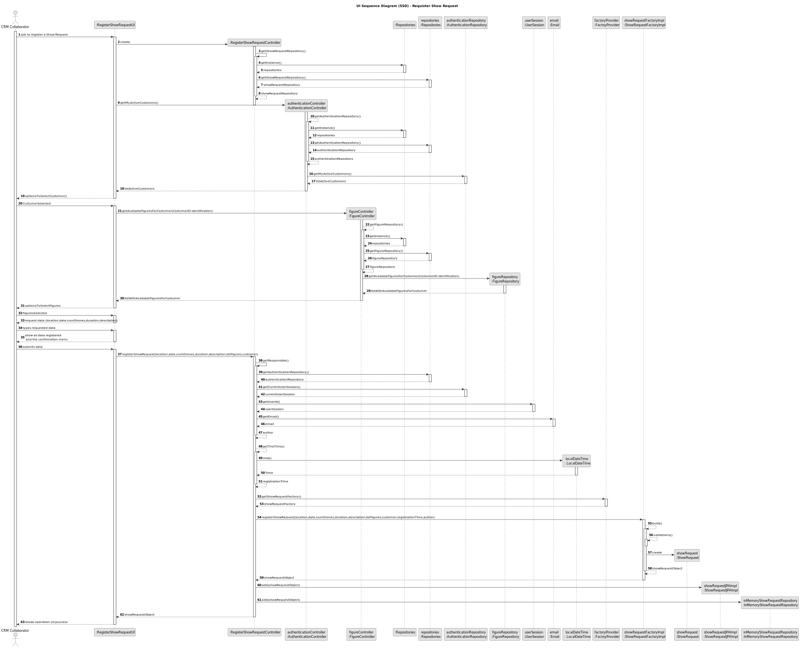

# US230 - Register Show Request

## 3. Design

### 3.1. Design Overview

The design for US230 focuses on implementing the registration of a `ShowRequest` by a CRM Collaborator within the Shodrone back-office application. The process involves the following high-level steps:

1. **Authentication and Authorization**: The CRM Collaborator logs into the system, and their role is verified (via US210, NFR08: role-based access).
2. **User Interaction**: The CRM Collaborator interacts with a console-based UI to input the show request details, including customer selection, place, time, number of drones, duration, and a sequence of figures.
3. **Business Logic Execution**: An application service (`RegisterShowRequestService`) orchestrates the registration process, performing validations (e.g., customer status, figure exclusivity) and creating the `ShowRequest` entity with its associated entities (`ShowDescription`, `FigureExecution`, `ShowRequestAuthor`, `ShowRequestStatus`).
4. **Persistence**: The `ShowRequest` and related entities are persisted using repositories (`ShowRequestRepository`, `CustomerRepository`, `FigureRepository`) in both in-memory and RDBMS modes (NFR07).
5. **Feedback**: The system provides a confirmation message to the CRM Collaborator (e.g., "Show request registered successfully with ID SR-001").

The design follows a layered architecture:
- **UI Layer**: Handles user interaction via EAPLI’s console UI.
- **Application Layer**: Contains the `RegisterShowRequestService`, which coordinates the use case logic.
- **Domain Layer**: Includes entities (`ShowRequest`, `Customer`, `ShowDescription`, `Figure`, etc.) and value objects, enforcing business rules.
- **Persistence Layer**: Uses EAPLI’s repository pattern (`ShowRequestRepository`, etc.) for data persistence.
- **Infrastructure Layer**: Leverages EAPLI’s authentication (`AuthFacade`) and persistence mechanisms.

### 3.2. Sequence Diagrams

#### 3.2.1. Class Diagram

#### 3.2.2. Sequence Diagram (SD)
The Sequence Diagram (SD) below provides a detailed view of the internal interactions within the system to register a `ShowRequest`. It includes the UI, application service, domain entities, and repositories.

### 3.3. Design Patterns (if any)
The following design patterns and principles have been applied throughout the system design to ensure maintainability, scalability, and adherence to best practices:

### Domain-Driven Design (DDD) Patterns

- **Application Service**  
  The `RegisterShowRequestService` implements the Application Service pattern by orchestrating the use case logic without containing domain-specific business rules itself. This separation promotes a clear layering between application and domain concerns, improving modularity and testability.

- **Repository**  
  All access to persistent storage is mediated through Repository interfaces, such as `ShowRequestRepository`, abstracting the underlying database technology. This ensures that the domain model remains persistence-agnostic (supporting Non-Functional Requirement NFR07) and fosters clean architecture boundaries.

- **Factory**  
  Entity and aggregate creation is managed through factories (either explicit classes or factory methods), guaranteeing that all invariants are correctly established at construction time. This approach prevents partially constructed objects from entering the system.

- **Aggregate Root**  
  Entities such as `ShowRequest` serve as Aggregate Roots, enforcing encapsulation within aggregates. All references to internal entities or value objects are strictly controlled through the root, ensuring transactional consistency and preserving aggregate invariants.

### Gang of Four (GoF) Design Patterns

- **Decorator**  
  The Decorator pattern is utilized to implement layered validation logic within application services. By composing validators dynamically, new validation behaviors can be added without modifying existing code, supporting the Open/Closed Principle (OCP).

- **Factory Method** (implicit)  
  Factory methods are used internally to encapsulate the instantiation logic of complex objects, hiding construction details from the client and promoting flexibility.

### SOLID Principles

- **Single Responsibility Principle (SRP)**  
  Each class and service in the design is responsible for a single functionality. For example, `RegisterShowRequestService` handles orchestration but delegates domain validation and persistence responsibilities.

- **Open/Closed Principle (OCP)**  
  The use of Decorators and Factory methods ensures that system behavior can be extended without modifying existing code, promoting safer and more maintainable extensions.

- **Liskov Substitution Principle (LSP)**  
  Interfaces and abstract classes, such as `DomainEntity` and `AggregateRoot`, guarantee that derived classes can be used interchangeably without affecting system correctness.

- **Interface Segregation Principle (ISP)**  
  The system avoids large, bloated interfaces by clearly defining small, role-specific contracts such as `Repository` interfaces.

- **Dependency Inversion Principle (DIP)**  
  High-level modules (application services) depend on abstractions (repositories, domain services), not on concrete implementations, facilitating dependency injection and promoting a loosely coupled architecture.

