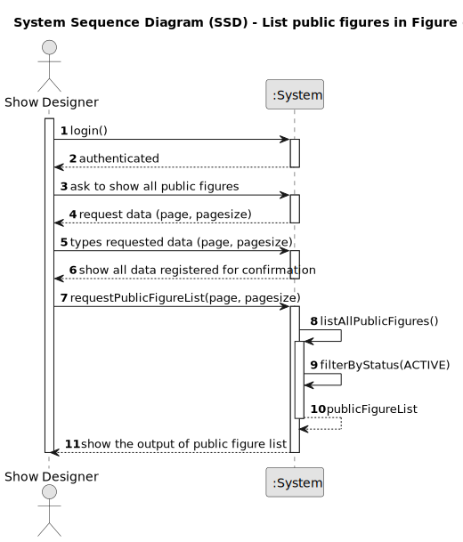

# US231 - List Public Figures in Figure Catalogue

## 1. Requirements Engineering

### 1.1. User Story Description

As a CRM Collaborator or Show Designer, I want to list all public figures in the figure catalogue so that I can select appropriate figures when creating or editing a show request. This functionality ensures that only valid, reusable content (non-exclusive figures) is presented for general use across customers.

### 1.2. Customer Specifications and Clarifications

The following specifications are derived from the requirements document and the DDD model:

- A **public figure** is defined as a `Figure` entity where `Figure.isPublic = true`.
- Only **active figures** should be listed (`Figure.status = Active`).
- Each figure includes:
    - **ID** (e.g., "FIG-101")
    - **Name** (e.g., "Spiral")
    - **Description**
    - **Category**
    - **version**
    - **availability** (`public`, `exclusive`)
    - **DSL** (optional but recommended)
    - **Status**: Automatically initialized as `Active`

**Clarifications**:
- **Q: Should exclusive figures appear in this list?**
    - A: No, only active and public figures should be displayed.
- **Q: Can the figures be reused across multiple customers?**
    - A: Yes. Public figures are reusable and not exclusive to any customer.
- **Q: Can the figures be filtered or sorted?**
    - A: Not in this version (covered by US232 – Search Figure Catalogue), though pagination may be included as a non-functional requirement.

**Forum Questions**:
> **Question:** Os utilizadores devem ver todas as figuras públicas, ou apenas de determinadas categorias?
>
> **Answer:** Devem ver todas as figuras públicas ativas, independentemente da categoria. Filtragem por categoria pode ser implementada em US232.

### 1.3. Acceptance Criteria

- **AC1**: Only authenticated CRM Collaborators and Show Designer can access the list (authorization via role-based access).
- **AC2**: The system must retrieve and list all `Figure` entities where `isPublic = true` and `status = Active`.
- **AC3**: Each listed figure must display its ID and optionally a name, a description, a duration, a category and a dsl.
- **AC4**: The list must be paginated if the number of results exceeds a configured limit (e.g., 20 per page).
- **AC5**: If no public figures are available, the system displays: "No public figures available."

### 1.4. Found out Dependencies

- **US210**: Authentication and user management – Required to verify the identity and role of the CRM Collaborator accessing the catalogue.
- **US233**: Add Figure to the catalogue – Used to populate the catalogue with public figures.
- **US234**: Decommission Figure – Used to change the `status` of a figure to inactive, affecting visibility in this list.
- **US245–US248**: Figure category management – Used to associate a given category to a figure.

### 1.5 Input and Output Data

**Input Data:**

- typed data:
    - `page` (integer, default: 1)
    - `pageSize` (integer, default: 20)

**Output Data:**

- List of `Figure` records with:
    - `Figure.id`
    - `Figure.name`
    - `Figure.description`
    - `Figure.version`
    - `Figure.availability`
    - `Figure.category.name`
    - `Figure.dsl`
    - `Figure.status`
  
### 1.6. System Sequence Diagram (SSD)

Below is the PlantUML source code for the System Sequence Diagram (SSD) of US231, showing the interaction between the Show Designer, the system, and external entities (e.g., authentication, customer/figure data).

### 1.7 Other Relevant Remarks

