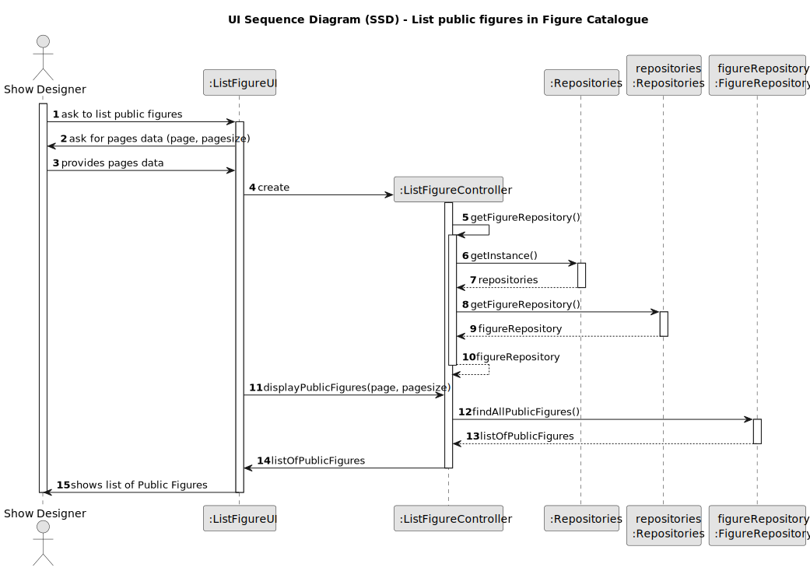

## 3. Design

### 3.1. Design Overview

The design for the "List Public Figures in Figure Catalogue" functionality follows the same layered and modular architectural principles as outlined in the project guidelines. The process is initiated by the user (e.g., a visitor or authenticated user) via the user interface, which delegates the listing request to a dedicated controller. The controller interacts with the query layer or repository to retrieve a filtered, paginated list of public figures.

Key behaviors and responsibilities include:
- Only authenticated users with the **Show Designer** or **CRM Collaborator** role can access the public figure listing.
- Supporting **pagination** to ensure organization.
- The controller filters results to include only figures currently active.
- Data retrieval is handled through a repository layer, which separates domain logic from the specifics of data storage and supports both temporary (in-memory) and persistent (database) storage options.
- The user interface presents a clean list of public figures, typically showing key attributes such as `id`, `name`, `category name`, ... .

This design promotes clarity, organized, and adherence to both functional and non-functional requirements, while remaining consistent with the project's overall architectural principles

### 3.2. Sequence Diagram(s)

The sequence diagram illustrates the flow for listing public figures:
- The Show Designer initiates the request via the UI.
- The UI delegates the request to the appropriate controller.
- The controller obtains the appropriate repository from the persistence context, using a factory for decoupling.
- The controller invokes the repository method to retrieve all active and public figure.
- The controller constructs the pagination parameters if added.
- The repository returns the list of figures to the controller.
- The list of figures is returned to the UI.
- The UI shows the results with support for pagination to the user.

### 3.3. Design Patterns (if any)

- **Controller Pattern:** Acts as the intermediary between the user interface and the application's core logic, concentrating business rules and coordinating data flow.
- **Separation of Concerns:** Ensures each layer—presentation, application logic, domain, and persistence—has distinct and focused responsibilities.
- **Factory Pattern:** Facilitates the instantiation of repositories, encouraging loose coupling and simplifying configuration and testing.
- **SOLID and GoF Principles:** The architecture incorporates SOLID design tenets and leverages well-established Gang of Four patterns to enhance flexibility, clarity, and long-term maintainability.
- **Repository Pattern:** Provides an abstraction layer over data storage, allowing domain logic to function independently of the underlying persistence mechanism.

This design guarantees reliability, transparency, and adherence to both functional and non-functional requirements
