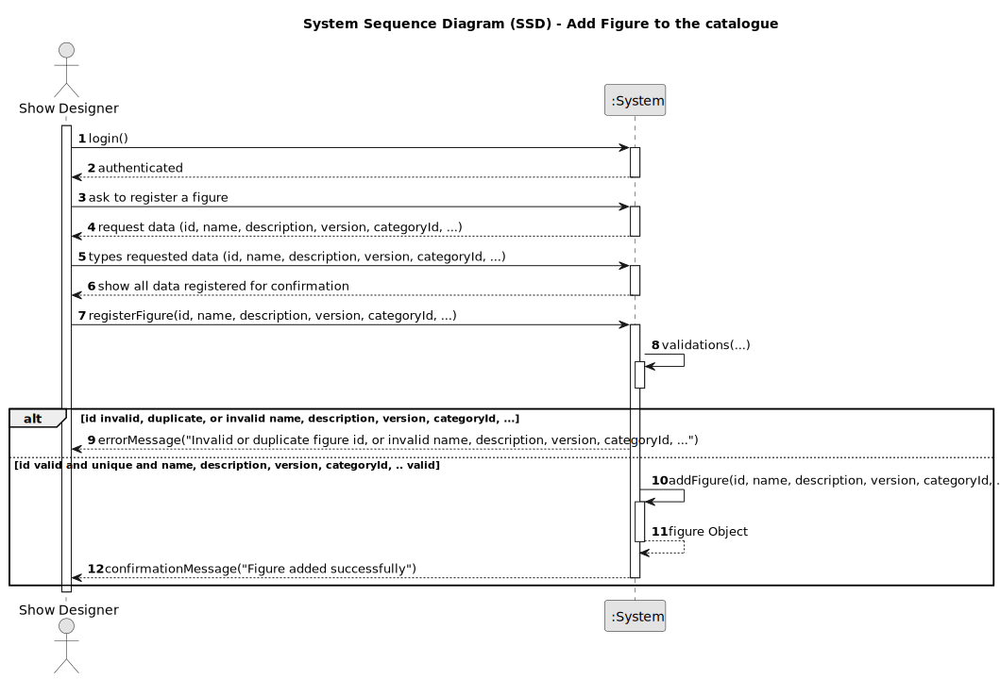

# US233 - Add Figure to the Catalogue

## 1. Requirements Engineering

### 1.1. User Story Description

As a Show Designer, I want to add new figures to the catalogue so that they can be used in drone shows by CRM Collaborators when creating or editing show requests. Each figure must include key descriptive and technical attributes and be assigned a visibility scope (public or customer-exclusive).

### 1.2. Customer Specifications and Clarifications

The following specifications are derived from the requirements document and the DDD model:

- A `Figure` must have:
    - **ID** (e.g., "FIG-101")
    - **Name** (e.g., "Spiral")
    - **Description**
    - **Category**
    - **version**
    - **availability** (`public`, `exclusive`)
    - **DSL** (optional but recommended)
    - **Status**: Automatically initialized as `Active`

**Clarifications**:
- **Q: Can multiple figures share the same name?**
    - A: Only if one or more are inactive. Active figure names must be unique.
- **Q: Can a figure be both public and exclusive?**
    - A: No. Visibility must be exclusive or public, not both.
- **Q: Who can add figures?**
    - A: Only authenticated users with the Catalogue Manager role.

**Forum Questions**:
> **Question:** Uma figura pública pode mais tarde tornar-se exclusiva de um cliente?
>
> **Answer:** Não, as figuras têm visibilidade definida na criação. Mudanças de visibilidade estão fora do escopo deste user story.

### 1.3. Acceptance Criteria

- **AC1**: Only authenticated Show Designer can add new figures.
- **AC2**: The system must enforce that:
    - `name` is non-empty and unique among active figures.
    - `isPublic` is explicitly set.
    - If not public, `exclusivity` must reference a valid, active customer.
- **AC3**: If a `category` is provided, it must be valid and active.
- **AC4**: The `status` of the new figure is automatically set to `Active`.
- **AC5**: The figure is persisted and given a unique identifier (e.g., `Figure.id = "FIG-501"`).
- **AC6**: Upon success, the system returns a confirmation message: "Figure added successfully with ID [Figure.id]."

### 1.4. Found out Dependencies

- **US210**: Authentication – Required to validate the Catalogue Manager.
- **US220**: List customers – Required to assign exclusivity when the figure is not public.
- **US234**: Decommission Figure – Impacts the visibility of figures (`status = Active`).
- **US245–US248**: Figure category management – Used to validate the assigned category.

### 1.5 Input and Output Data

**Input Data:**

- typed data:
    - `name` (string, required)
    - `description` (string, optional)
    - `version` (string)
    - `dls` (optional)
    - 
- selected data:
    - `categoryId` (integer, optional)
    - `availability` (enum: `public`, `exclusive`)
    - `exclusivityCustomerId` (string, optional)

**Output Data:**

* Confirmation of successful creation (success message and figure details), or
* Error message indicating reason for failure (e.g., duplicate name, invalid input).

### 1.6. System Sequence Diagram (SSD)

### 1.7 Other Relevant Remarks

<!-- Add any additional remarks or notes here -->
