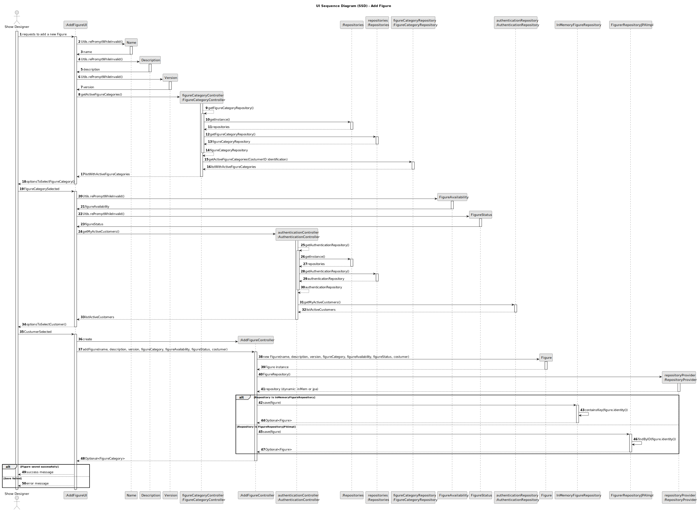

## 3. Design

### 3.1. Design Overview

The design for the *"Search Figure Catalogue"* functionality adheres to modular architectural principles outlined in the project guidelines. The process is initiated by the **Show Designer** via the UI, which allows them to specify search parameters such as `id`, `name`, `description`, `version`, `availability`, `category`, `dsl`, `status`, as well as pagination details like `page` and `pagesize`. The UI then forwards this data to a dedicated controller responsible for retrieving the relevant figures.

Key behaviors and responsibilities:
- **Authenticated Access:** Only users with the **Show Designer** or **CRM Collaborator** role can initiate the search.
- **Dynamic Search:** The controller allows flexible filtering based on various criteria, such as figure `id`, `name`, and `status`.
- **Pagination Support:** To improve usability, the results are paginated, reducing the amount of data displayed at once and improving performance.
- **Repository Layer Interaction:** The controller interacts with the repository to retrieve data, with the repository abstracting the data access logic from the rest of the application.
- **Active Figures:** The controller ensures only figures marked as active and public are returned in the search results.
- **Repository Pattern:** The design follows the repository pattern to encapsulate the logic for data access, supporting both in-memory and persistent storage.

The architecture is designed for flexibility, clarity, and modularity, aligning with both functional and non-functional requirements. It ensures separation of concerns, efficient data retrieval, and proper user access control.

---

### 3.2. Sequence Diagram

The sequence diagram illustrates the flow for searching figures in the catalogue:
1. The **Show Designer** requests to search for figures via the UI.
2. The UI prompts the user to input optional filtering and pagination parameters.
3. The **Show Designer** provides the requested search parameters.
4. The UI creates and invokes the `ListSearchedFigureController`.
5. The controller obtains the repository instance using the factory pattern and retrieves the appropriate `FigureRepository` from the repository singleton.
6. The controller constructs the query based on the user's search and pagination inputs.
7. The controller invokes the repository to retrieve the filtered list of figures.
8. The list of figures is returned to the UI.
9. The UI displays the search results with pagination support, showing only the relevant figures based on the provided criteria.

---

### 3.3. Design Patterns Used

- **Controller Pattern:** Acts as the intermediary between the UI and the application's core logic. The controller handles user requests, applies business logic, and coordinates data flow between layers.
- **Factory Pattern:** Used to instantiate repositories, promoting decoupling and enhancing maintainability by simplifying configuration and testing.
- **Repository Pattern:** Provides an abstraction layer over data storage, allowing for different storage mechanisms (e.g., in-memory or database) without affecting the business logic.
- **Separation of Concerns:** Ensures that each layer—presentation, business logic, and data persistence—has its own distinct responsibilities, allowing for easier maintenance and scalability.
- **SOLID and GoF Principles:** The architecture adheres to SOLID design principles and incorporates well-established Gang of Four design patterns to ensure high-quality, maintainable, and flexible code.

This design ensures clarity, modularity, and adherence to both functional and non-functional requirements. It maintains flexibility for future enhancements and scalability in terms of both functionality and performance.
