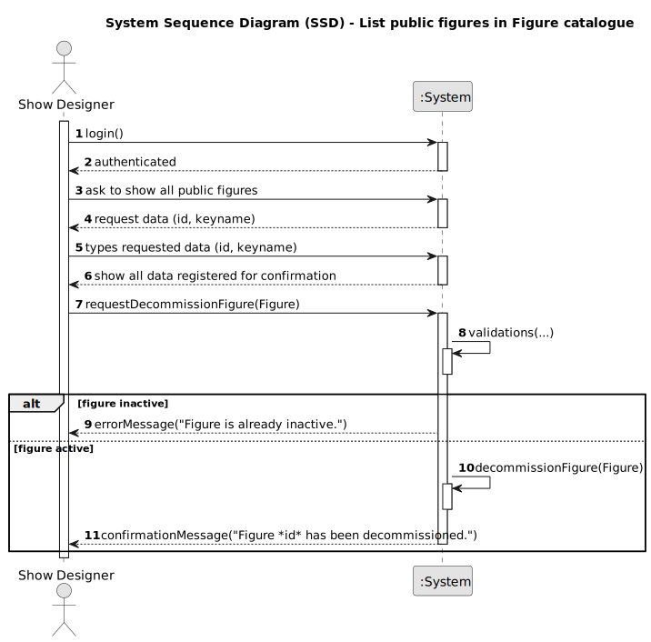

# US234 - Decommission Figure

## 1. Requirements Engineering

### 1.1. User Story Description

As a Show Designer, I want to decommission a figure so that it is no longer available for use in show requests or the public catalogue. This ensures outdated or inappropriate figures can be effectively removed from active circulation.

### 1.2. Customer Specifications and Clarifications

The following specifications are derived from the requirements document and domain model:

- To **decommission** a figure means updating its `Figure.status` from `Active` to `Inactive`.
- Only figures with status `Active` can be decommissioned.
- The operation must be auditable (e.g., track who decommissioned the figure and when).
- The figure’s data remains stored in the system but is excluded from lists of active/public figures.
- Decommissioning a figure **does not delete** it; it only hides it from standard usage and visibility.
- This action can affect ongoing or future show requests that attempt to reference this figure.

**Clarifications**:
- **Q: Can any user decommission a figure?**
  - A: No. Only users with the Show Designer role can perform this action.
- **Q: What if a figure is already inactive?**
  - A: The operation is rejected with a clear error message.
- **Q: Is a reason required to decommission a figure?**
  - A: Optional for now, but may be included in future audit improvements.

**Forum Questions**:
> **Question:** O que acontece às figuras desativadas? Ainda podem ser vistas por algum utilizador?
>
> **Answer:** Não, figuras desativadas não aparecem em nenhuma listagem pública ou ativa, mas continuam armazenadas no sistema para histórico e auditoria.

### 1.3. Acceptance Criteria

- **AC1**: Only authenticated Show Designers can perform the decommission operation.
- **AC2**: The system must validate that the figure is in `Active` status before allowing decommissioning.
- **AC3**: A confirmation message is displayed to the user upon successful decommissioning.
- **AC4**: If a figure is already inactive or not found, a relevant error message is shown.

### 1.4. Found out Dependencies

- **US210**: Authentication and user management – To identify and authorize Show Designers.
- **US231**: Listing public figures – Depends on `status = Active`; decommissioned figures are no longer included.
- **US233**: Add Figure to the catalogue – Source of figures that may later be decommissioned.

### 1.5 Input and Output Data

**Input Data:**

- Typed data:
  - `Figure.id` (string, Optional) 

- Selected data
  - `Figure.name` (string, Optional)
  
**Output Data:**

- Success: `"Figure FIG-101 has been decommissioned."`
- Error: Appropriate error message (e.g., "Figure is already inactive." )

### 1.6 System Sequence Diagram (SSD)

Below is the PlantUML source code for the System Sequence Diagram (SSD) of US234, showing the interaction between the Show Designer, the system, and supporting services:

### 1.7 Other Relevant Remarks

