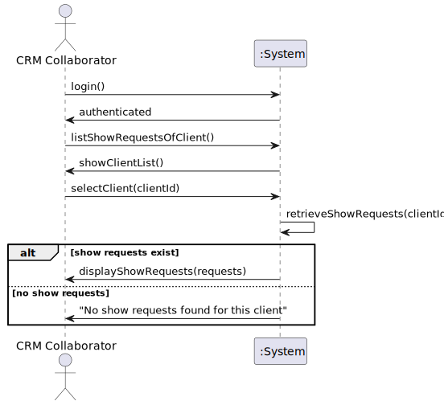

# US235 - List Show Requests of Client

## 3. Design

### 3.1. Design Overview

The design for US235 focuses on implementing the functionality to list all show requests associated with a specific client within the Shodrone back-office application, using the EAPLI framework (NFR07). The process involves the following high-level steps:

1. **Authentication and Authorization**: The CRM Collaborator (or CRM Manager) logs into the system, and their role is verified (via US210, NFR08: role-based access).
2. **User Interaction**: The user interacts with a console-based UI (provided by EAPLI) to select a client from a list of all clients and view their associated show requests.
3. **Business Logic Execution**: An application service (`ListShowRequestsService`) orchestrates the listing process, retrieving the client’s show requests, sorting them by `creationDate` (descending), and formatting the output with details like request ID, place, time, number of drones, duration, and current status.
4. **Persistence**: The `ShowRequestRepository` and `CustomerRepository` are used to retrieve data from both in-memory and RDBMS modes (NFR07).
5. **Feedback**: The system displays the list of show requests in a formatted table, or a message if no requests are found (e.g., "No show requests found for this client").

The design follows a layered architecture:
- **UI Layer**: Handles user interaction via EAPLI’s console UI (`ListShowRequestsUI`).
- **Application Layer**: Contains the `ListShowRequestsService`, which coordinates the use case logic.
- **Domain Layer**: Includes entities (`Customer`, `ShowRequest`, `ShowDescription`, `ShowRequestStatus`) and enforces business rules.
- **Persistence Layer**: Uses EAPLI’s repository pattern (`ShowRequestRepository`, `CustomerRepository`) for data access.
- **Infrastructure Layer**: Leverages EAPLI’s authentication (`AuthFacade`) and persistence mechanisms.

### 3.2. Sequence Diagrams

#### 3.2.1. Class Diagram

#### 3.2.2. Sequence Diagram (SD)
The Sequence Diagram (SD) below provides a detailed view of the internal interactions within the system to list show requests for a client. It includes the UI, application service, domain entities, repositories, and authentication components.

### 3.3. Design Patterns (if any)

The design for US235 leverages several design patterns, primarily those provided by the EAPLI framework and common in domain-driven design (DDD):

- **Application Service Pattern**:
  - The `ListShowRequestsService` acts as an application service, orchestrating the use case logic. It coordinates interactions between the UI, domain entities, and repositories, handling tasks like retrieving show requests, sorting, and formatting the output.

- **Repository Pattern**:
  - Repositories (`ShowRequestRepository`, `CustomerRepository`) are used to abstract persistence logic, supporting both in-memory and RDBMS modes (NFR07). This pattern decouples the domain layer from the persistence layer, allowing for flexible data access (e.g., `findByCustomer` method in `ShowRequestRepository`).

- **Iterator Pattern (Implicit in EAPLI)**:
  - The `ShowRequestRepository` returns a collection of `ShowRequest` entities (e.g., as an `Iterable` or `List`), which the `ListShowRequestsService` iterates over to process each request (e.g., to retrieve the `ShowDescription` and current status). This leverages the Iterator pattern for traversing the collection.

- **Decorator Pattern (for Formatting)**:
  - The `ListShowRequestsService` applies a lightweight Decorator-like approach to format the show requests for display. It "decorates" the raw `ShowRequest` data by adding formatted strings (e.g., combining `place` and coordinates, extracting the most recent status) before passing the result to the UI.

- **Strategy Pattern (Potential Future Use)**:
  - While not implemented in US235, the system could use the Strategy pattern for future enhancements, such as supporting different sorting strategies (e.g., by status or time instead of `creationDate`). This would involve defining a `SortStrategy` interface and implementations like `SortByCreationDateDescending`.

### Explanation of the Design Section

#### 3.1. Design Overview
- Provides a high-level view of the design, outlining the steps involved in listing show requests:
  - Authentication ensures role-based access (NFR08).
  - The UI allows the user to select a client.
  - The `ListShowRequestsService` retrieves and formats the show requests.
  - Repositories handle data access.
  - The UI displays the results.
- Describes the layered architecture (UI, Application, Domain, Persistence, Infrastructure), aligning with EAPLI’s structure and ensuring separation of concerns.

#### 3.2. Sequence Diagrams
- **SSD**: Reuses the SSD from the Requirements Engineering phase (Section 1.6), providing a high-level view of the interaction between the user and the system.
- **SD**: The detailed Sequence Diagram (`us235-sequence-diagram.puml`) shows internal interactions:
  - The `ListShowRequestsUI` handles user interaction, using EAPLI’s console UI.
  - The `ListShowRequestsService` orchestrates the use case, retrieving data, sorting, and formatting.
  - Repositories (`CustomerRepository`, `ShowRequestRepository`) handle data access.
  - Entities (`Customer`, `ShowRequest`, `ShowDescription`, `ShowRequestStatus`) are queried for details.
  - The `AuthFacade` (from US210) ensures role-based access.
  - The diagram includes alternative flows for edge cases (e.g., invalid role, client not found, no show requests).

#### 3.3. Design Patterns
- Identifies patterns used in the design:
  - **Application Service**: `ListShowRequestsService` coordinates the use case, a standard pattern in DDD and EAPLI.
  - **Repository**: Used for persistence, aligning with EAPLI’s approach (NFR07).
  - **Iterator**: Implicit in processing the collection of show requests.
  - **Decorator**: Used for formatting the output in the application service.
  - **Strategy**: Suggested for future sorting enhancements, but not implemented in US235.
