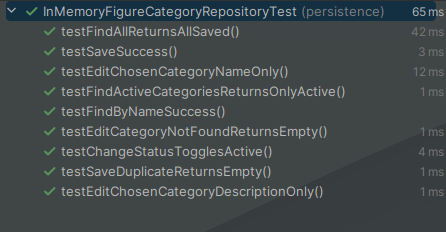

# US236 - Edit a Show Request

## 4. Tests

This section documents **unit tests**, **integration tests**, and **validation procedures** for the feature of editing a show request.

### Test Cases

1. **Unit Test: Edit Description and Location**

    * **Description**: Tests updating the description and location fields of a show request.
    * **Scenario**: The user modifies the description and location for a show request.
    * **Expected Outcome**: The fields are updated, and the change is reflected when the request is retrieved again.

2. **Unit Test: Edit Show Date and Number of Drones**

    * **Description**: Ensures that show date and number of drones can be updated correctly.
    * **Scenario**: The user changes the date and increases the number of drones for an existing request.
    * **Expected Outcome**: The new values are persisted, and validation rules (e.g., show date in the future) are enforced.

3. **Unit Test: Update Modification Metadata**

    * **Description**: Verifies that `modificationAuthor` and `modificationDate` fields are automatically updated.
    * **Scenario**: A user edits a request.
    * **Expected Outcome**: The system stores the current user and timestamp in the appropriate fields.

4. **Unit Test: Prevent Editing of Non-editable Fields**

    * **Description**: Ensures fields like `submissionDate` or `submissionAuthor` remain unchangeable.
    * **Scenario**: Attempt to update submission metadata through the edit function.
    * **Expected Outcome**: The update is rejected or ignored.

5. **Integration Test: End-to-End Edit Request**

    * **Description**: Tests the full flow from selecting a request in the UI to persisting the edited version.
    * **Scenario**: A CRM collaborator edits a show request from the CLI.
    * **Expected Outcome**: The edited values are saved and can be retrieved from the repository.

6. **Edge Case: Invalid Input Values**

    * **Description**: Validates handling of invalid edits (e.g., negative drone count, null dates).
    * **Scenario**: User attempts to set invalid values during editing.
    * **Expected Outcome**: Validation errors are shown, and the request is not updated.

### Screenshots

## 5. Construction (Implementation)

This section describes the implementation logic for editing a show request.

* **Controller**: `EditShowRequestController`
    * Coordinates loading the request, validating changes, and persisting updates.
    * Updates the `modificationAuthor` and `modificationDate` automatically.

* **UI**: `EditShowRequestUI`
    * Prompts the user to select an existing show request.
    * Asks for new values (or skips if left empty).
    * Displays confirmation before persisting changes.

* **Service**: `ShowRequestService` (optional depending on layering)
    * Could contain business logic for editable fields and validation rules.

* **Repository**: `ShowRequestRepository`
    * Provides `save(ShowRequest)` method to persist changes.

* **Implementation Strategy**:
    * The user enters the edit flow from the CLI.
    * The controller retrieves the selected show request.
    * The UI prompts for field updates, applying them to the entity.
    * The controller persists the updated request via the repository.
    * A success message is shown.

* **Patterns Used**:
    * **Repository Pattern**: `ShowRequestRepository` for persistence.
    * **Controller Pattern**: `EditShowRequestController` to encapsulate flow.
    * **Value Object Pattern**: Reused for `Description`, `Location`.

## 6. Integration and Demo

### Integration Points
* **Authentication**: Uses the logged-in CRM Collaborator's email as `modificationAuthor`.
* **Show Request Selection**: Reuses listing logic (`ShowRequestRepository.findByCostumer`) for request selection.
* **Persistence**: Integrates with JPA to persist changes to the `show_request` table.

### Demo Walkthrough
1. User selects "Edit Show Request" in the CLI.
2. System lists all show requests for selection.
3. User selects a request to edit.
4. User is prompted to input new values (leave blank to skip).
5. System shows a summary of changes and asks for confirmation.
6. Upon confirmation, the request is saved, and success is displayed.

## 7. Observations
* **Known Limitations**:
    * Cannot edit `submissionDate` or `submissionAuthor`.
    * No undo functionality is provided.
    * Cannot change the associated `costumer`.

* **Design Decisions**:
    * The `modificationDate` and `modificationAuthor` are automatically handled internally.
    * Skipping updates is done by allowing the user to leave fields empty in CLI.

* **Open Questions**:
    * Should the status of the request reset upon modification?
    * Should edits trigger notifications to clients or system users?

