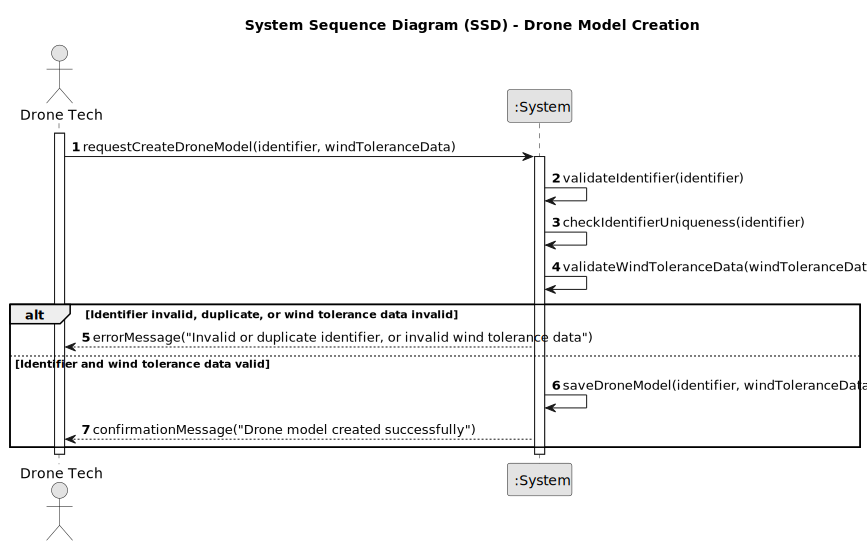

# US240 - Drone Model Creation

## 1. Requirements Engineering

### 1.1. User Story Description

As a Drone Tech, I want to create a drone model in the system, including its behavior under varying wind conditions, so that drones of this model can be used in simulations and inventory management. The drone model must include a unique identifier and positional tolerance (x, y, z) as a function of wind speed (x, y, z), defined in steps.

### 1.2. Customer Specifications and Clarifications

- **From Project Document (Sem4PI_Project_Requirements_v02b.pdf, Page 14)**:
    - "A drone model includes its behaviour under wind as a tolerance of the drone's position (x, y, z) as a function of the wind speed (x, y, z). In a first crude approach, this can be done in steps. Here is an example in a given direction (wind in m/s): wind <= 5 → 0, 5 < wind <= 7 → 0.3 m, 7 < wind <= 10 → 0.5 m, 10 < wind <= 15 → 0.8 m, 15 < wind → not safe to fly."
    - "This must also be achieved by a bootstrap process."

- **Additional Specifications**:
    - The drone model identifier must be unique and case-sensitive to avoid ambiguity.
    - Wind tolerance data must be provided for all three axes (x, y, z) or as a combined vector, with consistent step-based ranges.
    - Only authenticated users with the Drone Tech role can create drone models.
    - The system must provide clear feedback if invalid data is entered (e.g., duplicate identifier, invalid wind tolerance ranges).

### 1.3. Acceptance Criteria

- [ ] The system allows a Drone Tech to create a drone model with a unique, case-sensitive identifier.
- [ ] The system validates wind tolerance data to ensure logical consistency (e.g., increasing deviations, no negative values, "not safe to fly" for wind > 15 m/s).
- [ ] The system prevents creation of a drone model with a duplicate identifier.
- [ ] The system supports a bootstrap process to initialize at least one default drone model during system startup.
- [ ] Only users with the Drone Tech role can create drone models.
- [ ] The drone model is immediately available for inventory management after creation.
- [ ] A success or error message is shown after the operation (e.g., "Drone model created successfully" or "Invalid wind tolerance data").

> **Note:** These acceptance criteria will be checked off as they are addressed and implemented during the development process.

### 1.4. Found out Dependencies

- **US210 (Authentication and Authorization)**: Creation of drone models requires authentication and role-based authorization for Drone Tech users.
- **NFR07 (Database by Configuration)**: Drone model data must be persisted in a relational database or in-memory database, depending on configuration.
- **NFR08 (Authentication and Authorization)**: The system must enforce role-based access control for this operation.

### 1.5 Input and Output Data

**Input Data:**
- Drone model identifier (unique, case-sensitive string, e.g., "DJI-Mavic-Pro").
- Wind tolerance data (step-based mapping of wind speed to positional deviation for x, y, z directions, e.g., {wind <= 5 m/s: 0 m, 5 < wind <= 7 m/s: 0.3 m, ..., wind > 15 m/s: not safe}).

**Output Data:**
- Confirmation of successful creation (success message and drone model details, e.g., identifier and wind tolerance summary).
- Error message indicating reason for failure (e.g., "Duplicate drone model identifier", "Invalid wind tolerance data").

### 1.6. System Sequence Diagram (SSD)

  

### 1.7 Other Relevant Remarks

- None