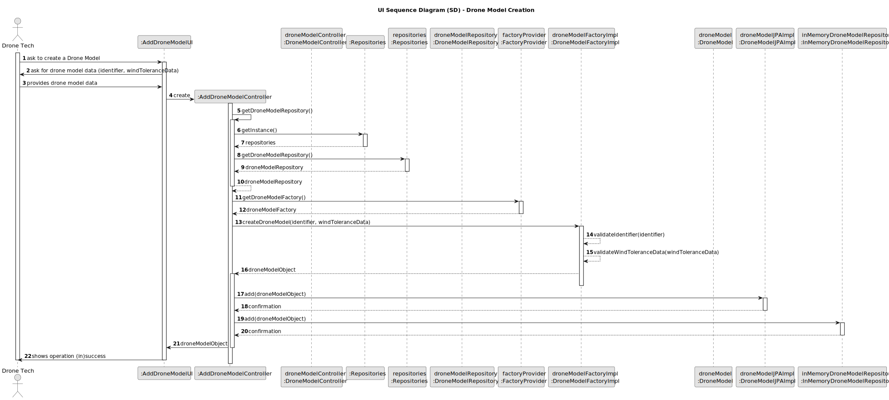

## 3. Design

### 3.1. Design Overview

The design for the "Drone Model Creation" functionality follows a modular and layered architecture, adhering to the project’s architectural principles and best practices. The process is initiated by the Drone Tech through the user interface, which delegates the business logic to a dedicated controller. The controller orchestrates the creation process, including validation of input data (e.g., identifier uniqueness, wind tolerance data consistency), creation of the `DroneModel` aggregate root (including a default `DroneCode`), setting of audit information, and coordination with the persistence layer to store the new drone model.

The system ensures that:
- All input is validated before persistence (e.g., `identifier` uniqueness, non-empty, case-sensitive; `windToleranceData` logical consistency, non-negative deviations, safe operational ranges).
- The `DroneModel` is created as an aggregate root, encapsulating all relevant attributes (`identifier`, `windToleranceData`).
- The repository pattern abstracts data access, supporting both in-memory and relational database persistence (per NFR07), ensuring flexibility and configurability.
- The UI provides clear feedback (success or error messages) based on the outcome of the operation.

### 3.2. Sequence Diagram(s)

The sequence diagram illustrates the complete flow for creating a drone model:
- The Drone Tech initiates the process via the `AddDroneModelUI`.
- The UI interacts with the `AddDroneModelController` to start the operation.
- The controller retrieves the `DroneModelRepository` from the `Repositories` singleton, ensuring persistence abstraction.
- The controller uses a factory (`DroneModelFactoryImpl`) to validate the input (`identifier`, `windToleranceData`) and create a `DroneModel` instance.
- The repository persists the `DroneModel` in both JPA (`DroneModelJPAImpl`) and in-memory (`InMemoryDroneModelRepository`) implementations.
- The UI provides feedback to the Drone Tech (success or error message).

### 3.3. Design Patterns (if any)

- **Repository Pattern**: Abstracts data access and persistence, allowing the domain layer to remain independent of the data source (in-memory or RDBMS), as required by NFR07.
- **Factory Pattern**: Used for `DroneModel` creation via `DroneModelFactoryImpl`, encapsulating validation and creation logic, promoting decoupling and testability.
- **Aggregate Root (DDD)**: `DroneModel` is modeled as an aggregate root, encapsulating all business logic and ensuring consistency within the `DroneModel` aggregate.
- **Controller Pattern**: The `AddDroneModelController` mediates between the UI, domain, and persistence layers, centralizing business logic, validation, and audit information handling.
- **Separation of Concerns**: Clear separation between UI (`AddDroneModelUI`), business logic (`AddDroneModelController`), domain model (`DroneModel`), and persistence (`DroneModelRepository`), improving maintainability and testability.
- **SOLID Principles**: The design adheres to SOLID object-oriented principles:
    - *Single Responsibility*: Each component (UI, controller, factory, repository) has a single responsibility.
    - *Open-Closed*: The design is extensible (e.g., new validation rules can be added to the factory).
    - *Interface Segregation*: Components interact via well-defined interfaces (e.g., `DroneModelRepository`).
    - *Dependency Inversion*: High-level modules (controller) depend on abstractions (repository interfaces, factory interfaces), not concrete implementations.
- **GoF Patterns**: The solution applies classic Gang of Four (GoF) design patterns, such as Repository and Factory, to ensure flexibility, decoupling, and maintainability.

This design ensures robustness, clarity, and compliance with both functional and non-functional requirements, fully aligned with the project’s architectural guidelines, including the use of Java (NFR09), DDD principles, and JPA for persistence (NFR07).