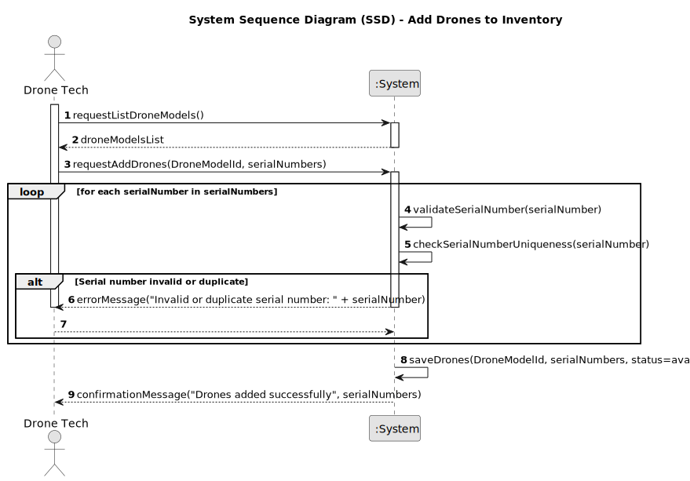

# US241 - Add Drones to Inventory

## 1. Requirements Engineering

### 1.1. User Story Description

As a Drone Tech, I want to add drones of an existing type to the inventory, so that they can be used in simulations and shows. The system must present a list of existing drone models for selection, and for each drone, a unique serial number must be stored.
### 1.2. Customer Specifications and Clarifications

- **From Project Document (Sem4PI_Project_Requirements_v02b.pdf, Page 15)**:
    - "The system must allow adding drones of an existing type to the inventory."
    - "For each drone the serial number has to be available."
    - "This functionality must support a bootstrap process to pre-populate the inventory with default drones."

### 1.3. Acceptance Criteria

- [ ] The system presents a list of existing `DroneModel` types to the Drone Tech for selection.
- [ ] The system prevents adding a drone with a duplicate serial number.
- [ ] The system supports a bootstrap process to initialize multiple default drones for a given `DroneModel` in the inventory during system startup, using a CSV file.
- [ ] Only users with the Drone Tech role can add drones to the inventory.
- [ ] Each drone is marked as available upon addition to the inventory.
- [ ] A success or error message is shown after the operation (e.g., "Drones added successfully" or "Duplicate serial number: SN-001").

> **Note:** These acceptance criteria will be checked off as they are addressed and implemented during the development process.

### 1.4. Found out Dependencies

- **US240 (Drone Model Creation)**: A `DroneModel` must exist in the system before drones can be added to the inventory, as each drone must be associated with a `DroneModel`.
- **US210 (Authentication and Authorization)**: Adding drones requires authentication and role-based authorization for Drone Tech users.

### 1.5 Input and Output Data

**Input Data:**
- Selected drone model identifier (chosen from a list of existing `DroneModel` types, e.g., "DJI Phantom X").
- Serial number (each unique, case-sensitive, e.g., ["SN-001"] for individual addition.

- **Output Data:**
- Confirmation of successful addition (success message and list of serial numbers added, e.g., ["SN-001", "SN-002", ..., "SN-005"]).
- Error message indicating reason for failure (e.g., "Duplicate serial number: SN-001").

### 1.6. System Sequence Diagram (SSD)

  

### 1.7 Other Relevant Remarks

- None