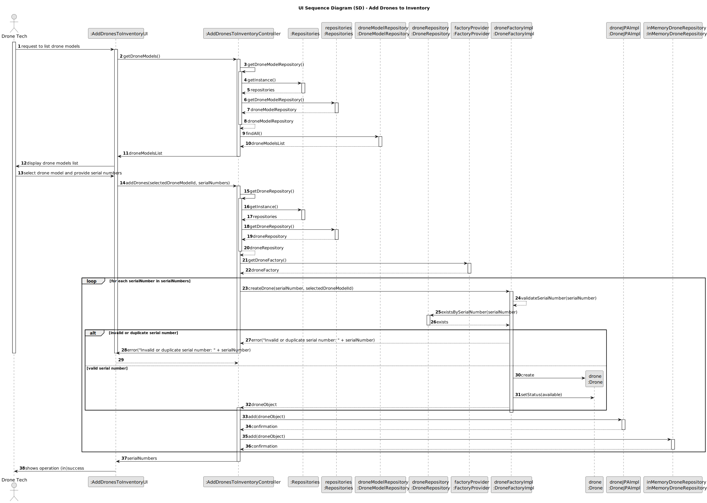

# US241 - Add Drones to Inventory

## 3. Design

### 3.1. UI Sequence Diagram (SD)

The following sequence diagram illustrates the process of adding drones to the inventory, including listing existing drone models, selecting one, and adding drones with unique serial numbers.

#### Key Interactions:
- **Drone Tech and UI**: The Drone Tech requests a list of existing `DroneModel` types via the `AddDronesToInventoryUI`. The UI displays the list, and the Drone Tech selects a model and provides a list of serial numbers (either manually or via a CSV file for bootstrap).
- **Controller and Repositories**: The `AddDronesToInventoryController` fetches the list of `DroneModel` types using the `DroneModelRepository`, and later uses the `DroneRepository` to check serial number uniqueness and persist the drones.
- **Controller and Factory**: The controller uses the `DroneFactoryImpl` to validate each serial number, check for uniqueness, and create `Drone` instances with a "stored" status.
- **Persistence**: Each `Drone` is persisted in both the JPA (`DroneJPAImpl`) and in-memory (`InMemoryDroneRepository`) repositories, adhering to NFR07.
- **Feedback**: The UI informs the Drone Tech of the operation’s success or failure, including the list of added serial numbers.
