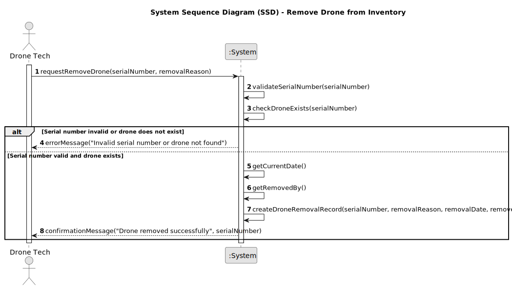

# US242 - Remove Drone from Inventory

## 1. Requirements Engineering

### 1.1. User Story Description

As a Drone Tech, I want to remove a specific drone from the inventory, so that it can be excluded from simulations and shows. The drone should be identified by its unique serial number, and its removal should update its status to "unavailable." The reason for removal and the date of removal must be stored for auditability.

### 1.2. Customer Specifications and Clarifications

- **From Project Document (Sem4PI_Project_Requirements_v02b.pdf, Page 15, Lines 32-33)**:
    - "The system must allow removing drones from the inventory."
    - "The reason for removal and the date must be stored."

- **Additional Specifications**:
    - The drone to be removed must be identified by its unique, case-sensitive serial number, which must exist in the inventory.
    - Upon removal, the drone’s status should be updated to "unavailable," rather than permanently deleting the record, to maintain auditability and historical data.
    - The Drone Tech must provide a reason for removal (e.g., "Damaged in simulation"), which will be stored with the drone’s record.
    - The system must automatically record the date of removal when the operation is performed.
    - Only authenticated users with the Drone Tech role can remove drones from the inventory.

### 1.3. Acceptance Criteria

- [ ] The system allows a Drone Tech to remove a drone from the inventory by providing its unique, case-sensitive serial number and a reason for removal.
- [ ] The system validates that the serial number corresponds to an existing drone in the inventory.
- [ ] The system updates the drone’s status to "unavailable" upon removal, rather than deleting the record.
- [ ] The system stores the reason for removal provided by the Drone Tech.
- [ ] The system automatically records the date of removal.
- [ ] Only users with the Drone Tech role can remove drones from the inventory.
- [ ] A success or error message is shown after the operation (e.g., "Drone removed successfully" or "Serial number not found").

> **Note:** These acceptance criteria will be checked off as they are addressed and implemented during the development process.

### 1.4. Found out Dependencies

- **US241 (Add Drone to Inventory)**: The ability to remove a drone depends on it being added to the inventory first, with a unique serial number.
- **US210 (Authentication and Authorization)**: Removing a drone requires authentication and role-based authorization for Drone Tech users.

### 1.5 Input and Output Data

**Input Data:**
- Serial number (unique, case-sensitive string, e.g., "SN-001"), identifying the drone to be removed.
- Removal reason (a string provided by the Drone Tech, e.g., "Damaged in simulation").

**Output Data:**
- Confirmation of successful removal (success message and serial number, e.g., "Drone removed successfully: SN-001").

### 1.6. System Sequence Diagram (SSD)

  

### 1.7 Other Relevant Remarks

- None