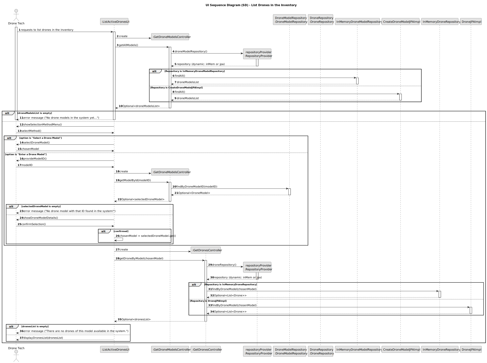

# US243 - List Drones in the Inventory

## 3. Design

### 3.1. UI Sequence Diagram (SD)

The following sequence diagram illustrates the process of listing active drones of a specific `DroneModel` in the inventory.

#### Key Interactions:
- **Drone Tech and UI**: The Drone Tech initiates the process via the `ListDronesInInventoryUI`, first requesting a list of `DroneModel` types, selecting one, and then requesting the list of drones for that model.
- **Controller and Repositories**: The `ListDronesInInventoryController` uses the `DroneModelRepository` to fetch all `DroneModel` types, and the `DroneRepository` to fetch drones filtered by the selected model, status “available” excluding removed drones, and sorted by serial number.
- **Repository Logic**: The `DroneRepository` method `findAllActiveByModelOrderedBySerialNumber` handles filtering by model, status, exclusion of removed drones (via `DroneRemovalRecord`), and sorting.
- **Feedback**: The UI displays the list of drones (serial numbers).
