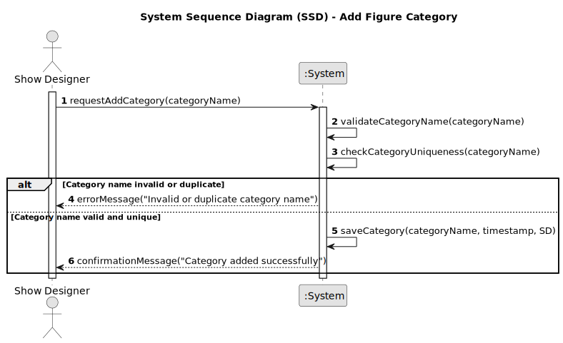

# US245 - Add figure category

## 1. Requirements Engineering

### 1.1. User Story Description

As a Show Designer, I want to add a new figure category to the catalog, so that figures can be organized and classified for easier management and retrieval. The category name must be unique, regardless of case (case-insensitive).

### 1.2. Customer Specifications and Clarifications

- The system must ensure that no two categories exist with names that only differ in capitalization or accents.
- The category name must not be empty or consist only of whitespace.
- Only authenticated users with the Show Designer role can add new categories.
- The system must provide clear feedback if a duplicate or invalid category name is entered.
- The category name should be stored as entered, but uniqueness is enforced case-insensitively.
- The creation date/time and the user responsible should be recorded for each category.
- Categories are immediately available for association with figures after creation.

### 1.3. Acceptance Criteria

- [ ] The system prevents adding a category with a name that already exists (case-insensitive).
- [ ] The system prevents adding a category with an empty name or only whitespace.
- [ ] Only users with the Show Designer role can add categories.
- [ ] The category is saved with the exact name entered by the user.
- [ ] The creation timestamp and creator are recorded.
- [ ] A success or error message is shown after the operation.
- [ ] The new category is available for figure association immediately.

> **Note:** These acceptance criteria will be checked off as they are addressed and implemented during the development process.

### 1.4. Found out Dependencies

- Depends on the existence of the user authentication and authorization module.
- Relies on the persistence infrastructure (JPA/Hibernate, database) being operational.
- Integration with the figure management module for category association.

### 1.5 Input and Output Data

**Input Data:**

* Category name provided by the Show Designer.

**Output Data:**

* Confirmation of successful creation (success message and category details), or
* Error message indicating reason for failure (e.g., duplicate name, invalid input).

### 1.6. System Sequence Diagram (SSD)

### 1.7 Other Relevant Remarks

- The category name may include spaces and special characters, but must be unique (case-insensitive).
- The system should be prepared for future internationalization/localization.
- There should be a configurable maximum length for the category name (e.g., 50 characters).
- All operations should be audited for traceability.
