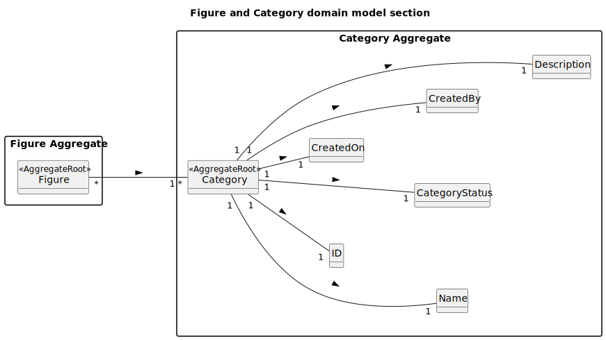

# US245 - Add figure category

## 2. Analysis

### 2.1. Relevant Domain Model Excerpt

The diagram presented in this section is a detailed excerpt of the domain model, focusing specifically on the entities and value objects relevant to the management of figure categories. This model is **more complete** than the general domain model of the system (in this section) because, in this context, it is important to explicitly represent all attributes and relationships required to ensure robustness, traceability, and extensibility for the category functionality.

In the general domain model, it is typical to identify only the main entities and their relationships, without detailing all internal attributes. That level of abstraction is sufficient for an overall view of the system, but it does not cover all the technical and functional needs of each specific use case. For example, in the general model, it may be enough to know that there is a `Category` entity associated with `Figure`, but there is no need to detail attributes such as `CreatedOn`, `CreatedBy`, `CategoryStatus,`etc...

In this excerpt, however, a higher level of detail is justified because:
- It ensures all functional and non-functional requirements defined for the category-related user stories (US245–US248) are met.
- It supports auditing (who created, when, who updated), uniqueness, activation/deactivation, and detailed category description.
- It facilitates the implementation of business rules and the future extensibility of the system.

#### **Explanation of the model elements**

- **Category** (`<<AggregateRoot>>`): The main entity of the category aggregate. All external operations on categories are performed through this root, ensuring integrity and encapsulation.
- **ID**: Unique identifier for the category.
- **Name**: Value object representing the category name, ensuring uniqueness (case-insensitive) and validation.
- **CategoryStatus**: Enum indicating whether the category is active or inactive, allowing activation/deactivation without data loss.
- **CreatedOn**: Date/time when the category was created, essential for auditing.
- **CreatedBy**: Reference to the user who created the category, also for auditing and traceability.
- **Description**: Optional field to describe the category, useful for clarification and future searches.
- **Figure** (`<<AggregateRoot>>`): The main entity of the figure aggregate, associated with one or more categories.

This detailed modeling enables the system to support all flows and business rules associated with the management of figure categories, as required by the project specification.

### 2.2. Other Remarks

n/a
