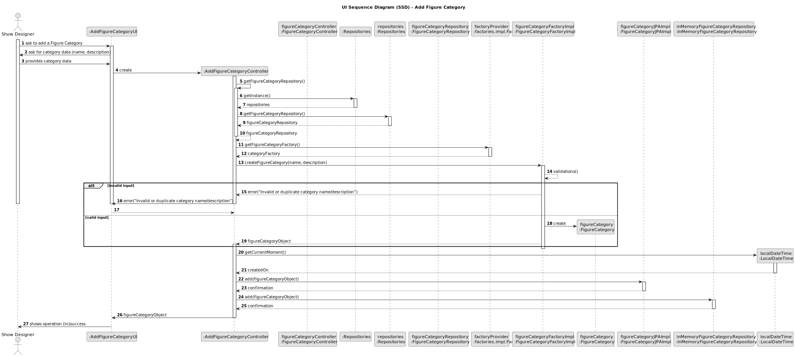

# US245 - Add figure category

## 3. Design

### 3.1. Design Overview

The design for the "Add Figure Category" functionality follows a layered and modular approach, aligned with the architectural principles and best practices recommended in the project requirements[1]. The process is initiated by the Show Designer through the user interface, which delegates the business logic to a dedicated controller. The controller is responsible for all validations (e.g., name uniqueness, input constraints), creation of the domain object, and coordination with the persistence layer to store the new category.

The system ensures that:
- All input is validated before persistence (e.g., uniqueness of the name, non-empty, length constraints, optional description).
- The category is created as an aggregate root, encapsulating all relevant attributes (name, description, status, createdOn, createdBy).
- Auditing information (creator, timestamp) is automatically recorded.
- The repository pattern is used to abstract data access, allowing for easy switching between in-memory and database-backed persistence as required by the non-functional requirements.
- The UI receives clear feedback (success or error messages) based on the outcome of the operation.

This design supports extensibility (future editing, inactivation, listing), maintainability, and traceability, and ensures that all business rules and non-functional requirements are respected.

### 3.2. Sequence Diagram(s)

The sequence diagram illustrates the complete flow for adding a figure category:
- The Show Designer initiates the process via the UI.
- The UI interacts with the controller to start the operation.
- The controller requests the appropriate repository from the persistence context, using a factory for decoupling.
- The controller validates the input (name, description) and checks for uniqueness.
- If validation fails, an error message is returned to the UI.
- If validation succeeds, a new `Category` aggregate root is created with all required attributes (name, description, status=ACTIVE, createdOn, createdBy).
- The repository persists the new category.
- The UI provides feedback to the user (success or error).

### 3.3. Design Patterns (if any)

- **Repository Pattern:** Abstracts data access and persistence, allowing the domain layer to remain independent of the data source (in-memory or RDBMS).
- **Factory Pattern:** Used for repository creation, promoting decoupling and easier testing/configuration.
- **Aggregate Root (DDD):** `Category` is modeled as an aggregate root, encapsulating all business logic and ensuring consistency within the category aggregate.
- **Controller Pattern:** The controller mediates between the UI and the domain/persistence layers, centralizing business logic and validation.
- **Separation of Concerns:** Clear separation between UI, business logic (controller), domain model, and persistence, improving maintainability and testability.
- **SOLID Principles:** The design follows SOLID object-oriented principles, ensuring single responsibility, open-closed extensibility, interface segregation, and dependency inversion throughout the architecture.
- **GoF Patterns:** The solution applies classic Gang of Four (GoF) design patterns, such as Repository and Factory, to promote flexibility, decoupling, and maintainability.

This design ensures robustness, clarity, and compliance with both functional and non-functional requirements, and is fully aligned with the project’s architectural guidelines.
