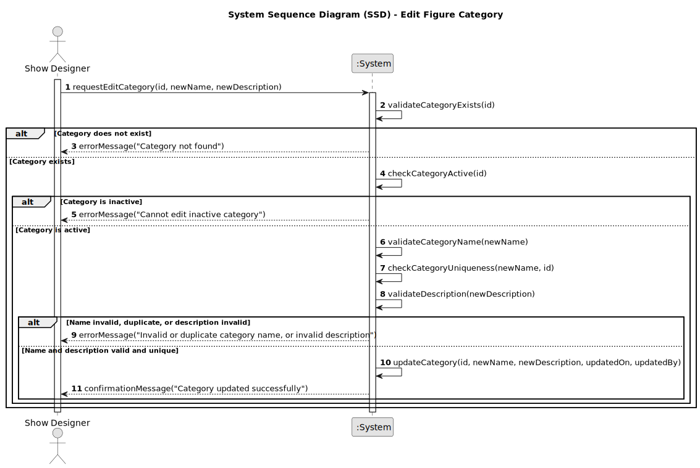

# US246 - Edit figure category

## 1. Requirements Engineering

### 1.1. User Story Description

As a Show Designer, I want to edit an existing figure category in the figure category catalogue, so that I can correct or update its name and description as needed.

### 1.2. Customer Specifications and Clarifications

- Only users with the Show Designer role can edit figure categories.
- The category name must remain unique (case-insensitive) after editing.
- The system must prevent editing the name to one that already exists in another category (case-insensitive).
- The category name cannot be empty or consist only of whitespace.
- The description is optional but, if provided, should respect the maximum length constraint.
- The system should record who performed the edit and when (audit trail).
- It should not be possible to edit a category that is inactive.
- All changes should be immediately reflected and available for figure association.

### 1.3. Acceptance Criteria

- [ ] Only Show Designers can edit figure categories.
- [ ] The system prevents changing the name to one that already exists (case-insensitive).
- [ ] The system prevents setting an empty or whitespace-only name.
- [ ] The description, if provided, respects the maximum length constraint.
- [ ] Edits to inactive categories are not allowed.
- [ ] The system records the user and timestamp of the edit.
- [ ] A success or error message is shown after the operation.
- [ ] The updated category is immediately available for figure association.

> **Note:** These acceptance criteria will be checked off as they are addressed and implemented during the development process.

### 1.4. Found out Dependencies

- Depends on the existence of the user authentication and authorization module.
- Depends on the category inactivation/activation logic (US248).
- Relies on the persistence infrastructure being operational.
- Integration with the figure management module for category association.

### 1.5 Input and Output Data

**Input Data:**

* Category identifier (ID) to select the category to edit.
* New category name (string).
* New description (optional string).

**Output Data:**

* Confirmation of successful edit (success message and updated category details), or
* Error message indicating reason for failure (e.g., duplicate name, invalid input, inactive category).

### 1.6. System Sequence Diagram (SSD)

### 1.7 Other Relevant Remarks

- The system should be prepared for future internationalization/localization.
- There should be a configurable maximum length for both the category name and description.
- All edit operations should be audited for traceability (who edited, when).
- Editing should not be allowed if the category is inactive (see US248).
