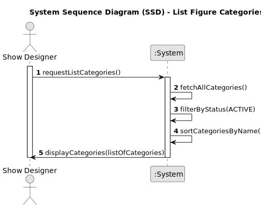

# US247 - List figure categories

## 1. Requirements Engineering

### 1.1. User Story Description

As a Show Designer, I want to list all figure categories in the catalogue so that I can view, select, and manage the available categories for figure association and maintenance.

### 1.2. Customer Specifications and Clarifications

- Only authenticated users with the Show Designer role can access the list of categories.
- The list should display all active categories by default.
- Each category entry should show at least: name, description (if available), and status.
- The list should be ordered alphabetically by category name.
- The system should support future extensibility for filtering (by status, name, etc.) and pagination.
- Inactive categories should be excluded from the default list, unless specifically requested in future enhancements.

### 1.3. Acceptance Criteria

- [ ] Only Show Designers can list figure categories.
- [ ] The system displays all active categories, ordered by name.
- [ ] Each entry shows the category name and description (if available).
- [ ] Inactive categories are not shown in the default listing.
- [ ] The list is up to date and reflects recent changes (additions, edits, inactivations).
- [ ] A suitable message is shown if no categories are available.

> **Note:** These acceptance criteria will be checked off as they are addressed and implemented during the development process.

### 1.4. Found out Dependencies

- Depends on the user authentication and authorization module.
- Relies on the persistence infrastructure for retrieving categories.
- Depends on category activation/inactivation logic (US248).

### 1.5 Input and Output Data

**Input Data:**

* Request to list categories (initiated by the Show Designer).

**Output Data:**

* List of active categories, each with name and description.
* Message indicating if no categories are available.

### 1.6. System Sequence Diagram (SSD)

### 1.7 Other Relevant Remarks

- The system should be prepared for future enhancements such as filtering, searching, and pagination.
- All list operations should be auditable for traceability.
