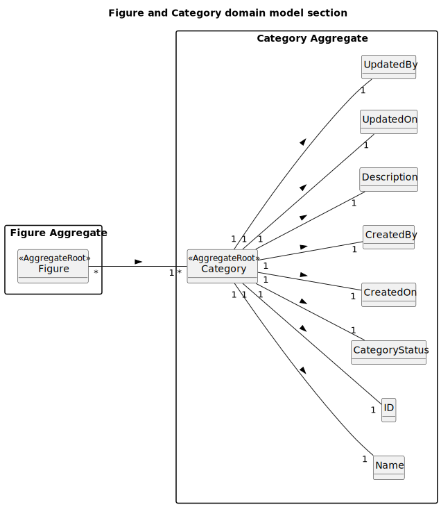

# US247 - List figure categories

## 2. Analysis

### 2.1. Relevant Domain Model Excerpt

The domain model for figure categories is already well-prepared for the requirements of listing categories. All the necessary information-such as category name, description, status (active/inactive), and audit fields-is present in the `Category` aggregate. This allows the system to efficiently retrieve and display all active categories, as required by the user story.

No structural changes to the model are needed for this use case. The listing functionality simply queries the existing `Category` entities, typically filtering by `CategoryStatus` (to show only active categories) and ordering by `Name`. The presence of fields like `Description`, `CreatedOn`, and `CreatedBy` also allows for richer displays or future extensions (e.g., advanced filtering, audit trails).

This design ensures that the system can support not only the current requirements (listing active categories for selection and management), but also future enhancements such as filtering by other attributes, pagination, or viewing audit information.

### 2.2. Other Remarks

There is little to add at the analysis level, as the domain model already covers all information needed for listing categories. The current structure is robust and extensible, supporting both the immediate needs of US247 and potential future requirements without modification.
