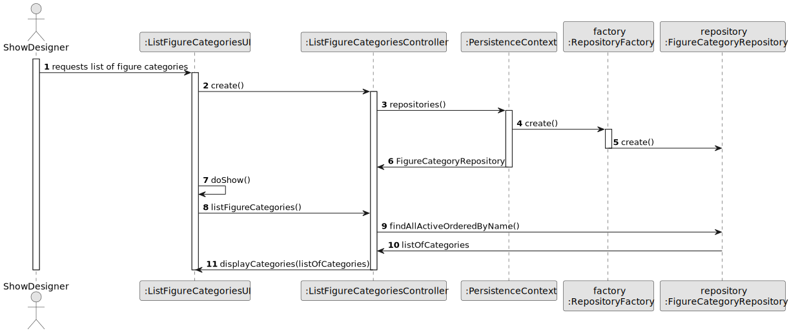

# US247 - List figure categories

## 3. Design

### 3.1. Design Overview

The design for the "List Figure Categories" functionality is based on a layered architecture, ensuring a clear separation of concerns between the user interface, business logic, and data access layers. The process is initiated by the Show Designer, who requests to view all available figure categories. The user interface delegates this request to a controller, which then interacts with the repository to retrieve the relevant categories from the persistence layer.

Key design aspects:
- Only authenticated users with the Show Designer role can access the category listing.
- The controller ensures that only active categories are retrieved and that the results are ordered alphabetically by name.
- The repository abstracts the data access logic, allowing the domain layer to remain independent of the underlying data source.
- The UI displays the resulting list, showing each category’s name and description.
- The design supports future extensibility, such as filtering, searching, and pagination.

This approach ensures maintainability, scalability, and compliance with both functional and non-functional requirements.

### 3.2. Sequence Diagrams

The sequence diagram illustrates the entire flow for listing figure categories:
- The Show Designer initiates the request via the UI.
- The UI calls the controller to handle the operation.
- The controller requests the repository from the persistence context, using a factory for decoupling.
- The controller invokes the repository method to retrieve all active categories, ordered by name.
- The repository returns the list of categories to the controller, which then passes it to the UI for display.
- The UI presents the list to the user.

Sequence diagrams, as part of UML, are used to visualize how objects interact in a particular sequence, emphasizing the order of interactions over time and clarifying the responsibilities of each component in the system.

### 3.3. Design Patterns (if any)

- **Repository Pattern:** Abstracts data access and persistence, keeping the domain logic independent of the data source.
- **Factory Pattern:** Used for repository creation, promoting decoupling and easier testing/configuration.
- **Controller Pattern:** Centralizes business logic and mediates between the UI and the domain/persistence layers.
- **Separation of Concerns:** Maintains clear boundaries between UI, business logic, domain model, and persistence.
- **SOLID and GoF Principles:** The design adheres to SOLID object-oriented principles and applies classic GoF patterns to ensure maintainability and extensibility.
