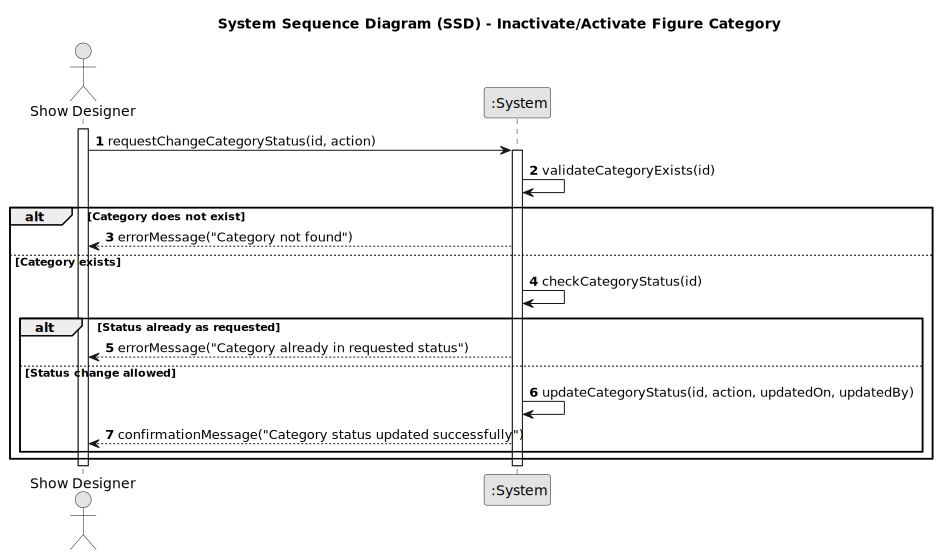

# US248 - Inactivate/Activate a Figure Category

## 1. Requirements Engineering

### 1.1. User Story Description

As a Show Designer, I want to inactivate or activate a figure category in the catalogue, so that categories no longer in use can be disabled and, if needed, re-enabled for future use.

### 1.2. Customer Specifications and Clarifications

- Only users with the Show Designer role can inactivate or activate categories.
- Inactivated categories must remain in the system for historical and audit purposes, but cannot be used in new figure associations.
- It must be possible to reactivate a previously inactivated category.
- The system must provide clear feedback (success or error) after each operation.
- All status changes (activation/inactivation) must be auditable (who performed the change and when).
- Inactivated categories should not appear in the default list for selection or association.

### 1.3. Acceptance Criteria

- [x] Only Show Designers can inactivate or activate categories.
- [x] The status of the category is updated to ACTIVE or INACTIVE as requested.
- [x] The user and timestamp of the status change are recorded.
- [x] A success or error message is shown after the operation.
- [x] It is possible to reactivate an inactivated category.

> **Note:** These acceptance criteria will be checked off as they are addressed and implemented during the development process.

### 1.4. Found out Dependencies

- Depends on the user authentication and authorization module.
- Relies on the persistence infrastructure for updating category status.
- Integration with the listing functionality to ensure inactivated categories are excluded from default views.

### 1.5 Input and Output Data

**Input Data:**

- Request to change the current availability of a category.
- Category selection by the user.

**Output Data:**

- Confirmation of successful status change, or
- Error message if the operation could not be performed (e.g., already in desired state).
### 1.6. System Sequence Diagram (SSD)

### 1.7 Other Relevant Remarks

- All status changes should be auditable (who changed, when).
- The system should be ready for future enhancements, such as providing a history of status changes.
- Inactivated categories must remain in the system for historical and reporting purposes.
- The UI should clearly indicate the current status of each category and prevent invalid operations.
