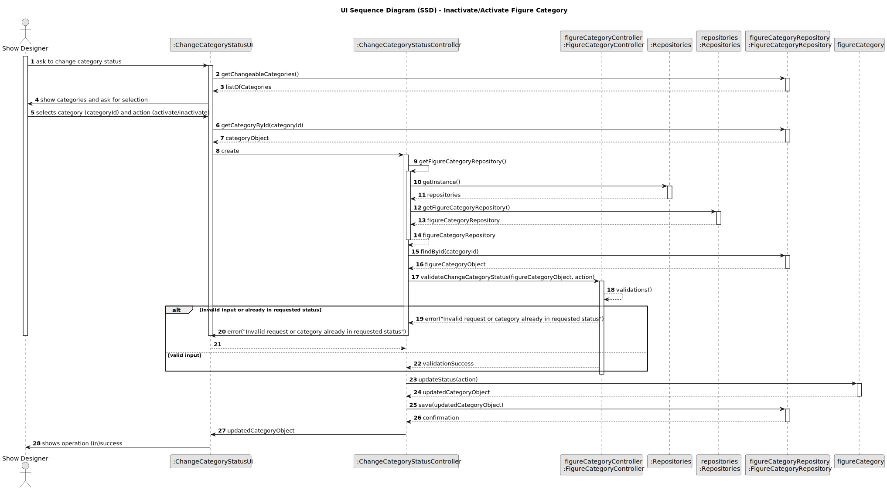

## 3. Design

### 3.1. Design Overview

The design for the "Inactivate/Activate a Figure Category" functionality follows the same layered and modular architecture as the rest of the system, ensuring clear separation between user interface, business logic, and data access layers. The process is initiated by the Show Designer through the UI, which delegates the request to a dedicated controller. The controller is responsible for:

- Validating input data (category existence, requested action, current status).
- Retrieving the target category aggregate from the repository.
- Checking if the status change is necessary (i.e., the category is not already in the requested state).
- Updating the status of the category (ACTIVE or INACTIVE) and recording audit information (who performed the change and when).
- Persisting the updated category back to the repository.
- Returning clear feedback (success or error messages) to the UI, which then informs the user.

This approach ensures that all business rules, auditability, and consistency are enforced at the appropriate layer. The design is extensible, allowing for future enhancements such as requiring a justification for status changes or maintaining a history of changes.

### 3.2. Sequence Diagram(s)

The sequence diagram illustrates the complete flow for inactivating or activating a figure category:
- The Show Designer initiates the status change via the UI.
- The UI retrieves the list of categories that can have their status changed and allows the user to select one and the desired action.
- The UI interacts with the controller to handle the operation.
- The controller obtains the appropriate repository from the persistence context, using a factory for decoupling.
- The controller validates the input (category existence, current status, requested action).
- If validation fails or the category is already in the requested status, an error message is returned to the UI.
- If validation succeeds, the controller retrieves the category, updates its status and audit fields, and persists the change.
- The UI provides feedback to the user (success or error).

### 3.3. Design Patterns (if any)

- **Repository Pattern:** Abstracts data access and persistence, keeping the domain logic independent of the data source.
- **Factory Pattern:** Used for repository creation, promoting decoupling and easier testing/configuration.
- **Aggregate Root (DDD):** `Category` is modeled as an aggregate root, ensuring all updates and business rules are encapsulated within the aggregate.
- **Controller Pattern:** The controller mediates between the UI and the domain/persistence layers, centralizing business logic and validation.
- **Separation of Concerns:** Maintains clear boundaries between UI, business logic, domain model, and persistence.
- **SOLID and GoF Principles:** The design adheres to SOLID object-oriented principles and applies classic GoF patterns to ensure maintainability and extensibility.

This design ensures robustness, clarity, and compliance with both functional and non-functional requirements, and is fully aligned with the project’s architectural guidelines.

