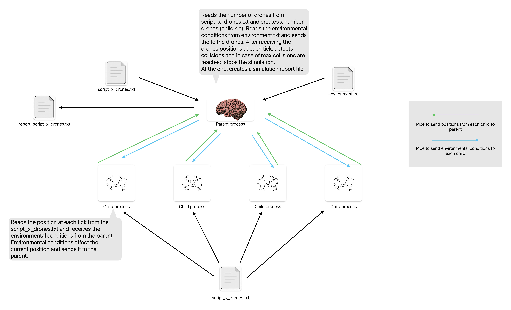

## 1. Diagram of solution components

Below is a high-level diagram representing the key components of the Shodrone simulation system, illustrating how they interact to fulfill the requirements outlined in the project specifications. This diagram focuses on the architecture for the simulation-related user stories (US261 to US266) implemented in Sprint 2, as described in the provided documentation.



### Explanation of Components

- **Environment File (environment.txt)**:  
  A configuration file containing environmental data such as wind speeds for different directions (North, South, East, West) and rain intensity. This file is read by the Parent Process at the start of the simulation to load conditions that will affect drone movements (US266).

- **Parent Process (Simulation Engine)**:  
  The central controller of the simulation, implemented in C as per US261. It performs multiple roles:
    - **Reads Environmental Data**: Loads wind and rain conditions from `environment.txt` using `read_enviroment_info()` and transmits them to drone processes via pipes with `transfer_environmental_effects()` (US266).
    - **Receives Position Updates**: Collects position data from each drone process through pipes at every tick, ensuring synchronization with blocking `read()` calls (US262, US264).
    - **Collision Detection**: Analyzes drone positions for overlaps or ground collisions (z <= 0) in real time using `collisionDetection()`, sending `SIGUSR1` signals to affected drones upon detection (US263).
    - **Report Generation**: Compiles simulation outcomes, including positions, collisions, and environmental conditions, into a detailed report saved in the `reports/` directory via `generate_report()` (US265).

- **Drone Processes (Child Processes)**:  
  Individual processes representing each drone, created via `fork()` as per US261. They handle:
    - **Reading Positions**: Load movement scripts from files in the `scripts/` directory using `simulate_drone()`, which define their intended positions over time (US261, US262).
    - **Applying Environmental Effects**: Receive environmental data from the parent via pipes, then adjust their positions using `apply_environment_effects()` to account for wind (modifies x and y coordinates) and rain (modifies z coordinate) with random variations (US266).
    - **Sending Positions**: Transmit updated positions back to the parent process via pipes for each tick, ensuring the parent can track their movements (US262, US264).

- **Simulation Report (reports/ dir)**:  
  The output of the simulation, generated by the parent process. It includes metadata, environmental conditions, a detailed timeline of drone positions, collision events, and return-to-base notifications, stored as text files in the `reports/` directory (US265).

- **Script Files (scripts/ dir)**:  
  Input files containing drone movement scripts, read by drone processes to determine their base positions before environmental adjustments. These scripts are parsed to extract drone-specific routines for the simulation (US261).

### Interaction Flow

1. **Environment Data Loading**: The Parent Process reads environmental conditions (wind and rain) from `environment.txt` at the start of the simulation.
2. **Environment Data Transmission**: The Parent Process sends the `Environment` structure to each Drone Process via dedicated pipes immediately after forking.
3. **Position Reading and Adjustment**: Each Drone Process reads its movement script from the `scripts/` directory, applies environmental effects to adjust positions, and prepares updates for the current tick.
4. **Position Updates**: Drone Processes send their updated positions (or -1, -1, -1 if inactive) to the Parent Process via pipes for each tick, paced by `usleep(100000)` to simulate real-time movement.
5. **Collision Detection**: The Parent Process, after receiving positions from all drones for a tick, checks for collisions (drone-to-drone or drone-to-ground) and logs events, sending `SIGUSR1` signals to terminate affected drones if necessary.
6. **Report Generation**: At the end of the simulation, the Parent Process compiles all data (positions, collisions, environmental conditions) into a comprehensive report saved in the `reports/` directory.

This architecture ensures that environmental influences are integrated into the simulation (US266), drone movements are synchronized and tracked (US262, US264), collisions are detected in real time (US263), and detailed outcomes are reported (US265), all while maintaining scalability for large numbers of drones as required by Shodrone's vision.

--- 

## 2. Example of a script used by drones

### Script for 10 drones (example start)

```
0 - 3x4x5
8 5 5
7 0 1
7 0 4
8 3 11
10 1 10
1 8 5
9 9 1
0 3 3
10 4 1
5 10 2
1 - 2x3x4
9 4 4
3 4 2
6 5 2
1 5 15
8 7 2
4 1 2
5 5 4
6 8 10
3 10 4
8 7 3
2 - 3x4x5
...
```

### Explanation of the Script Format

#### **Header Line**

- Example: `0 - 3x4x5`
    - **`0`**: Drone ID (unique identifier for the drone).
    - **`3x4x5`**: Dimensions of the drone (width x height x depth in meters). Used for collision detection.

#### **Coordinate Lines**

- Each subsequent line represents the drone's position at a specific **tick** (time unit):
    - Example: `8 5 5`
        - **`8`**: X-coordinate (horizontal axis).
        - **`5`**: Y-coordinate (vertical axis).
        - **`5`**: Z-coordinate (depth axis).
    - Positions are listed in chronological order (tick 1, tick 2, etc.).

#### Key Notes:

1. **Ticks**:
    - The number of coordinate lines determines the total simulation ticks for that drone.
    - Drones with fewer positions than the simulation's total ticks will be marked as **inactive** after their last
      tick.
2. **Collision Detection**:
    - The drone's dimensions (e.g., `3x4x5`) are used to calculate its collision radius.
    - Collision checks account for the drone's physical size and a safety margin (`COLLISION_RADIUS_EXTRA`).


### Script File Rules

- **File Location**: Scripts must be placed in the `scripts/` directory.
- **File Extension**: `.txt`.
- **Validation**:
    - Invalid coordinates (e.g., negative values) will default to `(-1, -1, -1)`, marking the drone as inactive.
    - Missing or malformed headers will cause the simulation to terminate with an error.

For a complete example, see the provided script for 10 drones above.

---

## 3. Description of the approach taken in each US

### US261 - Initiate Simulation for a Figure

#### Key Code Implementation (`main.c` and `utils.c`)

**1. Script Parsing and Initialization**  


```
// main.c (run_simulation)
char filename;
snprintf(filename, sizeof(filename), "scripts/%s", argv);
int num_drones = get_drone_number_from_file(filename); // From utils.c
int total_ticks = get_total_ticks_from_file(filename); // From utils.c

// utils.c
int get_drone_number_from_file(char* file_name) {
int n;
sscanf(file_name, "scripts/script_%d_drones.txt", &n);
return n;
}
```

- Parses script filename to determine number of drones
- Validates file format (`script_x_drones.txt`)

**2. Process Creation and Pipes**
```
// main.c
int pipes[num_drones];
pid_t pids[num_drones];
for (int droneNumber = 0; droneNumber < num_drones; droneNumber++) {
pipe(pipes[droneNumber]);
pids[droneNumber] = fork();

if (pids[droneNumber] == 0) {  // Child process (drone)
    close(position_pipes[droneNumber]);
    close(environment_pipes[droneNumber]);
    simulate_drone(filename, ..., position_pipes[droneNumber], environment_pipes[droneNumber]);
    exit(EXIT_SUCCESS);
}
close(position_pipes[droneNumber]);  // Parent closes write end for positions
close(environment_pipes[droneNumber]);  // Parent closes read end for environment

```

- Creates two pipes per drone: one for position data and one for environmental conditions
- Forks child processes for parallel drone simulation

**3. Timeline Initialization**

```
// main.c
report_of_simulation.timeline = malloc(total_ticks * sizeof(Position*));
for (int i = 0; i < total_ticks; i++) {
report_of_simulation.timeline[i] = malloc(num_drones * sizeof(Position));
// Initialize to (-1, -1, -1) for inactive state
for (int j = 0; j < num_drones; j++) {
report_of_simulation.timeline[i][j].x = -1;
report_of_simulation.timeline[i][j].y = -1;
report_of_simulation.timeline[i][j].z = -1;
}
}
```

- Pre-allocates memory for storing drone positions
- Uses (-1, -1, -1) to mark inactive drones


**4. Position Reading and Tracking**
```
// main.c
for (int timeStamp = 0; timeStamp < total_ticks; timeStamp++) {
for (int childNumber = 0; childNumber < num_drones; childNumber++) {
ssize_t bytes_read = read(pipes[childNumber], &current_pos, sizeof(Position));

    if (bytes_read == sizeof(Position)) {
        report_of_simulation.timeline[timeStamp][childNumber] = current_pos;
        printPositionDrone(current_pos, ...);  // Real-time UI update
    }
}

```

- Reads positions from pipes at each tick
- Updates timeline matrix
- Provides real-time terminal output

**5. Environmental Conditions Transmission**
```
// main.c
Environment environment;
read_enviroment_info(&environment);
for (int droneNumber = 0; droneNumber < num_drones; droneNumber++) {
// After fork, in parent process
transfer_environmental_effects(&environment, environment_pipes[droneNumber]);
close(environment_pipes[droneNumber]); // Close after sending
}
```

- Reads environmental conditions (wind and rain) from a configuration source
- Sends environmental data to each drone process via dedicated pipes immediately after process creation
- Ensures drones apply environmental effects to their movement paths

**6. Utility Functions (`utils.c`)**

```
int get_total_ticks_from_file(const char* filename) {
// Counts maximum number of position lines in any drone section
}
void fill_info(const char* filename, DroneInformation* dronesIDs, int num_drones) {
// Extracts drone ID and dimensions from script headers
}
int calculate_acceptable_collision_number(int numberOfDrones) {
return (int)floor(numberOfDrones * 0.05f); // 5% threshold
}
```

- Handles script content parsing
- Calculates safety thresholds for collisions

#### Process Flow
1. User selects script via terminal UI
2. System validates and parses script file
3. Parent process creates:
    - Communication pipes for positions and environmental conditions
    - Timeline data structure
    - Child processes (one per drone)
4. Parent sends environmental conditions to each drone via dedicated pipes
5. Drones execute movement scripts in parallel, applying environmental effects
6. Parent aggregates positions and manages synchronization

#### Summary
The initiation of the simulation involves parsing the script to determine the number of drones and ticks, creating child processes for each drone with dedicated communication channels, and ensuring environmental conditions are transmitted to influence drone behavior. This setup enables parallel execution of drone movements while maintaining centralized control and monitoring through the parent process.


---

### US262 - Capture and Process Drone Movements

Each drone process reads only its own section from the shared script file, loading its sequence of positions into memory.  
At every simulation tick, the drone sends its current position to the main process through a dedicated pipe.

The main process collects these positions from all drones and stores them in a two-dimensional array:  
`timeline[tick][drone_id]`  
This structure allows tracking and visualization of every drone's movement over time.

**Relevant code snippets:**

**In the drone process:**
```
for (drone.current_step = 0; drone.current_step < drone.total_steps && !terminated; drone.current_step++) {
Position current_pos = drone.script[drone.current_step];
current_pos.pid = pid;
write(pipe_fd, &current_pos, sizeof(Position));
usleep(100000); // 100ms between steps
}
```

- Each drone sends its position to the parent process at each tick.

**In the main process:**

```
for (int timeStamp = 0; timeStamp < total_ticks; timeStamp++) {
for (int childNumber = 0; childNumber < num_drones; childNumber++) {
Position current_pos;
read(pipes[childNumber], &current_pos, sizeof(current_pos));
report_of_simulation.timeline[timeStamp][childNumber] = current_pos;
}
}
```

- The main process reads all drone positions and fills the `timeline` matrix.

**Summary:**  
US262 ensures that, at every tick, the system collects and stores the positions of all drones, enabling analysis and visualization of their paths throughout the simulation.  
This is achieved via pipes for inter-process communication and a matrix for organized storage.

---

### US263 - Detect Drone Collisions in Real Time

Collision detection is performed after collecting all drones’ positions for each simulation tick. A collision is detected if the Euclidean distance between two active drones is less than the sum of their calculated safety radii. The safety radius is based on the largest drone dimension and a constant buffer. Additionally, a collision with the ground is detected if a drone's z-coordinate is less than or equal to zero. If a collision is found, the involved drones are sent a `SIGUSR1` signal, the event is captured in a `Collision_Stamp` structure, and the drones are temporarily halted. Drones are resumed later with `SIGCONT`. The simulation is aborted if the number of collisions exceeds a dynamic threshold.

#### Key Collision Detection Mechanism
```
// collisionDetection.c (Parent Process)
int collisionDetection(int numberOfDrones, int total_ticks, Radar historyOfRadar[numberOfDrones][total_ticks], int timeStamp, Collision_Stamp **stamps, int *stamps_capacity, int *stamps_count) {
int array_size = 0;
pid_t *drones_that_collied = NULL;
int number_of_collision = 0;

for (int i = 0; i < numberOfDrones; i++) {
    Radar droneA = historyOfRadar[i][timeStamp];
    if (droneA.terminated) continue;
    if (droneA.position.x == -1 && droneA.position.y == -1 && droneA.position.z == -1) continue;

    // Collision with ground
    if (droneA.position.z <= 0) {
        Radar ground = {
            .droneInformation = {.id = -1, .biggestDimension = 0},
            .timeStamp = timeStamp,
            .position = {.x = droneA.position.x, .y = droneA.position.y, .z = 0, .pid = 0},
            .terminated = 1
        };
        fill_stamp_moment(droneA, ground, timeStamp, stamps, stamps_capacity, stamps_count);
        // ... notify and handle ground collision ...
        pid_t drone1 = droneA.position.pid;
        kill(drone1, SIGUSR1);
        drones_that_collied = add_drone_to_list(drone1, drones_that_collied, &array_size);
        number_of_collision++;
        continue;
    }

    float radiusA = (droneA.droneInformation.biggestDimension / 200.0f) + COLLISION_RADIUS_EXTRA;

    for (int j = i + 1; j < numberOfDrones; j++) {
        Radar droneB = historyOfRadar[j][timeStamp];
        if (droneB.terminated) continue;
        if (droneB.position.x == -1 && droneB.position.y == -1 && droneB.position.z == -1) continue;

        float radiusB = (droneB.droneInformation.biggestDimension / 200.0f) + COLLISION_RADIUS_EXTRA;
        float distance = calculateDistance(droneA.position, droneB.position);
        float combinedRadius = radiusA + radiusB;

        if (distance < combinedRadius) {
            fill_stamp_moment(droneA, droneB, timeStamp, stamps, stamps_capacity, stamps_count);
            number_of_collision++;
            // ... notify collision ...
            pid_t drone1 = droneA.position.pid;
            pid_t drone2 = droneB.position.pid;
            kill(drone1, SIGUSR1);
            kill(drone2, SIGUSR1);
            drones_that_collied = add_drone_to_list(drone1, drones_that_collied, &array_size);
            drones_that_collied = add_drone_to_list(drone2, drones_that_collied, &array_size);
        }
    }
}
// ... handle post-collision actions ...
return number_of_collision;
}
```

#### How It Works

1. **Position Analysis per Tick**:  
   After collecting positions for all drones in the current tick, the `collisionDetection` function iterates through each pair of active drones in the `historyOfRadar` array to analyze potential overlaps. Drones marked as terminated or inactive (positions -1, -1, -1) are skipped.

2. **Ground Collision Detection**:  
   For each active drone, the system checks if its z-coordinate is less than or equal to zero. If true, a collision with the ground is recorded using a dummy `Radar` structure (ID -1), a `Collision_Stamp` is created, a `SIGUSR1` signal is sent to the drone process, and the event is logged with a message.

3. **Drone-to-Drone Collision Detection**:  
   For each pair of active drones, the Euclidean distance between their positions is calculated using `calculateDistance`. The safety radius for each drone is derived from its largest dimension divided by 200, plus a constant buffer (`COLLISION_RADIUS_EXTRA = 0.5f`). If the distance is less than the sum of their radii, a collision is detected, a `Collision_Stamp` is recorded, `SIGUSR1` signals are sent to both drones, and the event is logged.

4. **Collision Handling and Termination**:  
   After detecting collisions, the parent process temporarily halts the affected drones using `waitpid` with `WUNTRACED`, resumes them with `SIGCONT`, and waits for their termination. Unique drone PIDs are stored in a dynamic array (`drones_that_collied`) to avoid duplicate handling. If the total number of collisions exceeds a dynamic threshold (5% of total drones), the simulation is aborted by sending termination signals to all drones.

5. **Real-Time Notification**:  
   Collision events are logged to `STDOUT` in real time with descriptive messages (e.g., "❗ Drone [X] collided with the ground" or "💥 Collision detected between drone [X] and [Y]"). These events are also stored in the `Collision_Stamp` array for inclusion in the final simulation report.

#### Result

The system continuously monitors drone positions for overlaps in real time, identifying and reporting collisions as they occur during each tick. Upon detection, it notifies the involved drone processes via `SIGUSR1` signals, logs the event for user visibility, and ensures proper handling of drone termination and simulation abortion if necessary, aligning with safety and validation requirements for drone figures.


---

### US264 - Synchronize Drone Execution with a Time Step

The simulation enforces step-by-step synchronization using **blocking I/O operations** on pipes. The parent process iterates through each tick and waits for all drones to report their positions before advancing to the next time unit.

#### Key Synchronization Mechanism

```
// run_simulation.c (Parent Process)
for (int timeStamp = 0; timeStamp < total_ticks; timeStamp++) {
    printTimeOfSimulation(timeStamp);
    for (int childNumber = 0; childNumber < num_drones; childNumber++) {
    Position current_pos;
    ssize_t bytes_read = read(position_pipes[childNumber], &current_pos, sizeof(current_pos)); // Blocks until data is available
    if (bytes_read == -1) {
        perror("Father failed to read from pipe\n");
        exit(EXIT_FAILURE);
    }
report_of_simulation.timeline[timeStamp][childNumber] = current_pos;
// ... store position and handle termination status ...
}
// Process collisions and advance to next tick ONLY after all positions are received
int collisions_in_tick = collisionDetection(num_drones, total_ticks, historyOfRadar, timeStamp, &stamps, &stamps_capacity, &stamps_count);
// ... handle collision results ...
}
```

#### Drone Behavior

```
// simulate_drone.c (Drone Process)
for (int tick = 0; tick < total_ticks && !terminated; tick++) {
    Position current_pos;
    if (tick < drone.total_steps) {
        current_pos = drone.script[tick];
    } else {
        current_pos.x = -1;
        current_pos.y = -1;
        current_pos.z = -1;
}
current_pos.pid = pid;
ssize_t bytes_written = write(position_pipes, &current_pos, sizeof(Position)); // Send position
if (bytes_written == -1) {
    perror("Drone failed to write to pipe");
break;
}
usleep(100000); // 100ms delay for pacing between ticks
if (terminated) break;
}
```

#### How It Works

1. **Tick-Centric Loop**:  
   The parent process iterates through ticks sequentially using a loop over `total_ticks`. For each tick:
    - It reads positions from **all** drones' pipes using `read()` on `position_pipes[childNumber]`.
    - The `read()` system call **blocks** until data is available from each drone, ensuring the parent waits for slower drones to send their positions before proceeding.

2. **Implicit Synchronization**:
    - Drones send their positions for each tick via `write()` to their respective pipes, iterating up to `total_ticks` or until terminated.
    - The parent **never processes a new tick** until it has read all positions for the current tick from every drone, creating a "virtual barrier" between ticks.
    - This ensures that all active drones are synchronized at each time step, as the parent only advances after collecting all data.

3. **No Drone Left Behind**:
    - If a drone terminates early (e.g., due to a collision or completing its script), it either sends positions as (-1, -1, -1) or the pipe returns `EOF` (read returns 0), and the parent marks it as inactive in `historyOfRadar[childNumber][timeStamp].terminated`.
    - The simulation continues with active drones only, ensuring that inactive drones do not disrupt the synchronization.

#### Result

All drones progress through the simulation at the same pace, with the parent guaranteeing lockstep execution via controlled I/O blocking on pipes. The `usleep(100000)` in the drone process adds a small delay to simulate real-time pacing, preventing overwhelming the parent with rapid writes, while the blocking `read()` ensures the parent waits for all updates before advancing to the next tick.

---

### US265 - Generate a Simulation Report

At the end of each simulation run (whether completed or aborted due to excessive collisions), the system **automatically generates a detailed report** and saves it in the `./reports/` directory. This report is essential for validating the safety and correctness of the drone figure and for audit or debugging purposes.

#### What the Report Includes

- **Simulation Metadata:**
    - Simulation name (script used)
    - Date and time of the simulation
    - Number of drones and total ticks
    - Maximum allowed collisions and actual number of collisions
    - Final status: approved (no excessive collisions) or rejected

- **Environmental Conditions:**
    - Status of wind in each direction (North, South, East, West) with intensity if active
    - Status of rain with intensity if active
    - Indication if no wind or rain is active or if environmental data is unavailable

- **Detailed Timeline:**
    - For each tick, the report lists the position of every active drone.
    - Inactive drones (those with positions -1, -1, -1) are not listed in the position output.
    - When a drone becomes inactive for the first time (without a collision), a message indicates it has returned to base.
    - Collision events are listed with timestamps, including collisions with the ground or between drones, followed by a crash notification for ground collisions.


#### Implementation Details

- The report is generated by the `generate_report` function at the end of the simulation:
```
char output_filename;
snprintf(output_filename, sizeof(output_filename), "./reports/report_%s_%d.txt", argv, collision_counter);
generate_report(&report_of_simulation, output_filename);
```
- The function writes all simulation data in a structured, human-readable format.
- The timeline and collision events are iterated and formatted for clarity.
- Environmental conditions are extracted from the `Environment` structure in the `Report` and displayed in the summary section.
- Drones returning to base are identified by the first occurrence of (-1, -1, -1) in their positions, triggering a specific message.
- Collision events, including ground collisions followed by crash notifications, are logged per tick.
- Audio feedback is provided based on simulation outcome using `play_sound` to play success or failure sounds.
- The report can be used for validation, debugging, and as a formal record of the simulation outcome.

#### Summary

This reporting mechanism ensures transparency and traceability for every simulation, making it easy to verify if a drone figure is safe for real-world execution and to analyze any issues or collisions that occurred during the test. It aligns with the project's quality and safety commitments by providing comprehensive feedback on drone behavior under various environmental conditions.


### US266 - Integrate Environmental Influences into Simulation

The simulation system incorporates environmental factors such as wind and rain to make drone flight paths more realistic and adaptive to dynamic conditions. These factors are loaded from an external configuration file, transmitted to drone processes, and applied to modify drone movements during the simulation.

#### Key Implementation Mechanism

**1. Loading Environmental Data**
```
// environment.c (Parent Process)
void read_enviroment_info(Environment* environment) {
FILE* file = fopen("environment/environment.txt", "r");
if (!file) {
perror("Failed to open environment.txt");
exit(EXIT_FAILURE);
}

char line;
int wind_status = {-1, -1, -1, -1}; 
int rain_on = 0; 

while (fgets(line, sizeof(line), file)) {
    line[strcspn(line, "\n")] = 0;

    if (strstr(line, "Wind direction:")) {
        char dir;
        char status;
        if (sscanf(line, "Wind direction: %c [%7]", &dir, status) == 2) {
            int index = -1;
            if (dir == 'N') index = 0;
            else if (dir == 'S') index = 1;
            else if (dir == 'E') index = 2;
            else if (dir == 'W') index = 3;

            if (index != -1 && strcmp(status, "ON") == 0) {
                wind_status[index] = 0; 
            }
        }
    }

    if (strstr(line, "Wind speed")) {
        char dir;
        int speed;
        if (sscanf(line, "Wind speed %c: %d", &dir, &speed) == 2) {
            if (dir == 'N' && wind_status == 0) environment->north = speed;
            else if (dir == 'S' && wind_status[1] == 0) environment->south = speed;
            else if (dir == 'E' && wind_status[2] == 0) environment->east = speed;
            else if (dir == 'W' && wind_status == 0) environment->west = speed;
        }
    }

    if (strstr(line, "Rain:")) {
        char rain_status;
        if (sscanf(line, "Rain: [%7]", rain_status) == 1) {
            if (strcmp(rain_status, "ON") == 0) {
                rain_on = 1;
            } else {
                rain_on = 0;
                environment->rain = -1;
            }
        }
    }

    if (strstr(line, "Rain intensity:")) {
        int intensity;
        if (sscanf(line, "Rain intensity: %d", &intensity) == 1 && rain_on) {
            environment->rain = intensity;
        }
    }
}

if (wind_status != 0) environment->north = -1;
if (wind_status[1] != 0) environment->south = -1;
if (wind_status[2] != 0) environment->east = -1;
if (wind_status != 0) environment->west = -1;

fclose(file);

```


- Reads environmental data from a configuration file (`environment/environment.txt`) at the start of the simulation.
- Parses wind direction and speed for North, South, East, and West, setting values to -1 if inactive.
- Parses rain status and intensity, setting intensity to -1 if rain is off.

**2. Transmitting Environmental Data to Drones**

```
// environment.c (Parent Process)
void transfer_environmental_effects(Environment* environment, int pipe_fd) {
ssize_t bytes_written = write(pipe_fd, environment, sizeof(Environment));
if (bytes_written == -1) {
perror("Father failed to write to pipe");
exit(EXIT_FAILURE);
}
if (bytes_written != sizeof(Environment)) {
    fprintf(stderr, "Incomplete write to pipe (expected %zu, got %zd bytes)\n",
            sizeof(Environment), bytes_written);
    exit(EXIT_FAILURE);
}
}
```


- Sends the `Environment` structure containing wind and rain data to each drone process via a dedicated pipe immediately after process creation.
- Ensures reliable transmission by checking for write errors or incomplete data transfer.

**3. Applying Environmental Effects to Drone Movements**

```
// environment.c (Drone Process)
void apply_environment_effects(Environment* env, Position* pos) {
if (env->north > 0)
pos->y += rand_inclusive(env->north);

if (env->south > 0)
    pos->y -= rand_inclusive(env->south);

if (env->east > 0)
    pos->x += rand_inclusive(env->east);

if (env->west > 0)
    pos->x -= rand_inclusive(env->west);

if (env->rain > 0)
    pos->z -= rand_inclusive(env->rain);
}

int rand_inclusive(int max) {
if (max <= 0) return 0;
return rand() % (max + 1);
}

```

- Each drone process applies environmental effects to its position before sending updates to the parent.
- Wind from North increases the y-coordinate, South decreases y, East increases x, and West decreases x, with random variation up to the specified intensity.
- Rain decreases the z-coordinate (altitude) with random variation up to the specified intensity.
- Effects are only applied if the respective intensity value is greater than 0.

#### How It Works

1. **Loading Configuration**:  
   At the start of the simulation, the parent process reads environmental data (wind speeds for each direction and rain intensity) from an external file (`environment/environment.txt`) into an `Environment` structure.

2. **Data Transmission**:  
   The parent process transmits the `Environment` structure to each drone process via dedicated pipes immediately after forking, ensuring all drones have the same environmental context before starting movement.

3. **Movement Adjustment**:  
   Each drone process, upon receiving the environmental data, applies the effects to its scripted positions during execution. Wind influences horizontal movement (x and y axes), while rain impacts vertical movement (z axis), introducing randomness within the intensity limits to simulate real-world variability.

4. **Collision Detection Integration**:  
   The collision detection mechanism, running in the parent process, considers the modified positions resulting from environmental influences. This ensures that potential collisions due to deviations caused by wind or rain are detected and reported in real time.

#### Result

The integration of environmental influences enhances the realism of the drone simulation by dynamically adjusting flight paths based on wind and rain conditions. Drones adapt their movements to these factors, and the collision detection system accounts for resulting trajectory deviations, ensuring a more accurate safety assessment of drone figures under varying environmental conditions.

---

## 4. Self-Assessment of Each Group Member's Commitment (0 – 100%)


| Name             | Student Number | Commitment (%) |
|------------------|:--------------:|:--------------:|
| Francisco Santos |    1230564     |      100%      |
| Emanuel Almeida  |    1230839     |      100%      |
| Jorge Rodrigues  |    1231274     |      100%      |
| Paulo Mendes     |    1231498     |      100%      |
| Romeu Xu         |    1230444     |      100%      |

All group members contributed equally to the implementation, testing, and documentation of the
solution, ensuring full commitment and balanced participation throughout the project.
