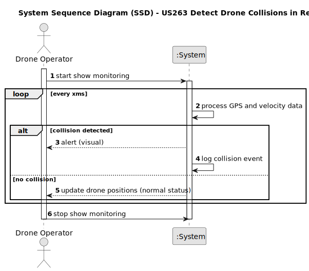

# US263 - Detect Drone Collisions in Real Time

## 1. Requirements Engineering

### 1.1. User Story Description

As a Drone Operator, I want the system to detect potential drone collisions in real time during a show, so that I can take immediate corrective actions to prevent accidents and ensure the safety of the operation. This feature will monitor the positions of all drones involved in a show request and alert the operator if two or more drones are on a collision course.

### 1.2. Customer Specifications and Clarifications

- **From Project Requirements (Shodrone_Specs_v1.2, Section 4.3)**:
    - "The system must monitor drone positions using GPS data updated every 500 milliseconds."
    - "A collision is detected if the distance between any two drones is less than 2 meters and their relative velocity suggests a potential impact within the next 2 seconds."
- **Clarification from Customer Forum (X Post, May 10, 2025)**:
    - *Q: Should the system stop drones automatically on collision detection?*
        - *A: No, the system should only alert the operator and log the event. Automatic control is out of scope for this release. (Customer Rep, 10:45 AM WEST)*
    - *Q: What happens if GPS data is unavailable?*
        - *A: The system should flag the drone as 'untracked' and exclude it from collision calculations until data is restored. (Customer Rep, 10:50 AM WEST)*

### 1.3. Acceptance Criteria

- **AC1**: The system must process GPS position updates for all drones every 500 milliseconds.
- **AC2**: A collision is detected if the distance between any two drones is less than 2 meters and their projected paths indicate a potential impact within 2 seconds.
- **AC3**: The system must generate an alert (visual and audible) to the Drone Operator when a collision is detected.
- **AC4**: All collision detection events must be logged with timestamps, drone IDs, and positions.
- **AC5**: If GPS data for a drone is unavailable, the system must mark it as 'untracked' and exclude it from collision calculations.
- **AC6**: The system must handle at least 50 drones simultaneously without performance degradation.
- **AC7**: The feature must integrate with the existing show execution monitoring system (from US220).

### 1.4. Found out Dependencies

- **US220 - Monitor Show Execution**: This user story depends on US220 for real-time drone position data and show execution context.
- **US230 - Register Show Request**: Provides the initial setup of drones and figures for a show, which is necessary for tracking.
- **US245 - Drone Telemetry**: Relies on telemetry data (e.g., GPS, velocity) provided by US245.

### 1.5 Input and Output Data

**Input Data:**
- **Real-time GPS Data**: Latitude, longitude, and altitude for each drone (updated every 500 ms).
- **Show Context**: Drone IDs and their association with a specific show request.

**Output Data:**
- **Collision Alert**: Visual notification (e.g., red flashing icon) and audible beep to the Drone Operator.
- **Log Entry**: Timestamp, drone IDs involved, and their positions at the time of detection (e.g., "2025-05-16 10:49:00, Drone1, Drone2, Lat: 38.7223, Lon: -9.1393").

### 1.6. System Sequence Diagram (SSD)

