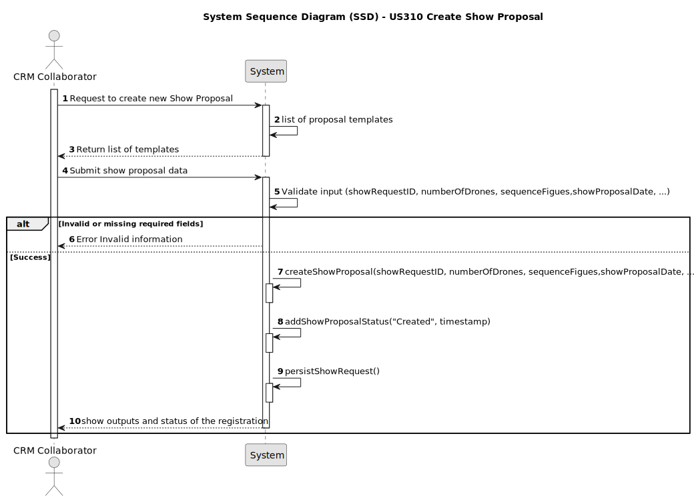

# US310 - Create Show Proposal

## 1. Requirements Engineering

### 1.1. User Story Description

As a CRM Collaborator, I want to start the process of creating a show proposal so that we can reply to the customer. The show proposal includes essential show configuration such as the total number of drones to be used and must follow a predefined proposal template. This process formalizes the initial response to a customer's show request.

### 1.2. Customer Specifications and Clarifications

The following specifications are derived from the requirements documents and business rules:

- The **show proposal** must contain:
  - Total number of drones to be used in the show.
  - Customer and request information.
  - Link or reference to the predefined show proposal template.
- At this stage, **all figures in the show must use the same number of drones** — the total number specified in the proposal.
- The show proposal is created through a dedicated system interface and saved as a draft until formally submitted.
- A **predefined template** is used for all show proposals to ensure consistency in structure and presentation.
- The template is versioned and stored in the system.

**Clarifications**:
- **Q: Can different figures use different numbers of drones in a proposal?**
  - A: No, currently all figures must use the same number of drones — the total specified for the show.
- **Q: Is the show proposal editable after creation?**
  - A: Yes, until it's submitted or approved.
- **Q: Who defines the template for the proposal?**
  - A: The template is defined and versioned by the operations team and stored in the system.

**Forum Questions**:
> **Question:** A proposta pode ser gerada automaticamente ou precisa ser criada manualmente?
>
> **Answer:** Deve ser criada manualmente, com campos preenchidos pelo utilizador através de um formulário estruturado, com base no template.

### 1.3. Acceptance Criteria

- **AC1**: Only authenticated CRM Collaborators can create a show proposal.
- **AC2**: The system must provide a form based on the predefined template for inputting show proposal details.
- **AC3**: The user must define the total number of drones for the show.
- **AC4**: Upon submission, the system validates that all figures used conform to the specified drone count.
- **AC5**: The proposal must be saved as a draft and later marked as "Submitted" when finalized.
- **AC6**: The template used must be referenced by version number.

### 1.4. Found Out Dependencies

- **US210**: Authentication and authorization – Required to ensure only authenticated CRM Collaborators can initiate show proposals.
- **US220**: Register customer – Required to associate a show proposal with a registered customer.
- **US230**: Register show request – The show proposal is typically created in response to a show request.
- **US231**: List public figures in the figure catalogue – Required for selecting valid figures to include in the proposal.
- **US233**: Add Figure to the catalogue – Needed for figure availability in the proposal process.
- **US234**: Decommission Figure – Affects which figures are available for inclusion.
- **US240–US243**: Drone model and inventory management – Provide drone availability data necessary to define drone count in proposals.
- **US248**: Inactivate/Activate a figure category – Influences visibility and selection of figures.
- **US311**: Add drones to a proposal – Handles configuration of drone count per proposal.
- **US312**: Add figures to a proposal – Links specific figures to the proposal based on total drone count.
- **US318**: Templates for show proposals – Defines the structure and versioned template required for creating the proposal.

### 1.5 Input and Output Data

**Input Data:**
- **Typed data:**
  - `numberOfDrones` (integer): Total number of drones to be used in the show.
  - `showDate` (date): Proposed date for the show.
  - `location` (string): Location where the show is intended to take place.
  - `description` (string): Optional description of the proposal.
  - `showDuration` (integer): Estimated total duration of the drone show in seconds or minutes.
  - `video` (object): Optional video preview or simulation associated with the proposal.

- **Selected data:**
  - `showRequestId` (integer): Identifier of the associated customer show request.
  - `templateVersion` (string): Version ID of the predefined proposal template to use.
  - `sequenceFigures` (list of objects): Ordered list of figures to be used in the show. Each includes: `figures` that are active and public or customer-exclusive figures (`Figure.isActive = true`)
  - `droneTypes`: Mappings of `DroneType` to selected `DroneModel`.

- **Automatic data:**
  - `status` (enum): Initial status of the proposal (`CREATED`, `SENT`, `APPROVED`, `REJECTED`).

**Output Data:**

- Show proposal ID (generated by the system, e.g., `showProposal.id = "SP-001"`)
- Confirmation message (e.g., "Show proposal registered successfully with ID SP-001")

### 1.6. System Sequence Diagram (SSD)

Below is a high-level representation of the interaction for creating a show proposal:

### 1.7 Other Relevant Remarks

