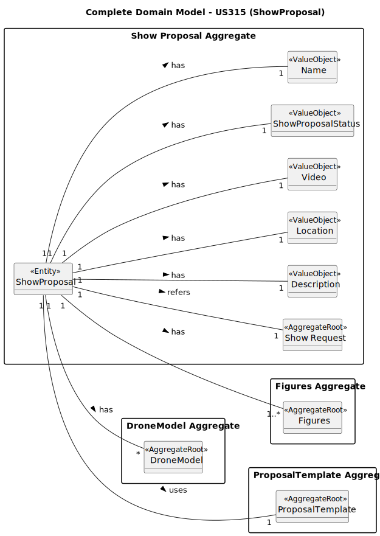

# US310 – Create Show Proposal

## 2. Analysis

### 2.1. Relevant Domain Model Excerpt

This domain model represents the structure for creating a **Show Proposal**. It introduces the `ShowProposal` aggregate as the core entity, encapsulating all required data to initiate, describe, and track a proposal based on a customer's show request.

The model aligns with the business process of generating a proposal from a **show request**, defining a template, selecting figures, and optionally attaching a simulation video. The internal value objects provide strong typing and encapsulation for all critical fields.

#### **Explanation of the model elements**

- **ShowProposal** (`<<AggregateRoot>>`): Central domain entity for representing a customer's drone show proposal. Contains:
  - `showProposalId`: Unique identifier for the proposal.
  - `showRequestId`: Link to the originating customer request.
  - `template`: Structure or blueprint used to guide the proposal creation.
  - `numberOfDrones`: The number of drones planned to be used in the show.
  - `showDate`, `location`, `description`, `showDuration`: Operational and logistical metadata for planning the show.
  - `status`: Current proposal state (`CREATED`, `SEND`, `APPROVED`, `REJECTED`).
  - `createdAt`, `createdBy`: Audit trail capturing who and when the proposal was created.
  - `video`: Optional simulation video to preview the proposal.

- **Figure** (`<<AggregateRoot>>`): A reference to the selected figures intended for inclusion in the show. Though figures are modeled separately, they are logically connected to the proposal and drive much of its content.

- **Value Objects**: Each property within the `ShowProposal` is modeled as a value object. This provides immutability, validation, and encapsulated domain rules. Notable examples include:
  - `NumberOfDrones` ensures consistent drone count enforcement across the show.
  - `Template` ensures that only validated structures are used to create proposals.
  - `Status` manages state transitions in the proposal lifecycle.

This structure ensures that show proposals are reliable, traceable, and structured according to business rules.

### 2.2. Other Remarks

This domain model emphasizes **clarity**, **modularity**, and **traceability**, which are all essential in delivering high-quality proposals that align with customer expectations and system constraints. Noteworthy design considerations include:

- **Separation of concerns**: The `Figure` aggregate is managed independently from the proposal, allowing figure reuse, version control, and public/exclusive visibility.
- **Extensibility**: Future features like proposal editing, review logs, drone assignment validation, or customer feedback workflows can be cleanly integrated.
- **Robust validation**: Encapsulating business rules in value objects allows the domain to reject invalid or inconsistent proposals early.

This domain structure ensures the creation of proposals is both technically sound and functionally aligned with the customer journey.
