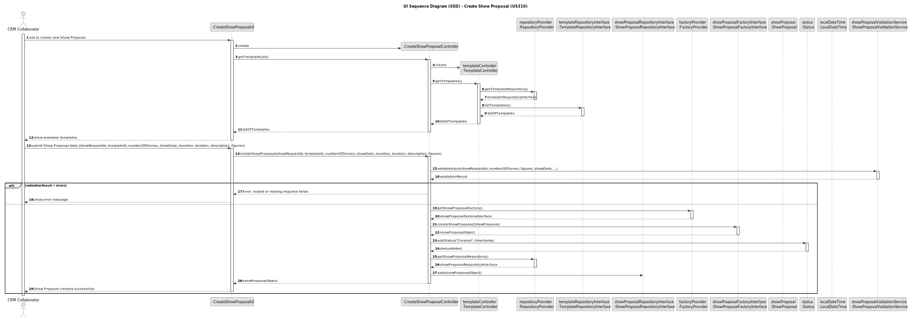

# US310 - Create Show Proposal

## 3. Design

### 3.1. Design Overview

The design for the "Create Show Proposal" functionality adheres to the layered and modular architectural principles established for the project, focusing on creating a consistent and complete `ShowProposal` aggregate rooted in domain-driven design (DDD) practices.

The process begins with a CRM Collaborator interacting with the UI to initiate the creation of a new `ShowProposal`. The domain model encapsulates various value objects representing the proposal’s attributes, including `ShowProposalId`, `ShowRequestId`, `Template`, `NumberOfDrones`, `ShowDate`, `Location`, `Description`, `ShowDuration`, `Status`, `CreatedAt`, `CreatedBy`, and optionally a `Video`. The `ShowProposal` aggregate root maintains references to one or more `Figure` aggregates, representing figures included in the proposal.

Key behaviors and responsibilities include:
- The CRM Collaborator requests the list of available proposal templates through the UI.
- The controller delegates template retrieval to a dedicated template controller and repository, maintaining separation of concerns.
- The user submits comprehensive proposal data, including `showRequestId`, `templateId`, number of drones, show date, duration, location, description, and figures.
- The `ShowProposalValidationService` validates inputs against domain rules to ensure data integrity before creation.
- Upon successful validation, the `ShowProposalFactoryInterface` constructs a fully initialized and consistent `ShowProposal` aggregate, composed of its associated value objects and figures.
- A status of "Created" with a timestamp (`CreatedAt`) is assigned, and the creator (`CreatedBy`) is tracked to maintain lifecycle and audit information.
- The proposal is persisted through the `ShowProposalRepositoryInterface`, abstracting the underlying data storage mechanism.
- Feedback, including success confirmation or validation errors, is communicated back to the CRM Collaborator via the UI.

This design enforces a strong separation between UI, application, domain, and persistence layers while leveraging DDD principles. It promotes maintainability, testability, and aligns with both functional and non-functional requirements, ensuring the integrity and completeness of the `ShowProposal` aggregate.

### 3.2. Sequence Diagram(s)

The sequence diagram depicts the interaction flow:

- The CRM Collaborator initiates the creation by requesting to create a new Show Proposal via the UI.
- The UI requests the `CreateShowProposalController` to start the creation process and fetch the list of available templates.
- The controller creates a `TemplateController` and requests the `TemplateRepositoryInterface` from the `RepositoryProvider`.
- The `TemplateController` retrieves the list of templates from the `TemplateRepositoryInterface`.
- The list of templates is returned back through the layers to the UI.
- The UI displays the available templates to the CRM Collaborator.
- The CRM Collaborator submits the Show Proposal data (including `showRequestId`, `templateId`, number of drones, show date, duration, location, description, and figures) to the UI.
- The UI calls the controller’s `createShowProposal()` method with the submitted data.
- The controller delegates input validation to the `ShowProposalValidationService`.
- The validation service processes the input and returns the validation result.
- If validation fails, the controller returns an error message to the UI, which shows it to the CRM Collaborator.
- If validation succeeds:
    - The controller obtains a `ShowProposalFactoryInterface` from the `FactoryProvider`.
    - The factory creates a new `ShowProposal` domain object with the provided data.
    - The controller assigns a “Created” status to the proposal, including a timestamp.
    - The controller requests the `ShowProposalRepositoryInterface` from the `RepositoryProvider`.
    - The proposal is added to the repository.
    - The controller returns the created `ShowProposal` object to the UI.
    - The UI notifies the CRM Collaborator that the Show Proposal was created successfully.

### 3.3. Design Patterns

- **Controller Pattern:** Centralizes coordination between the UI and domain logic, managing flow and delegating tasks effectively within the use case.
- **Separation of Concerns:** Clearly divides responsibilities across layers (UI, Application, Domain, Persistence), enhancing modularity and maintainability.
- **Factory Pattern:** Utilized to create fully initialized domain aggregates (`ShowProposal`), ensuring all business invariants are met at construction time.
- **Repository Pattern:** Abstracts data persistence behind interfaces, enabling flexible storage implementations and decoupling domain logic from infrastructure concerns.
- **Validation Service:** Encapsulates input validation logic in a dedicated service (`ShowProposalValidationService`), maintaining thin controllers and promoting single responsibility.
- **Dependency Injection & Factory Provider:** Uses a `FactoryProvider` to supply domain factories, supporting loose coupling and testability.
- **SOLID and GoF Principles:** The design follows key SOLID principles (SRP, DIP, OCP, ISP) and incorporates GoF patterns like Factory Method to improve extensibility and maintainability.

This design ensures robustness, clarity, and strict adherence to both functional and non-functional requirements, while remaining aligned with the overall project architecture.
