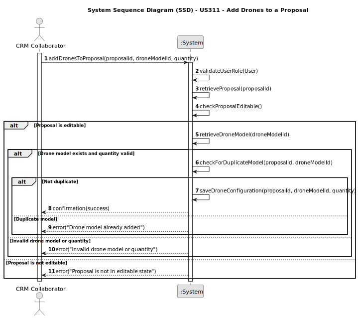

# US311 - Add Drones to a Proposal

## 1. Requirements Engineering

### 1.1. User Story Description

As a CRM Collaborator, I want to configure the list of drone models (number of drones and model) of a show proposal.

### 1.2. Customer Specifications and Clarifications

- The user must be able to select existing drone models already registered in the system.
- The user must specify the quantity of each drone model to be used in the proposal.
- The drones in the proposal must be compatible with the drone models in the Shodrone inventory.
- The proposal must be in a modifiable state (STAND_BY).

**Clarifications**

Q: Can the user assign a drone model that is not in the system?
A: No. Only registered drone models (created in US240) can be selected.

### 1.3. Acceptance Criteria

* AC1: Only CRM Collaborators can add drones to a proposal.
* AC2: The drone model must already exist in the system.
* AC3: The number of drones per model must be a positive integer.
* AC4: The system must prevent exceeding the available inventory for any drone model.
* AC5: The configuration must be persisted and linked to the correct proposal.
* AC6: Only proposals in STAND_BY status can be modified.
* AC7: It must be possible to update or remove existing drone model entries from the proposal.

### 1.4. Found out Dependencies

* US310 – A proposal must exist before drones can be added to it.
* US240 – Drone models must exist in the system.
* NFR07 – Persistence of configuration data must be ensured.
* NFR08 – Authorization must be enforced based on user role.
* 
### 1.5 Input and Output Data

**Input Data:**

* Proposal ID
* Drone model ID
* Quantity of drones

**Output Data:**

* Confirmation of configuration saved
* Error messages if validation fails

### 1.6. System Sequence Diagram (SSD)

### 1.7 Other Relevant Remarks

None