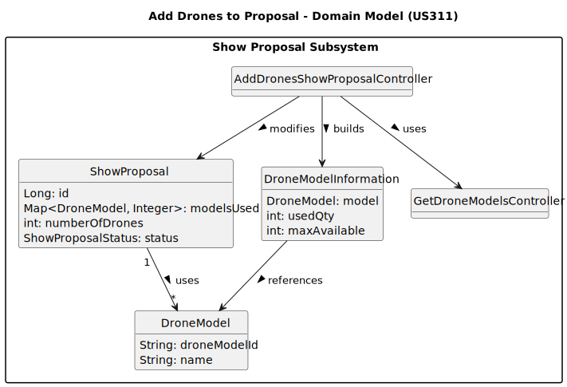

# US211 - Register users

## 2. Analysis

### 2.1. Relevant Domain Model Excerpt 

### 2.2. Other Remarks

* Proposal Status Requirement: Drones can only be configured for proposals with status STAND_BY. Proposals in any other state must be rejected with a proper error message.
* Drone Model Source: Only models retrieved from the current drone inventory (DroneRepository.numberOfDronesPerModel()) are allowed. These models must have been previously created (US240).
* Inventory Enforcement: The system ensures that the total number of drones per model used in the proposal does not exceed what is available in inventory. Attempts to exceed this limit result in a validation error.
* No Duplicates: Adding the same drone model more than once is not allowed. If attempted, the system issues a “Drone model already added” warning.
* Quantity Validation: Quantities must be strictly positive integers, and within the available inventory limits for each model.
* Editable State Only: The configuration can only be applied if the selected proposal is in an editable state. Otherwise, the operation is cancelled with an appropriate error.
* Persistence: The selected drone models and their quantities are stored in the modelsUsed map of the ShowProposal entity. The total number of drones is also updated accordingly.
* Feedback to User: The system gives immediate feedback on success or failure.
* Atomic Update: All additions/modifications/removals are processed in-memory and only persisted when the user finishes the configuration and confirms. This avoids partial/inconsistent saves.
* Role Enforcement: Only users with the CRM Collaborator role can access this functionality.ling: The registration process must return meaningful error messages, such as “Invalid email format”, “Email must be @showdrone.com”, or “Email already in use”.