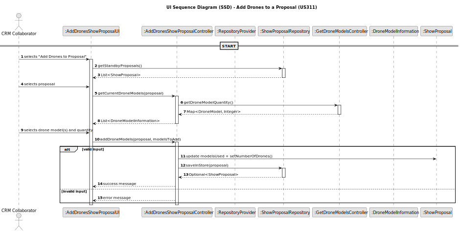

# US211 - Register users

## 3. Design

### 3.1. Design Overview

The design for US311 enables CRM Collaborators to configure the list of drone models and their respective quantities for a ShowProposal in STAND_BY state. This configuration is subject to inventory constraints and proposal editability rules.
The process follows these high-level steps:
1. **Proposal Selection**: The CRM Collaborator selects a show proposal with status STAND_BY.

2. **Drone Configuration**:
- The system displays the current drone configuration.
- The user can:
* Add new drone models (from inventory).
* Change the quantity of already configured models.
* Remove existing models from the proposal.

3. **Validation**:
* Ensure the selected proposal is editable.
* Check if selected drone models exist in inventory.
* Ensure the quantity requested does not exceed availability.
* Prevent duplicate model entries.

4. **Persistence**:
* The proposal’s modelsUsed map is updated accordingly.
* The numberOfDrones field is recalculated.
* The updated proposal is persisted via the ShowProposalRepository.

Layered architecture applied:
- UI Layer: AddDronesShowProposalUI handles user interaction (menu, selection, prompts).
- Application Layer: AddDronesShowProposalController coordinates operations, validation, and persistence.
- Domain Layer: ShowProposal stores drone model configurations and tracks drone counts and DroneModelInformation encapsulates model, used quantity, and availability.
- Persistence Layer: ShowProposalRepository and DroneRepository provide access to proposal and inventory data.
- Infrastructure Layer: RepositoryProvider resolves repository dependencies.

### 3.2. Sequence Diagrams

3.2.1. Class Diagram
The following class diagram models the relevant classes involved in US311, including the controller, domain entities, and supporting components:

3.2.2. Sequence Diagram (SD)
The sequence diagram below illustrates the drone configuration process for a proposal, from user input to validation and persistence:

### 3.3. Design Patterns (if any)

Domain-Driven Design (DDD) Patterns

- Application Service
  AddDronesShowProposalController acts as the application service, coordinating the logic of configuration.

-Repository
  ShowProposalRepository and DroneRepository abstract access to persisted entities and inventory data.

- Value Object
  DroneModelInformation functions as a read-only helper structure encapsulating a drone model, its used quantity, and available stock.

- Aggregate Root
  ShowProposal is the aggregate root. It contains the business state (status, drone configuration) and enforces consistency.

- Factory Method
  Although not formal factories, methods such as getAvailableDroneModelsToAdd build DroneModelInformation structures based on current inventory and proposal state.
