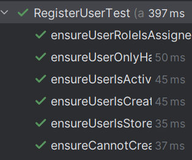

# US211 - Register users

## 4. Tests

This section documents the unit tests and validation strategies used to verify the correctness of the user registration functionality, including domain constraints, repository integrity, and bootstrap logic.
You should include:

### **Test Cases**

1. **Unit Test: Successful User Creation**
    * **Description**: Verifies that a user with valid details and unique email can be registered successfully.
    * **Expected Outcome**: The user is added to the repository with the correct role.
    * **Test**:
   ```java
    @Test
    public void ensureUserIsCreatedSuccessfully() {
        boolean result = authRepo.addUserWithRole("João Silva", "joao@shodrone.app", "Pass123@", AuthenticationController.ROLE_ADMIN);
        assertTrue(result);

        List<UserDTO> users = authRepo.getAllUsers();
        assertEquals(9, users.size());
        UserDTO joao = users.stream()
                .filter(u -> u.getId().equalsIgnoreCase("joao@shodrone.app"))
                .findFirst()
                .orElseThrow(() -> new AssertionError("João Silva not found"));

        assertEquals("joao@shodrone.app", joao.getId());
        assertEquals(AuthenticationController.ROLE_ADMIN, joao.getRoles().get(0).getId());
    }
    ```

2. **Unit Test: Duplicate Email Not Allowed**
    * **Description**: Ensures that creating a user with an already-used email address is not permitted.
    * **Expected Outcome**: The second attempt to create the user returns false.
    * **Test**:
   ```java
    @Test
    public void ensureCannotCreateUserWithExistingEmail() {
        authRepo.addUserWithRole("Ana Lima", "ana@shodrone.app", "pw", "ADMIN");
        boolean result = authRepo.addUserWithRole("Ana Lima 2", "ana@shodrone.app", "pw2", "ADMIN");
        assertFalse(result);
    }
    ```

3. **Unit Test: Role Is Assigned Correctly**
    * **Description**: Confirms that the correct role is associated with a newly created user.
    * **Expected Outcome**: The stored user has the assigned role in their data.
    * **Test**:
   ```java
    @Test
    public void ensureUserRoleIsAssignedCorrectly() {
        authRepo.addUserWithRole("Carlos", "carlos@shodrone.app", "Carlos123!", AuthenticationController.ROLE_ADMIN);

        List<UserDTO> users = authRepo.getAllUsers();

        UserDTO user = users.stream()
                .filter(u -> u.getId().equalsIgnoreCase("carlos@shodrone.app"))
                .findFirst()
                .orElseThrow(() -> new AssertionError("User not found"));

        assertEquals(AuthenticationController.ROLE_ADMIN, user.getRoles().get(0).getId());
    }
    ```

4. **Unit Test: New Users Are Active by Default**
    * **Description**: Verifies that users are created with active status unless explicitly disabled.
    * **Expected Outcome**: The user object has isActive() == true.
    * **Test**:
   ```java
    @Test
    public void ensureUserIsActiveByDefault() {
        authRepo.addUserWithRole("Rita", "rita@shodrone.app", "Xyz123$", AuthenticationController.ROLE_ADMIN);

        UserRepository userRepo = RepositoryProvider.userRepository();
        userRepo.ofIdentity(new Email("rita@shodrone.app"))
                .ifPresentOrElse(
                        user -> assertTrue(user.isActive(), "User should be active by default"),
                        () -> fail("User not found")
                );
    }
    ```

5. **Unit Test: Only One Role per User**
    * **Description**: Enforces the business rule that each user must only have one role assigned.
    * **Expected Outcome**: Attempts to assign additional roles are ignored or rejected.
    * **Test**:
   ```java
    @Test
    public void ensureUserOnlyHasOneRole() {
        authRepo.addUserWithRole("Maria", "maria@shodrone.app", "Mariapass123!", AuthenticationController.ROLE_ADMIN);

        UserRepository userRepo = RepositoryProvider.userRepository();
        userRepo.ofIdentity(new Email("maria@shodrone.app")).ifPresent(user -> {
            user.addRole(new UserRole(AuthenticationController.ROLE_CRM_MANAGER, AuthenticationController.ROLE_CRM_MANAGER));
            userRepo.save(user);
        });

        UserDTO maria = authRepo.getAllUsers().stream()
                .filter(u -> u.getId().equalsIgnoreCase("maria@shodrone.app"))
                .findFirst()
                .orElseThrow();

        assertEquals(1, maria.getRoles().size());
    }
    ```

6. **Unit Test: Persistence in Repository**
    * **Description**: Verifies that registered users are correctly stored and retrievable from the repository.
    * **Expected Outcome**: UserRepository.ofIdentity(...) returns a matching user.
    * **Test**:
   ```java
    @Test
    public void ensureUserIsStoredCorrectlyInRepository() {
        authRepo.addUserWithRole("Pedro", "pedro@shodrone.app", "Pedro321@", AuthenticationController.ROLE_DRONE_TECH);

        UserRepository userRepo = RepositoryProvider.userRepository();
        boolean exists = userRepo.ofIdentity(new Email("pedro@shodrone.app")).isPresent();

        assertTrue(exists, "User should be stored in user repository");
    }
    ```

### Screenshot


## 5. Construction (Implementation)

**Controller**: RegisterUserController
The RegisterUserController coordinates the registration workflow, interfacing between UI input and domain validation/persistence logic.

**Responsibilities**
- Validates email uniqueness and format.
- Retrieves roles from the role repository.
- Instantiates User aggregates with hashed passwords and status.
- Persists users using UserRepository.
- 
**DDD Principle**
- Business logic like validation (single role, email format) is enforced at the domain and service level.
- The controller acts as an Application Service, delegating to repositories and domain constructors.

**Persistence Layer**
- UserRepository: Provides storage/retrieval of users.
- UserRoleRepository: Manages available user roles.

Implemented by:
- InMemoryAuthenticationRepository (for test and dev)
- AuthenticationRepositoryJPAImpl (for production persistence)
