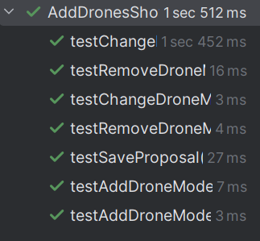

# US211 - Register users

## 4. Tests

This section documents the unit tests and validation strategies used to verify the correctness of the drone configuration functionality for show proposals. It focuses on controller logic, inventory validation, and business rule enforcement.
You should include:

### **Test Cases**

1. **Unit Test: Valid Drone Quantity Change**
    * **Description**: Verifies that changing the quantity of an existing drone model to a valid number updates the proposal correctly.
    * **Expected Outcome**: The quantity is updated in the modelsUsed map.
    * **Test**:
   ```java
    @Test
    void testChangeDroneModelQuantityValid() {
        when(mockedDroneModelsController.getDroneModelQuantity())
                .thenReturn(Optional.of(Map.of(modelA, 5)));

        Optional<String> result = controller.changeDroneModelQuantity(proposal, modelA, 3);
        assertTrue(result.isEmpty());
        verify(used).put(modelA, 3);
    }
    ```

2. **Unit Test: Invalid Drone Quantity**
    * **Description**: Description: Ensures that attempting to assign a drone quantity above available inventory returns an error.
    * **Expected Outcome**: An error message is returned indicating invalid quantity.
    * **Test**:
   ```java
    @Test
    void testChangeDroneModelQuantityInvalidTooHigh() {
        when(mockedDroneModelsController.getDroneModelQuantity())
                .thenReturn(Optional.of(Map.of(modelA, 3)));

        Optional<String> result = controller.changeDroneModelQuantity(proposal, modelA, 5);
        assertTrue(result.isPresent());
        assertTrue(result.get().contains("Invalid quantity"));
    }
    ```

3. **Unit Test: Add Drone Models Successfully**
    * **Description**: Confirms that adding new drone models with valid quantities updates the proposal correctly.
    * **Expected Outcome**: Quantities are added cumulatively and stored.
    * **Test**:
   ```java
    @Test
    void testAddDroneModelsSuccess() {
        Map<DroneModel, Integer> inventory = new HashMap<>();
        inventory.put(modelA, 5);
        inventory.put(modelB, 2);

        when(mockedDroneModelsController.getDroneModelQuantity()).thenReturn(Optional.of(inventory));
        when(used.getOrDefault(modelA, 0)).thenReturn(2);
        when(used.getOrDefault(modelB, 0)).thenReturn(1);

        Map<DroneModel, Integer> modelsToAdd = new HashMap<>();
        modelsToAdd.put(modelA, 2);
        modelsToAdd.put(modelB, 1);

        Optional<String> result = controller.addDroneModels(proposal, modelsToAdd);
        assertTrue(result.isEmpty());

        verify(used).put(modelA, 4);
        verify(used).put(modelB, 2);
    }
    ```

4. **Unit Test: Add Drone Models Fails Due to Insufficient Stock**
    * **Description**: Prevents addition of drones if the quantity exceeds the available inventory.
    * **Expected Outcome**: An error message is returned; no update is made.
    * **Test**:
   ```java
    @Test
    void testAddDroneModelsFailsDueToLackOfStock() {
        Map<DroneModel, Integer> inventory = new HashMap<>();
        inventory.put(modelA, 3); // only 3 available

        when(mockedDroneModelsController.getDroneModelQuantity()).thenReturn(Optional.of(inventory));
        when(used.getOrDefault(modelA, 0)).thenReturn(2);

        Map<DroneModel, Integer> modelsToAdd = new HashMap<>();
        modelsToAdd.put(modelA, 2);

        Optional<String> result = controller.addDroneModels(proposal, modelsToAdd);
        assertTrue(result.isPresent());
        assertTrue(result.get().contains("Not enough drones"));
    }
    ```

5. **Unit Test: Remove Drone Model Successfully**
    * **Description**: Ensures that a drone model can be removed from the proposal if it exists.
    * **Expected Outcome**: The model is removed from modelsUsed.
    * **Test**:
   ```java
    @Test
    void testRemoveDroneModelSuccess() {
        when(used.containsKey(modelA)).thenReturn(true);

        Optional<String> result = controller.removeDroneModel(proposal, modelA);
        assertTrue(result.isEmpty());
        verify(used).remove(modelA);
    }
    ```

6. **Unit Test: Remove Drone Model Fails**
    * **Description**: Prevents removal of a drone model not present in the proposal.
    * **Expected Outcome**: An appropriate error is returned.
    * **Test**:
   ```java
    @Test
    void testRemoveDroneModelFails() {
        when(used.containsKey(modelA)).thenReturn(false);

        Optional<String> result = controller.removeDroneModel(proposal, modelA);
        assertTrue(result.isPresent());
        assertEquals("Drone model is not in the proposal.", result.get());
    }
    ```
7. **Unit Test: Save Proposal Updates Total Drones**
   * **Description**: Confirms that calling saveProposal() correctly sets the total number of drones and persists the proposal.
   * **Expected Outcome**: Proposal is saved, and setNumberOfDrones() is called with the correct total.
   * **Test**:
   ```java
    @Test
    void testSaveProposal() {
        ShowProposalRepository repo = mock(ShowProposalRepository.class);
        RepositoryProvider.injectShowProposalRepository(repo);

        when(proposal.getModelsUsed()).thenReturn(Map.of(modelA, 3, modelB, 2));
        when(repo.saveInStore(proposal)).thenReturn(Optional.of(proposal));

        Optional<ShowProposal> result = controller.saveProposal(proposal);
        assertTrue(result.isPresent());
        verify(proposal).setNumberOfDrones(5);
    }
    ```


### Screenshot


## 5. Construction (Implementation)

**Controller**: AddDronesShowProposalController
The AddDronesShowProposalController is responsible for managing the configuration of drones in a show proposal. It interacts with the drone inventory via GetDroneModelsController and ensures all business constraints are enforced before persisting the proposal.

**Responsibilities**
- Retrieves inventory data from the drone repository.
- Ensures drone quantities are within available limits.
- Updates or removes models from the modelsUsed map of the proposal.
- Prevents duplicate entries.
- Calculates and updates the total number of drones.

**DDD Principle**
- Aggregate Root: ShowProposal encapsulates the state being modified and acts as the aggregate root.
- Application Service: The controller coordinates logic between the UI, domain entities, and persistence layer.
- Repository: The proposal and drone inventory are accessed via injected repositories.
- Mocking: Tests use mock proposals and inventory to simulate different edge cases and avoid persistence dependencies.

**Persistence Layer**
- ShowProposalRepository: Saves and retrieves ShowProposal instances.
- DroneRepository: Provides inventory quantity per model.