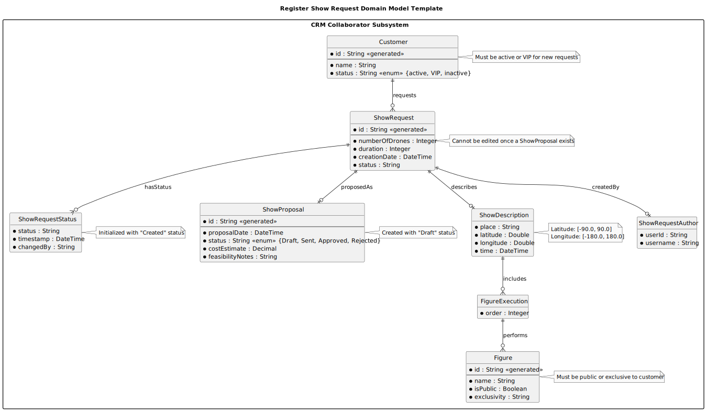

# US312 - Add Figure to a Proposal

## 2. Analysis

### 2.1. Relevant Domain Model Excerpt

O modelo de domínio relevante para US312 inclui as entidades e relações envolvidas na adição de figuras a uma proposta de espetáculo. Abaixo está o PlantUML que representa o trecho atualizado do modelo de domínio para esta user story.

### 2.2. Other Remarks

- **Implementation Considerations**:
  - A adição de uma figura a uma `ShowProposal` deve utilizar padrões de Domain-Driven Design (DDD), como Entidades (`ShowProposal`, `FigureExecution`, `Figure`), Objetos de Valor (`DroneTypeMapping`, `ShowProposalAuthor`), e Repositórios (`ShowProposalRepository`, `FigureRepository`, `InventoryRepository`). O `ShowProposalRepository` deve suportar persistência em memória e RDBMS (NFR07).
  - A validação de entrada é essencial para garantir a integridade dos dados. O sistema deve verificar se a figura selecionada é ativa (`Figure.isActive = true`), se é pública ou exclusiva ao cliente, se não há repetição consecutiva na sequência de figuras (`FigureExecution.sequencePosition`), e se o mapeamento de tipos de drones para modelos é compatível com o inventário (US311).
  - O `ShowProposalAuthor` deve capturar automaticamente os detalhes do CRM Collaborator autenticado (e.g., `userId`, `username`) usando o contexto de autenticação fornecido por US210 (EAPLI’s `AuthFacade`).

- **Business Rule Enforcement**:
  - O sistema deve validar que a figura selecionada é ativa e disponível para o cliente (`Figure.isPublic = true` ou `Figure.exclusivity` corresponde ao cliente da proposta, per Section 3.1.3, Page 9). Isso deve ser feito na camada de aplicação, consultando o `FigureRepository`.
  - Deve ser garantido que a figura adicionada não seja a mesma que a última na sequência, evitando repetições consecutivas (e.g., "Circle -> Circle" é inválido, mas "Circle -> Spiral -> Circle" é válido).
  - O mapeamento de tipos de drones para modelos deve assegurar que o número total de drones por modelo não exceda o inventário ativo (`DroneModelAssignment.quantity`), verificado através do `InventoryRepository` (US311).

- **Future Considerations**:
  - A sequência de figuras (`FigureExecution`) será usada em user stories futuras, como US315 (Add video of simulation to the proposal), onde a simulação dependerá das figuras adicionadas. Isso pode exigir validações adicionais, como verificar colisões entre figuras consecutivas durante a simulação.
  - Um recurso de visualização ou reordenação da sequência de figuras pode ser útil para o CRM Collaborator, o que pode ser abordado em uma user story futura (e.g., "Reorder Figures in Proposal").

- **Alignment with Non-Functional Requirements**:
  - **NFR02 (Documentation)**: O modelo de domínio (`us312-domain-model-Add_Figure_To_Proposal_Domain_Model.svg`) e este documento de análise são parte da documentação exigida, armazenados no repositório GitHub na pasta "docs".
  - **NFR03 (Test-Driven Development)**: Devem ser escritos testes unitários para o serviço `AddFigureToProposalService`, cobrindo validações como o status da figura, repetição consecutiva, e compatibilidade com o inventário. Testes de integração devem verificar a persistência e o workflow completo, incluindo a mensagem de confirmação.
  - **NFR08 (Role-Based Access)**: O sistema deve garantir que apenas CRM Collaborators autenticados podem adicionar figuras a uma proposta, utilizando o módulo de autenticação do EAPLI (US210).
  - **NFR07 (Database by Configuration)**: A persistência da `ShowProposal` atualizada deve ser configurável para suportar ambos os modos (in-memory e RDBMS), utilizando o `ShowProposalRepository`.

