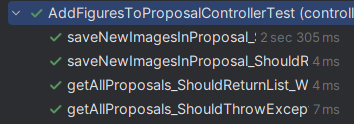
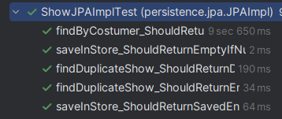

# US312 - Add Figure to a Proposal

## 4. Tests

This section documents the **unit tests**, **integration tests**, and other **validation procedures** developed for this User Story to ensure the functionality of adding a figure to a `ShowProposal` works as expected.

### Test Cases

1. **Unit Test: Figure Active Status Validation**

    * **Description**: Verifies if the system correctly validates that the selected `Figure` is active.
    * **Scenario**: Attempt to add a figure to a `ShowProposal` when the figure is inactive.
    * **Expected Outcome**: The system should throw an exception with the message "Selected figure is inactive or unavailable".
    * **Test**:

   ```java
   @Test
   void testAddFigureInactiveThrowsException() {
       Figure inactiveFigure = new Figure("FIG-001", false, true, null);
       ShowProposal proposal = new ShowProposal("SP-001", 50, new ArrayList<>(), new ArrayList<>(), author, creationDate);

       Exception exception = assertThrows(IllegalArgumentException.class, () -> {
           proposal.validateFigure(inactiveFigure);
       });
       assertEquals("Selected figure is inactive or unavailable", exception.getMessage());
   }
   ```

2. **Unit Test: Figure Exclusivity Validation**

    * **Description**: Verifies if the system validates that the figure is either public or exclusive to the customer.
    * **Scenario**: Attempt to add a figure to a `ShowProposal` that is neither public nor exclusive to the customer.
    * **Expected Outcome**: The system should throw an exception with the message "Figure not available for this customer".
    * **Test**:

   ```java
   @Test
   void testAddFigureNotExclusiveThrowsException() {
       Customer otherCustomer = new Customer("CUST-002", "Other Corp");
       Figure exclusiveFigure = new Figure("FIG-002", true, false, otherCustomer);
       ShowProposal proposal = new ShowProposal("SP-001", 50, new ArrayList<>(), new ArrayList<>(), author, creationDate);
       proposal.setCustomer(new Customer("CUST-001", "Test Corp"));

       Exception exception = assertThrows(IllegalArgumentException.class, () -> {
           proposal.validateFigure(exclusiveFigure);
       });
       assertEquals("Figure not available for this customer", exception.getMessage());
   }
   ```

3. **Unit Test: Consecutive Figure Repetition**

    * **Description**: Verifies if the system prevents adding a figure that repeats consecutively in the sequence.
    * **Scenario**: Add a figure to a `ShowProposal` that already contains the same figure as the last one in the sequence.
    * **Expected Outcome**: The system should throw an exception with the message "Consecutive repetition not allowed".
    * **Test**:

   ```java
   @Test
   void testConsecutiveFigureRepetitionThrowsException() {
       Figure figure = new Figure("FIG-001", true, true, null);
       FigureExecution lastExecution = new FigureExecution("FE-001", figure, 1, new ArrayList<>());
       ShowProposal proposal = new ShowProposal("SP-001", 50, new ArrayList<>(), Arrays.asList(lastExecution), author, creationDate);

       Exception exception = assertThrows(IllegalStateException.class, () -> {
           proposal.checkConsecutiveRepetition(figure);
       });
       assertEquals("Consecutive repetition not allowed", exception.getMessage());
   }
   ```

4. **Unit Test: Successful Figure Addition**

    * **Description**: Verifies if a figure can be successfully added to a `ShowProposal` when all conditions are met.
    * **Scenario**: Add a valid, active, public figure to a `ShowProposal` with no consecutive repetition and valid drone type mappings.
    * **Expected Outcome**: The figure should be added to the `ShowProposal`’s sequence.
    * **Test**:

   ```java
   @Test
   void testAddFigureSuccessfully() {
       Figure figure = new Figure("FIG-001", true, true, null);
       List<DroneTypeMapping> mappings = Collections.singletonList(new DroneTypeMapping(new DroneType("DT-001"), new DroneModel("DM-001")));
       ShowProposal proposal = new ShowProposal("SP-001", 50, new ArrayList<>(), new ArrayList<>(), author, creationDate);

       proposal.createFigureExecution(figure, mappings);
       assertEquals(1, proposal.getFigureExecutions().size());
       assertEquals(figure, proposal.getFigureExecutions().get(0).getFigure());
   }
   ```

5. **Integration Test: Add Figure with Inventory Validation**

    * **Description**: Verifies if the system correctly validates inventory limits when adding a figure to a `ShowProposal`.
    * **Scenario**: Attempt to add a figure with drone type mappings that exceed the available inventory.
    * **Expected Outcome**: The system should throw an exception with the message "Drone model count exceeds inventory".
    * **Test**:

   ```java
   @Test
   void testAddFigureExceedsInventoryThrowsException() {
       Figure figure = new Figure("FIG-001", true, true, null);
       List<DroneTypeMapping> mappings = Collections.singletonList(new DroneTypeMapping(new DroneType("DT-001"), new DroneModel("DM-001")));
       ShowProposal proposal = new ShowProposal("SP-001", 50, Collections.singletonList(new DroneModelAssignment(new DroneModel("DM-001"), 10)), new ArrayList<>(), author, creationDate);

       when(inventoryRepository.getAvailableCount("DM-001")).thenReturn(5);
       Exception exception = assertThrows(IllegalStateException.class, () -> {
           addFigureToProposalService.validateDroneTypeMappings(mappings);
       });
       assertEquals("Drone model count exceeds inventory", exception.getMessage());
   }
   ```

6. **Integration Test: Persistence of ShowProposal**

    * **Description**: Verifies if the updated `ShowProposal` is correctly persisted after adding a figure.
    * **Scenario**: Add a figure to a `ShowProposal` and save it using the repository.
    * **Expected Outcome**: The `ShowProposal` should be persisted with the new `FigureExecution`.
    * **Test**:

   ```java
   @Test
   void testPersistShowProposalAfterAddingFigure() {
       Figure figure = new Figure("FIG-001", true, true, null);
       List<DroneTypeMapping> mappings = Collections.singletonList(new DroneTypeMapping(new DroneType("DT-001"), new DroneModel("DM-001")));
       ShowProposal proposal = new ShowProposal("SP-001", 50, new ArrayList<>(), new ArrayList<>(), author, creationDate);

       addFigureToProposalService.addFigureToProposal("SP-001", "FIG-001", mappings);
       verify(showProposalRepository).save(proposal);
   }
   ```
   
## 6. ScreenShots






## 5. Construction (Implementation)

This section describes the implementation logic for **Add Figure to a Proposal**, based on **Domain-Driven Design (DDD)**, **SOLID**, and **GoF** design patterns.

### Controller: `AddFigureToProposalController`

The **Controller** is responsible for orchestrating the process of adding a figure to a `ShowProposal`. It acts as an entry point for the user interface, coordinating interactions between the UI, services, and repositories.

* **Responsibilities**:
    * Receives user inputs, including the proposal ID, figure ID, and drone type mappings.
    * Validates inputs, ensuring the figure is active, available to the customer, and does not repeat consecutively.
    * Calls services to execute business logic and persists the updated `ShowProposal`.

* **SOLID Principle**:
    * **Single Responsibility Principle (SRP)**: The controller’s sole responsibility is to orchestrate the process of adding a figure, delegating validation and persistence to other components.

* **DDD Principle**:
    * The **Controller** layer does not contain business logic; it invokes **Domain Services** that encapsulate the logic.

### Services/Factories:

#### `AddFigureToProposalService`

The **Service** (`AddFigureToProposalService`) is responsible for coordinating the business logic of adding a figure to a `ShowProposal`. It ensures all validations are performed and updates the proposal accordingly.

* **Responsibilities**:
    * Validates the figure’s status (active, public/exclusive to the customer).
    * Checks for consecutive figure repetition in the sequence.
    * Validates drone type mappings against inventory limits.
    * Updates the `ShowProposal` with the new `FigureExecution`.

* **SOLID Principle**:
    * **Open/Closed Principle (OCP)**: The service is open for extension (e.g., adding new validations) but closed for modification, as validations are modular.

#### `FigureExecutionFactory`

The **Factory** (`FigureExecutionFactory`) is responsible for creating `FigureExecution` instances, encapsulating the creation logic.

* **Responsibilities**:
    * Creates a `FigureExecution` with the provided figure, sequence position, and drone type mappings.
    * Ensures the entity is created with all necessary invariants.

* **SOLID Principle**:
    * **Dependency Inversion Principle (DIP)**: The controller depends on the factory abstraction, not a concrete implementation, promoting flexibility.

#### `ShowProposalRepository`

The **Repository** layer handles the persistence and retrieval of `ShowProposal` entities.

* **Responsibilities**:
    * Persists the updated `ShowProposal` after adding a figure.
    * Retrieves `ShowProposal` instances by ID for modification.

* **SOLID Principle**:
    * **Interface Segregation Principle (ISP)**: The repository provides a focused interface for domain-specific operations.

* **GoF Pattern**:
    * **Repository Pattern**: Abstracts the persistence layer, allowing flexibility in storage implementation (in-memory or RDBMS, per NFR07).

### Implementation Strategy

The implementation follows a logical sequence to ensure data consistency and integrity:

1. **Figure and Drone Type Mapping Selection**:
    * The user selects a `ShowProposal`, a `Figure` from the catalog, and maps the figure’s drone types to available drone models.

2. **Validations**:
    * The system performs the following validations:
        * **Active Figure**: Ensures the figure is active (`isActive = true`).
        * **Figure Availability**: Ensures the figure is public or exclusive to the customer.
        * **Consecutive Repetition**: Prevents adding a figure that repeats consecutively in the sequence.
        * **Inventory Compatibility**: Validates that the drone type mappings do not exceed inventory limits (via `InventoryRepository`).

    * **SOLID Principle**:
        * **Open/Closed Principle (OCP)**: New validations can be added without modifying existing code, thanks to modular validation logic.

3. **Creation of `FigureExecution`**:
    * The `AddFigureToProposalService` uses the `FigureExecutionFactory` to create a `FigureExecution` instance with the figure, sequence position, and drone type mappings.

4. **Update and Persistence**:
    * The `ShowProposal` is updated with the new `FigureExecution` and persisted using the `ShowProposalRepository`.

    * **SOLID Principle**:
        * **Dependency Inversion Principle (DIP)**: The service depends on repository abstractions, not concrete implementations.

5. **Confirmation**:
    * The system displays a confirmation message (e.g., "Figure FIG-001 added to proposal SP-001 successfully").

### Patterns Used

* **Factory Pattern**: Used for creating `FigureExecution` objects, encapsulating creation logic and ensuring consistency.
* **Repository Pattern**: Abstracts data access, allowing the application to work with domain entities without worrying about storage details.
* **Service Pattern**: The `AddFigureToProposalService` coordinates the use case, keeping business logic separate from the controller.

### DDD Principles Applied

* **Bounded Context**: The process of adding a figure to a proposal operates within a well-defined context, with clear business rules (e.g., no consecutive repetition).
* **Entities**: `ShowProposal` and `FigureExecution` are entities with their own identities and lifecycles.
* **Value Objects**: `DroneTypeMapping` and `ShowProposalAuthor` are value objects, immutable and without identity.
* **Aggregates**: `ShowProposal` is an **aggregate root**, ensuring the consistency of its `FigureExecution` list and related data.

