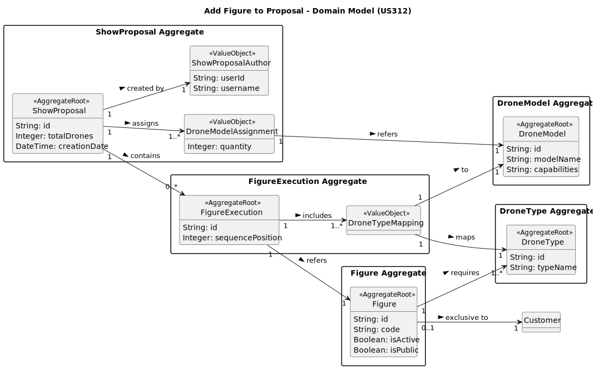

# US312 - Add Figure to a Proposal

## 2. Analysis

### 2.1. Relevant Domain Model Excerpt

The relevant domain model for US312 includes the entities and relationships involved in adding figures to a show proposal. Below is the PlantUML representation of the updated domain model excerpt for this user story.

### 2.2. Other Remarks

- **Implementation Considerations**:
  - Adding a figure to a `ShowProposal` should utilize Domain-Driven Design (DDD) patterns, such as Entities (`ShowProposal`, `FigureExecution`, `Figure`), Value Objects (`DroneTypeMapping`, `ShowProposalAuthor`), and Repositories (`ShowProposalRepository`, `FigureRepository`, `InventoryRepository`). The `ShowProposalRepository` must support both in-memory and RDBMS persistence (NFR07).
  - Input validation is essential to ensure data integrity. The system must verify that the selected figure is active (`Figure.isActive = true`), is either public or exclusive to the customer, does not repeat consecutively in the figure sequence (`FigureExecution.sequencePosition`), and that the mapping of drone types to models is compatible with the inventory (US311).
  - The `ShowProposalAuthor` should automatically capture the authenticated CRM Collaborator’s details (e.g., `userId`, `username`) using the authentication context provided by US210 (EAPLI’s `AuthFacade`).

- **Business Rule Enforcement**:
  - The system must validate that the selected figure is active and available to the customer (`Figure.isPublic = true` or `Figure.exclusivity` matches the proposal’s customer, per Section 3.1.3, Page 9). This should be performed in the application layer by querying the `FigureRepository`.
  - It must be ensured that the added figure is not the same as the last one in the sequence, preventing consecutive repetitions (e.g., "Circle -> Circle" is invalid, but "Circle -> Spiral -> Circle" is valid).
  - The mapping of drone types to models must ensure that the total number of drones per model does not exceed the active inventory (`DroneModelAssignment.quantity`), verified through the `InventoryRepository` (US311).

- **Future Considerations**:
  - The figure sequence (`FigureExecution`) will be used in future user stories, such as US315 (Add video of simulation to the proposal), where the simulation will depend on the added figures. This may require additional validations, such as checking for collisions between consecutive figures during simulation.
  - A feature for viewing or reordering the figure sequence could be beneficial for the CRM Collaborator, which could be addressed in a future user story (e.g., "Reorder Figures in Proposal").

- **Alignment with Non-Functional Requirements**:
  - **NFR02 (Documentation)**: The domain model (`us312-domain-model-Add_Figure_To_Proposal_Domain_Model.svg`) and this analysis document are part of the required documentation, stored in the GitHub repository under the "docs" folder.
  - **NFR03 (Test-Driven Development)**: Unit tests should be written for the `AddFigureToProposalService`, covering validations such as figure status, consecutive repetition, and inventory compatibility. Integration tests should verify persistence and the complete workflow, including the confirmation message.
  - **NFR08 (Role-Based Access)**: The system must ensure that only authenticated CRM Collaborators can add figures to a proposal, using EAPLI’s authentication module (US210).
  - **NFR07 (Database by Configuration)**: The persistence of the updated `ShowProposal` must be configurable to support both in-memory and RDBMS modes, utilizing the `ShowProposalRepository`.
