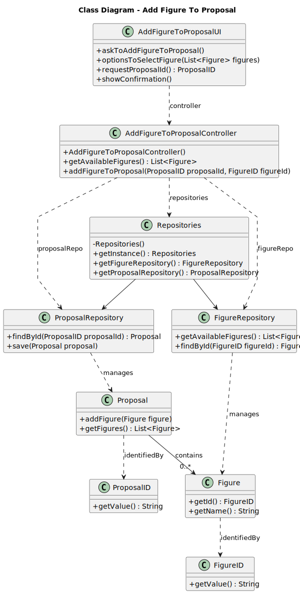
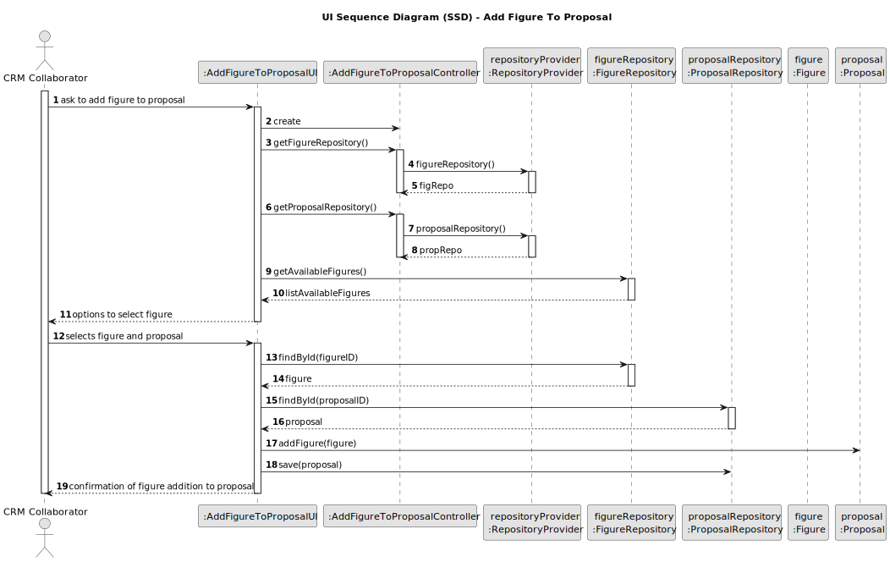

# US312 - Add Figure to a Proposal

## 3. Design

### 3.1. Design Overview

The design for US312 focuses on implementing the addition of a figure to a `ShowProposal` by a CRM Collaborator within the Shodrone back-office application. The process involves the following high-level steps:

1. **Authentication and Authorization**: The CRM Collaborator logs into the system, and their role is verified (via US210, NFR08: role-based access).
2. **User Interaction**: The CRM Collaborator interacts with a console-based UI to select an active figure from the catalog and map the figure’s drone types to the drone models available in the proposal, ensuring inventory compatibility.
3. **Business Logic Execution**: An application service (`AddFigureToProposalService`) orchestrates the process, performing validations (e.g., active figure, no consecutive repetition, inventory compatibility) and updating the `ShowProposal` with the new `FigureExecution` and `DroneTypeMapping`.
4. **Persistence**: The `ShowProposal` and related entities are persisted using repositories (`ShowProposalRepository`, `FigureRepository`, `InventoryRepository`) in both in-memory and RDBMS modes (NFR07).
5. **Feedback**: The system displays a confirmation message to the CRM Collaborator (e.g., "Figure FIG-001 added to proposal SP-001 successfully").

The design follows a layered architecture:
- **UI Layer**: Manages user interaction via EAPLI’s console UI.
- **Application Layer**: Contains the `AddFigureToProposalService`, which coordinates the use case logic.
- **Domain Layer**: Includes entities (`ShowProposal`, `FigureExecution`, `Figure`, etc.) and value objects, enforcing business rules.
- **Persistence Layer**: Uses EAPLI’s repository pattern (`ShowProposalRepository`, etc.) for data persistence.
- **Infrastructure Layer**: Leverages EAPLI’s authentication (`AuthFacade`) and persistence mechanisms.

### 3.2. Sequence Diagrams

#### 3.2.1. Class Diagram

#### 3.2.2. Sequence Diagram (SD)
The Sequence Diagram (SD) below provides a detailed view of the internal interactions within the system to add a figure to a `ShowProposal`. It includes the UI, application service, domain entities, and repositories.

### 3.3. Design Patterns (if any)

The following design patterns and principles have been applied to ensure maintainability, scalability, and adherence to best practices:

#### Domain-Driven Design (DDD) Patterns

- **Application Service**  
  The `AddFigureToProposalService` implements the Application Service pattern, orchestrating the use case logic without containing domain-specific business rules. This promotes a clear separation between the application and domain layers, enhancing modularity and testability.

- **Repository**  
  Access to persistent storage is mediated through Repository interfaces, such as `ShowProposalRepository`, abstracting the underlying database technology. This ensures the domain model remains persistence-agnostic (supporting Non-Functional Requirement NFR07) and maintains clean architecture boundaries.

- **Factory**  
  The creation of entities and aggregates, such as `FigureExecution`, is managed through factory methods (implicit or explicit), ensuring all invariants are established at construction time. This prevents the creation of partially constructed objects.

- **Aggregate Root**  
  The `ShowProposal` entity acts as an Aggregate Root, encapsulating business logic and ensuring transactional consistency. All changes (such as adding a `FigureExecution`) are controlled through the root, preserving the aggregate’s invariants.

#### Gang of Four (GoF) Design Patterns

- **Decorator**  
  The Decorator pattern is used to implement layered validations within the `AddFigureToProposalService`. Validations such as consecutive repetition and inventory compatibility can be composed dynamically, allowing extensions without modifying existing code, in line with the Open/Closed Principle (OCP).

- **Factory Method** (implicit)  
  Factory methods are used internally to encapsulate the creation logic of complex objects, such as `FigureExecution`, hiding construction details from the client and promoting flexibility.

#### SOLID Principles

- **Single Responsibility Principle (SRP)**  
  Each class and service has a single responsibility. For example, `AddFigureToProposalService` coordinates the logic but delegates domain validations and persistence to other layers.

- **Open/Closed Principle (OCP)**  
  The use of Decorators and factory methods allows extending the system’s behavior (e.g., adding new validations) without modifying existing code, promoting maintainability.

- **Liskov Substitution Principle (LSP)**  
  Interfaces and abstract classes, such as `DomainEntity` and `AggregateRoot`, ensure derived classes can be used interchangeably without affecting system correctness.

- **Interface Segregation Principle (ISP)**  
  Small, specific interfaces, such as those for repositories (`ShowProposalRepository`), avoid large, unnecessary contracts.

- **Dependency Inversion Principle (DIP)**  
  High-level modules (application services) depend on abstractions (repositories, domain services), not concrete implementations, facilitating dependency injection and maintaining a loosely coupled architecture.

